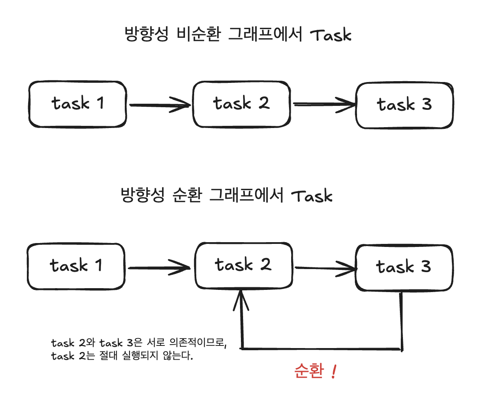

# Chapther 1. Apache Airflow 살펴보기

주차: 1주차
발표: 창배님
생성 일시: 2024년 7월 23일 오후 4:47

### 데이터 파이프라인이란?

- 원하는 결과를 얻기 위해 실행되는 여러 태스크 또는 동작으로, 서로 다른 태스크로 구성되어 있으며, 암묵적 순서를 적용해야 한다.

### 데이터 파이프라인 그래프

- 태스크 간 의존성을 명확하게 하는 방법 중 하나 = 그래프로 표현
- **방향성 그래프**

## 방향성 비순환 그래프 (Directed Acyclic Graph, DAG)

- 그래프는 화살표 방향성의 끝점을 포함하되, 반복이나 순환을 허용하지 않는다. **(비순환성)**

### 비순환성

- 태스크 간 순환 실행을 방지하기 때문에 매우 중요 (태스크 A가 B에 의존, B가 Adp dmlwhs)
- 그래프에서 순환 의존성이 문제를 발생할 수 있음
- 태스크 3이 완료된 후에만 태스크 2가 실행되는데, 태스크 3은 태스크 2가 완료된 후에 실행되기 때문

    → 논리적 오류가 교착상태(데드락)으로 이어지며, 2와 3 모두 실행 할 수 없기 때문에 그래프 실행 불가

### 파이프라인 그래프 실행

> DAG는 파이프라인 실행을 위한 단순한 알고리즘을 제공한다
> 
1. 그래프 안에 태스크는 각각 개방된 상태(미완료)이며 다음과 같은 단계 수행
    - 각각의 화살표 끝점은 태스크를 향하며 다음 태스크로 향하기 전에 이전 태스크가 완료되었는 지 확인
    - 태스크가 완료되면 다음에 실행할 태스크를 대기열에 추가
2. 실행 대기열에 있는 태스크 실행 후 완료되면 완료 표시
3. 그래프의 모든 태스크가 완료될 때까지 1단계로 돌아감

### 그래프 파이프라인 vs 절차적 스크립트 파이프라인

- 그래프에 실행 알고리즘을 적용하면 태스크를 병렬로 실행 시킬 수 있다.
- 가용 컴퓨팅 리소스를 더 효율적으로 활용할 수 있다.
- 따라서 순차적으로 실행하는 것 보다 전체 파이프라인 실행 시간을 줄일 수 있다.
- 전체 작업을 하나의 모놀리식 스크립트 또는 프로세스로 구성하는 것이 아닌 파이프라인을 작은 점진적인 태스크로 명확하게 분리한다.
- 그래프 기반 표현은 실패한 태스크만 재실행하면 되므로 효율적으로 구성할 수 있다.

### 워크플로 매니저

> DE 관련하여 들어본 것 & 내가 관심있는 기술만 정리
> 
| 이름 | 워크플로 정의 | 개발 언어 | 스케줄 관리 | 백필 | 사용자 인터페이스 | 플랫폼 설치 |
| --- | --- | --- | --- | --- | --- | --- |
| Airflow | 파이썬 | 파이썬 | 예 | 예 | 예 | Anywhere |
| Argo | YAML | Go | 3rd Party |  | 예 | K8s |
| Nifi | UI | Java | 예 | 아니오 | 예 | Anywhere |
| Oozie | XML | Java | 예 | 예 | 예 | Hadoop |
| Prefect | 파이썬 | 파이썬 | 예 | 예 | 예 | Anywhere |

# Airflow

### 파이썬 코드로 유연한 파이프라인 정의

- Airflow는 파이썬 스크립트로 DAG의 구조를 설명하고 구성
- DAG에 대한 태스크 집합과 태스크 간 의존성 기술
- DAG 구조 식별을 위해 코드를 파싱
- DAG 파일에는 Airflow의 실행 방법과 시간 등을 정의한 추가 메타 데이터 포함

<aside>
💡 ***Airflow DAG를 파이썬으로 정의할 때 장점***
1. 프로그래밍 접근 방식이 DAG를 구성하는데 많은 유연성 제공
2. 외부 DB, 클라우드 등 다양한 시스템에서 태스크 실행할 수 있도록 Airflow 확장 기능이 개발되고 있음

</aside>

## 파이프라인 스케줄링 및 실행

### Airflow 구성 요소

- Airflow 스케줄러 : DAG를 분석하고 현재 시점에서 DAG의 스케줄이 지난 경우 Airflow 워커에 DAG의 태스크를 예약
- Airflow 워커 : 예약된 태스크를 선택하고 실행
- Airflow 웹 서버 : 스케줄러에서 분석한 DAG를 시각화하고 DAG 실행과 결과를 확인할 수 있는 인터페이스 제공

### Airflow 스케줄러

1. 스케줄러는 DAG 파일 분석 후 태스크, 의존성 및 예약주기 확인
2. 마지막 DAG까지 확인 후 DAG의 예약주기를 확인 → 예약주기 현재 시간 이전이라면 실행되도록 예약
3. 예약된 태스크에 대해 태스크 의존성 확인 → 의존성 태스크 완료되지 않았으면 실행 대기열에 추가
4. 스케줄러 1단계로 돌아가고 루프를 대기

### Airflow 워커

- 태스크가 실행 대기열에 추가되면 Airflow 워커의 풀의 워커가 태스크를 선택하고 실행
- 실행은 병렬 수행 & 결과는 지속적으로 추가
- 이 과정의 모든 결과 Airflow의 메타스토어로 전달
- 이후 사용자 인터페이스를 통해 태스크 진행상황 추적 및 로그 확인

### 모니터링과 실패 처리

- 기본적으로 Airflow는 태스크 실패 시에 재시도 할 수 있음
- 오류 발생 시 태스크 복구 가능
- 실패한 경우 사용자에게 실패 통보
- 실패 태스크를 보고 로그를 추적할 수 있어 디버깅을 쉽게 할 수 있다.
- 트리 뷰에서 개별 태스크 결과를 삭제하고 종속된 태스크를 모두 재실행 할 수 있다.

### 점진적 로딩과 백필

- 점진적 실행 : 매번 전체 데이터 세트를 다시 처리할 필요 없이 해당 시간 슬롯에 대한 데이터만 처리
- 백필 : DAG를 과거 시점 및 기간에 대해 실행 가능 / 과거 특정 시간에 대해 새로운 데이터 셋 생성하거나 실행결과를 재구성 가능

# 언제 Airflow를 사용해야 할까?

### Airflow 선택하는 이유

<aside>
💡 ***배치 지향 데이터 파이프라인***

</aside>

- 파이썬 코드를 이용해 파이프라인을 구현할 수 있기 때문에 복잡한 커스텀 파이프라인 개발 가능
- 파이썬 기반이라 쉽게 확장 가능 (다양한 시스템 통합 / DB, 클라우드 등)
- **정기적으로 실행하고 점진적 증분처리를 통해 부분 재실행이 가능한 효율적인 파이프라인 구축 가능**
- 백필 기능을 통해 과거 데이터 재처리
    - 백필 : 특정 기간 기준으로 다시 실행하는 기능
- 훌륭한 웹 인터페이스 → 파이프라인 결과 모니터링 및 오류 디버깅에 쉬운 뷰
- 반복적이고 배치인 태스크 실행에 집중

### Airflow가 적절하지 않은 경우

- 스트리밍(실시간 데이터 처리) 워크 플로
- 추가 및 삭제 태스크가 빈번한 동적 파이프라인
    - 웹 인터페이스의 DAG는 최근 실행버전의 정의만 표현하므로 실행되는 동안 구조가 변경되지 않는 것이 좋다
- 파이썬 프로그래밍 경험이 필요
- 파이프라인 규모가 커지면 관리가 어려울 수 있으므로 사용 시점부터 엄격한 관리 필요