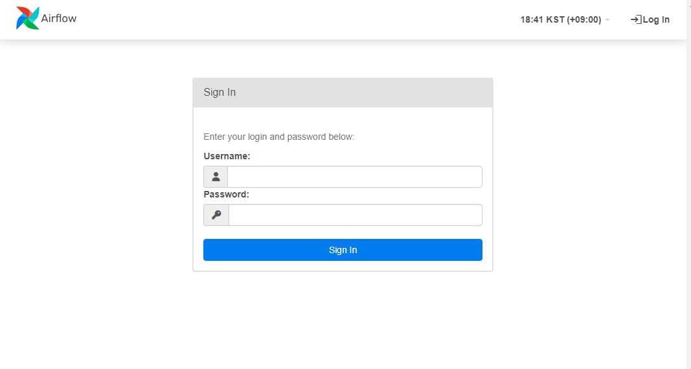

# **Chapter2 Airflow DAG의 구조**

## **2.1 다양한 소스에서 데이터 수집**
- 로켓 발사 데이터 수집 파이프라인 예시

https://ll.thespacedevs.com/2.0.0/launch/upcoming


- JSON형식으로 된 로켓 데이터 셋


> ### 파이프라인 구성

 1. Launch라이프러리로부터 다음 5개의 로켓 발사 데이터 Fetch 후 저장
 2. 1번에서 저장한 데이터를 읽어 인터넷에서 로켓이미지 Fetch 후 저장
 3. 시스템 알림


## **2.2 첫번째 Airflow DAG 작성**

```python
import json
import pathlib

import airflow.utils.dates
import requests
import requests.exceptions as requests_exceptions
from airflow import DAG
from airflow.operators.bash import BashOperator
from airflow.operators.python import PythonOperator

dag = DAG( #  객체의 인스턴스 생성 (모든 워크플로의 시작점)
    dag_id="download_rocket_launches", # (필수) DAG ID
    start_date=airflow.utils.dates.days_ago(14), # (필수) DAG처음 실행 시작 날짜
    schedule_interval="@daily", # DAG 실행 간격
)

download_launches = BashOperator( # Bash오퍼레이터를 이용해 curl로 데이터 다운로드
    task_id="download_launches", # Task ID
    bash_command="curl -o /tmp/launches.json -L 'https://ll.thespacedevs.com/2.0.0/launch/upcoming'",  # 실행시킬 Bash 커맨드
    dag=dag, # DAG변수 참조
)

# 결과값을 파싱하고 모든 로켓 사진을 다운로드 하는 함수
def _get_pictures():
    # 경로 존재 확인
    pathlib.Path("/tmp/images").mkdir(parents=True, exist_ok=True)

    # launches.json 파일 내용을 파싱하여 이미지 다운로드
    with open("/tmp/launches.json") as f:
        launches = json.load(f)
        image_urls = [launch["image"] for launch in launches["results"]]
        for image_url in image_urls:
            try:
                response = requests.get(image_url)
                image_filename = image_url.split("/")[-1]
                target_file = f"/tmp/images/{image_filename}"
                with open(target_file, "wb") as f:
                    f.write(response.content)
                print(f"Downloaded {image_url} to {target_file}")
            except requests_exceptions.MissingSchema:
                print(f"{image_url} appears to be an invalid URL.")
            except requests_exceptions.ConnectionError:
                print(f"Could not connect to {image_url}.")

# Python 오퍼레이터에서 Python으로 작성된 함수 호출
get_pictures = PythonOperator( 
    task_id="get_pictures", 
    python_callable=_get_pictures, 
    dag=dag,
)

notify = BashOperator(
    task_id="notify",
    bash_command='echo "There are now $(ls /tmp/images/ | wc -l) images."',
    dag=dag,
)

# 태스크 실행순서 설정
download_launches >> get_pictures >> notify

```

> ### 태스크 vs 오퍼레이터 
- 태스크 : DAG의 실행 단위이며, 오퍼레이터를 사용하여 정의된 특정 작업을 수행
- 오퍼레이터 : 태스크를 정의하는 템플릿으로, 어떤 작업을 수행할지를 명세

- 태스크는 작업의 올바른 실행을 보장하기 위한 오퍼레이터의 매니저이다.


## **2.3 Airflow에서 DAG실행하기**
- 환경 구성 :  https://github.com/Mollis-Kim/Airflow-Docker-Compose


> ### Airflow UI 둘러보기



DAG 구성


이미자 다운로드 완료(6건)


## **2.4 스케줄 간격으로 실행하기**
- 수동 작업이 아닌 일정 주기의 작업을 필요로 할때,
- DAG에서 schedule_interval 인수를 설정한다.

시간 경과에 따른 태스크 상태


- @daily로 설정 시 하루 한번 실행함.
- start_date가 14일 전 이라면, 14개 간격으로 실행됨.

## **2.5 실패한 태스크에 대한 처리**
- notify 태스크는 get_pictures태스크에 의존하기 때문에, get_pictures가 실패한다면, notify는 실행되지 않는다.
- download_launches가 성공했다면, 굳이 처음부터가 아닌, get_pictures부터 재수행을 하면 된다.

