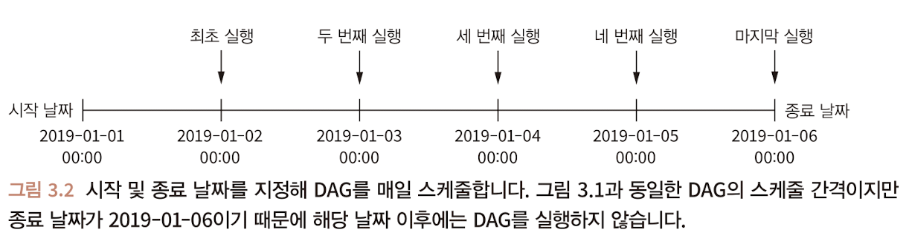

# Chapter 3. Airflow의 스케줄링

주차: 2주차
발표: 승현님
생성 일시: 2024년 8월 12일 오후 10:05

## 3.1 예시 : 사용자 이벤트 처리하기

## 3.2 정기적으로 실행하기

- `schedule_interval` : DAG 초기화 시 스케줄 간격을 정의 (default : None)

```jsx
dag = DAG(
		dag_id = "02_daily_schedule",
		schedule_interval = "@daily",
		start_date = dt.datetime(2019, 1, 1),
		end_date = dt.datetime(2019, 1, 5), # end_date없으면, 이론적으로 영원히 실행
)
```

- Airflow는 정의된 간격 후에 태스크 실행



### Cron 기반 스케줄 간격 설정하기

- 시간 / 날짜가 해당 필드값과 시스템 시간이 일치할 때 실행
- Airflow에 적용하기 전, 작성된 태스크에 대해 태스트할 것
- 복잡한 cron식에 대한 의미를 문서화할 것


| 구문 | 설명 |
| --- | --- |
| 0 * * * * | 매시간 (정시에 실행) |
| 0 0 * * * | 매일 (자정에 실행) |
| 0 0 * * 0 | 매주 (일요일 자정에 실행) |
| 0 0 1 * *  | 매월 1일 자정 |
| 45 23 * * SAT | 매주 토요일 23시 45분 |
| 0 0 * * MON, WED, FRI | 매주 월, 화, 금 자정에 실행 |
| 0 0,12 * * * | 매일 자정 및 오후 12시에 실행 |

| 프리셋 이름 | 의미 |
| --- | --- |
| @once | 1회만 실행하도록 스케줄 |
| @hourly | 매시간 변경 시 1회 실행 |
| @daily | 매일 자정에 1회 실행 |
| @weekly | 매주 일요일 자정에 1회 실행 |
| @monthly | 매월 1일 자정에 1회 실행 |
| @yearly | 매년 1월 1일 자정에 1회 실행 |

### 빈도 기반 스케줄 간격 설정하기

- 3일마다 실행하려면? → 상대적인 시간 간격으로 스케줄 간격을 정의
- **timedelta 인스턴스 사용**
- timedelta(days=3) : 2019.01.04 → 2019.01.07 → 2019.01.10 실행 가능
    - timedelta(minutes=10) : 10분마다
    - timedelta(hours=2) : 2시간마다

```jsx
dag = DAG(
		dag_id = "04_time_delta",
		schedule_interval = dt.timedelta(days=3),
		start_date = dt.datetime(2019, 1, 1),
		end_date = dt.datetime(2019, 1, 5), # end_date없으면, 이론적으로 영원히 실행
)
```

## 3.3 데이터 증분 처리하기

### 데이터 증분이란?


- 마지막 백업 이후에 변경된 데이터만 백업한다.

https://aws.amazon.com/ko/compare/the-difference-between-incremental-differential-and-other-backups/

### 이벤트 증분

- 스케줄 간격에 해당하는 일자의 이벤트만 로드하고, 새로운 이벤트만 통계를 계산


- 증분 방식 : 스케줄된 하나의 작업에서 처리해야 할 데이터 양을 크게 줄일 수 있기 때문에 전체 데이터 세트를 처리하는 것보다 훨씬 효율적
- 날짜 별로 분리된 단일 파일로 저장하고 있기 때문에 API가 제한하고 있는 30일 간의 내용을 한 파일로 저장하지 않고, 시간이 지남에 따라 매일 순차적으로 파일을 저장할 수 있다.

### 실행 날짜(execution_date)를 사용하여 동적 시간 참조하기


```python
fetch_events=BashOperator(
	task_id="fetch_events",
    bash_command=(
    	"mkdir -p /data && "
        "curl -o /data/events.json "
        "http://localhost:5000/events?"
        "start_date={{execution_date.strftime('%Y-%m-%d')}}" 
        "end_date={{next_execution_date.strftime('%Y-%m-%d')}}" 
    ),
    dag=dag,
)
```

- `start_date={{execution_date.strftime('%Y-%m-%d')}}` : Jinja 템플릿으로 형식화된 execution_date 삽입
- `end_date={{next_execution_date.strftime('%Y-%m-%d')}}` : next_execution_date로 다음 실행 간격의 날짜를 정의
- `{{variable_name}}` :

### 축약어 사용하기

- 일반적인 날짜 형식에 대한 여러 유형의 축약 매개변수를 제공
- YYYY-MM-DD : `ds`, `next_ds`, `prev_ds`
- YYYYMMDD : `ds_nodash`, `next_ds_nodash`, `prev_ds_nodash`

```python
fetch_events=BashOperator(
	task_id="fetch_events",
    bash_command=(
    	"mkdir -p /data && "
        "curl -o /data/events.json "
        "http://localhost:5000/events?"
        "start_date={{ds}}&" # YYYY-MM-DD 형식의 execution_date
        "end_date={{next_ds}}" # YYYY-MM-DD 형식의 next_execution_date
    ),
    dag=dag,
)
```

### 3.3 데이터 파티셔닝

- `fetch_events` 태스크로 이벤트 데이터를 새롭게 스케줄한 간격에 맞춰 점진적으로 가져오지만, 각각의 새로운 태스크가 전일의 데이터를 덮어쓰게된다.
- **출력 파일에 새 이벤트 추가**
    - 이 문제를 해결하기 위해 출력파일인 `events.json` 파일에 새 이벤트를 추가
    - 하나의 json파일에 모든 데이터를 작성할 수 있음
    - 단점 : 특정 날짜의 통계 계산을 하려고 해도 전체 데이터 세트를 로드하는 다운스트림 프로세스 작업이 필요
    - 이 파일은 장애 지점이 되어 파일이 손상되어 전체 데이터 세트가 손실될 위험 갖게 됨
- **해당 실행 날짜의 이름이 적힌 파일에 기록 (파티셔닝)**
    - 해당 실행 날짜의 이름이 적힌 파일에 기록함으로써 데이터 세트를 일일배치로 나눈다.
    - 파티셔닝 & 파티션: 데이터 세트를 더 작고 관리하기 쉬운 조각으로 나누는 작업 → 데이터 저장 및 처리 시스템에 일반적인 전략
    
    ```python
    fetch_events=BashOperator(
    	task_id="fetch_events",
        bash_command=(
        	"mkdir -p /data/events && "
            "curl -o /data/events/{{ds}}.json "
            "http://localhost:5000/events?"
            "start_date={{ds}}&" # YYYY-MM-DD 형식의 execution_date
            "end_date={{next_ds}}" # YYYY-MM-DD 형식의 next_execution_date
        ),
        dag=dag,
    )
    ```
    

### 비효율적인 이벤트 통계 작업

```python
from pathlib import Path
import pandas as pd

def _calculate_stats(input_path, output_path):
	Path(output_path).parent.mkdir(exist_ok=True)
    events=pd.read_json(input_path)
    stats=events.groupby(["date", "user"]).size().reset_index()
    stats.to_csv(output_path, index=False)

calculate_stats = PythonOperator(
	task_id="calculate_stats",
    python_callable=_calculate_stats,
    op_kwags={
    	"input_path": "/data/events.json",
        "output_path": "/data/stats.csv",
    },
    dag=dag
)
```

- 매일 전체 데이터 세트를 load하고, 전체 이벤트 기록에 대한 통계를 계산
- Task의 입력, 출력에 대한 경로를 변경해 파티션된 데이터 세트를 사용하면, 각 파티션에 대한 통계를 효율적으로 계산

### 효율적인 이벤트 통계 계산 (실행 스케줄 간격마다 통계 계산)

```python
def _calculate_stats(**context): # 모든 컨텍스트 변수를 수신
	input_path=context["templates_dict"]["input_path"] # templates_dict 개체에서 템플릿 값 검색
    output_path=context["templates_dict"]["output_path"]

	Path(output_path).parent.mkdir(exist_ok=True)
    events=pd.read_json(input_path)
    stats=events.groupby(["date", "user"]).size().reset_index()
    stats.to_csv(output_path, index=False)

calculate_stats = PythonOperator(
	task_id="calculate_stats",
    python_callable=_calculate_stats,
    templates_dict={ # 템플릿되는 값 전달
    	"input_path": "/data/events/{{ds}}.json", #
        "output_path": "/data/stats/{{ds}}.csv",
    },
    dag=dag
)
```

- PythonOperator에서 템플릿을 구현하려면 Operator의 `template_dict` 매개변수를 사용하여 템플릿화해야하는 모든 인수를 전달

## 3.4 Airflow의 실행 날짜와 이해 (execution date)

> 실제 실행시간이 아니라 스케줄 간격의 시작 날짜
> 


- 간격 기반 접근 방식 : 실행되는 시간 간격 (시작 및 끝)을 정확히 알고 있으므로, 증분 데이터 처리 유형을 수행하는 데 적합
- 시점 기반 접근 방식 (cron) : 현재의 시점만 아는 cron / cron에서는 작업이 전날 실행되었다고 가정하고 이전 실행이 중단된 위치를 계산하거나 추측해야 한다.


- `previous_execution_date` 및 `next_execution_date` 매개변수를 사용할 때 주의사항
    - 매개변수가 스케줄 간격 이후의 DAG 실행을 통해서만 정의되는 점
    - Airflow UI 또는 CLI를 통해 수동으로 실행하는 경우, Airflow가 다음 또는 이전 스케줄 간격에 대한 정보를 확인 할 수 없기 때문에 매개변수 값이 정의되지 않아 사용할 수 없다.

## 3.5 과거 데이터 간격을 매꾸기 위한 백필 사용

- 임의 시작 날짜로부터 스케줄 간격을 정의 → 과거의 시작 날짜부터 과거 간격을 정의할 수 있음
- 과거 데이터 세트를 로드하거나 분석하기 위해 DAG의 과거 시점을 지정해 실행할 수 있다. → 백필

### 과거 시점의 작업 실행하기

`catchup` : (false로 비활성화)


- Airflow 구성 파일에서 `catchup_by_default` 값 설정하여 제어할 수 있다.
- 원천 시스템의 데이터 가용성에 따라 제한적
- 코드를 변경한 후 데이터를 다시 처리하는 데 사용할 수 있음

## 3.6 태스크 디자인을 위한 모범 사례

- 원자성 & 멱등성

### 원자성

- 원자성 트랜잭션 : 모두 발생하거나 전혀 발생하지 않는 & 나눌 수 없고 돌이킬 수 없는 일련의 데이터 베이스와 같은 작업
- 성공적으로 수행하여 적절한 결과를 생성하거나, 시스템 상태에 영향을 미치지 않고 실패


- 하나의 태스크 안에서 두개의 작업은 원자성을 무너뜨림
- 다수의 태스크로 분리하여 원자성을 개선
- 모든 작업을 개별 태스크로 분리하면 모든 태스크를 원자성을 유지할 수 있다고 생각할 수 있겠지만, 그렇지 않음
    - 만약 이벤트 API를 호출하기 전 로그인해야 하는 경우, 인증 토큰을 가져오기 위한 추가적인 API 호출이 필요하며 그 이후에 이벤트 API를 호출할 수 있음
- **하나의 작업 = 하나의 태스크**
- 하지만, 두 테스크 사이에 강한 의존성이 발생 → 단일 태스크 내에서 두 작업을 유지해 하나의 일관된 태스크 단위를 형성하는 것이 더 나을수도?

### 멱등성

- 동일한 입력으로 동일한 태스크를 여러 번 호출해도 결과에 효력이 없어야 한다.
- 입력 변경 없이 태스크를 다시 실행해도 전체 결과가 변경되지 않아야 한다.

