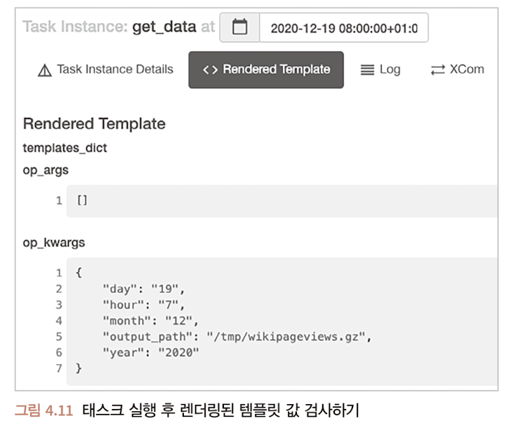

# Chapter 4. Airflow 콘텍스트를 사용하여 태스크 템플릿 작업하기

주차: 2주차
발표: 승현님
생성 일시: 2024년 8월 13일 오후 7:42

## 4.2 태스크 콘텍스트와 Jinja 템플릿 작업

### BashOperator

- bash 명령을 제공하는 bash_command 사용
- 이중 중괄호는 JinJa 템플릿 문자열
    - Jinja 템플릿 : 런타임 시에 템플릿 문자열의 변수와 and 및 or 표현식을 대체하는 템플릿 엔진

```python
import airflow
from airflow import DAG
from airflow.operators.bash import BashOperator

dag = DAG(
    dag_id="listing_4_01",
    start_date=airflow.utils.dates.days_ago(3),
    schedule_interval="@hourly",
)

get_data = BashOperator(
    task_id="get_data",
    bash_command=(
        "curl -o /tmp/wikipageviews.gz "
        "https://dumps.wikimedia.org/other/pageviews/"
        "{{ execution_date.year }}/" # 이중 중괄호: 런타임 시 삽입될 변수
        "{{ execution_date.year }}-{{ '{:02}'.format(execution_date.month) }}/"
        "pageviews-{{ execution_date.year }}"
        "{{ '{:02}'.format(execution_date.month) }}"
        "{{ '{:02}'.format(execution_date.day) }}-"
        # 모든 파이썬 변수 또는 표현식에 대해 제공 가능
        "{{ '{:02}'.format(execution_date.hour) }}0000.gz" 
    ),
    dag=dag,
)
```

### Python Operator

- 별도로 런타임 콘텍스트를 적용 가능 → python_callabe 인수 사용
- `python_callabe` : 어떤 함수라도 실행시 PythonOperator 호출 가능
- `**kwargs` : 예상하는 키워드 인수를 모두 명시적으로 작성할 필요 없음
    - `**context` : Airflow 태스크 콘텍스트를 의미

```python
def _print_context(**context) : 
	print(context)

print_context = PythonOperator(
	task_id = "print_context",
	python_callable = _print_context,
	dag = dag,)
```

- `op_args` : 콜러블 함수에 추가변수 제거
    
    ```python
    get_data=PythonOperator(
    	task_id="get_data",
    	python_callable=_get_data,
    	op_args=["/tmp/wikipageviews.gz"],
    	dag=dag,
    ```
    
- `op_kwargs = {"output_path" : "/tmp/wikipageviews.gz"}`
    
    ```python
    get_data=PythonOperator(
    	task_id="get_data",
    	python_callable=_get_data,
    	op_kwargs={"output_path" : "/tmp/wikipageviews.gz"},
    	dag=dag
    ```
    

콜러블 함수에 대한 입력으로 템플릿 문자열 제공

```python
def _get_data(year, month, day, hour, output_path, **_):
    url = (
        "https://dumps.wikimedia.org/other/pageviews/"
        f"{year}/{year}-{month:0>2}/pageviews-{year}{month:0>2}{day:0>2}-{hour:0>2}0000.gz"
    )
    request.urlretrieve(url, output_path)

get_data = PythonOperator(
    task_id="get_data",
    python_callable=_get_data,
    op_kwargs={
		    # 사용자 정의 키워드 인수는 callable 함수에 전달되기 전에 템플릿화 됨
        "year": "{{ execution_date.year }}",
        "month": "{{ execution_date.month }}",
        "day": "{{ execution_date.day }}",
        "hour": "{{ execution_date.hour }}",
        "output_path": "/tmp/wikipageviews.gz",
    },
    dag=dag,
)
```

### 템플릿 인수 검사하기

- Airflow UI 템플릿 인수 오류를 디버깅하는데 유용
- Rendered Template 버튼을 클릭하여 템플릿 인수 값을 검사할 수 있음



```bash
airflow tasks render [dag_id] [task id] [desired execution date]
```

## 4.3 다른 시스템과 연결하기

- 지정된 페이지 이름에 대한 페이지 뷰 읽기


```python
extract_gz = BashOperator(
    task_id="extract_gz", 
    bash_command="gunzip --force /tmp/wikipageviews.gz", 
    dag=dag,
)

def _fetch_pageviews(pagenames):
    result = dict.fromkeys(pagenames, 0)
    with open("/tmp/wikipageviews", "r") as f: # 이전 태스크에서 작성한 파일 열기
        for line in f:
            domain_code, page_title, view_counts, _ = line.split(" ") # 줄에서 필요 요소 추출
            # page_title이 정해진 페이지 이름인지 확인 & 도메인이 "en"인 것만 필터링
            if domain_code == "en" and page_title in pagenames: 
                result[page_title] = view_counts

    print(result)

fetch_pageviews = PythonOperator(
    task_id="fetch_pageviews",
    python_callable=_fetch_pageviews,
    op_kwargs={
    "pagenames": {
	    "Google", 
	    "Amazon", 
	    "Apple", 
	    "Microsoft", 
	    "Facebook",
	    }
	   },
    dag=dag,
)

get_data >> extract_gz >> fetch_pageviews

```

- 출력 결과 : `{'Facebook' : '778', 'Apple' : '20', 'Google' : '451', 'Amazon' : '9', 'Mircosoft' : '119'}`
- 출력 저장을 위한 테이블 생성 구문
    
    ```sql
    CREATE TABLE pageview_counts (
    	pagename VARCHAR(50) NOT NULL,
    	pageviewcount INT NOT NULL,
    	datetime TIMESTAMP NOT NULL
    );
    ```
    
- INSERT 예시
    
    ```sql
    INSERT INTO pageview_counts VALUES ('Google', 333, '2019-07-17T00:00:00');
    ```
    

- Airflow는 태스크 간 데이터를 전달하는 방법
    - Airflow 메타스토어를 사용하여 태스크 간 결과를 쓰고 읽는다 : XCom
    - 영구적인 위치(디스크 or 데이터베이스)에 테스크 결과를 기록한다.
- Airflow 태스크는 설정에 따라 물리적으로 서로 다른 컴퓨터에서 독립적으로 실행되므로 메모리에서 데이터 공유불가 → 테스크 간 데이터는 태스크가 완료된 후 다른 태스크에서 읽을 수 있는 다른 위치에 유지 필요
- Airflow XCom이라는 기본 매커니즘 제공해 메타스토어에서 선택 가능한 picklable 개체를 저장하고 나중에 읽을 수 있음
- 피클(Pickle)은 파이썬 직렬화 프토토콜 & 직렬화는 메모리의 개체를 나중에 다시 읽을 수 있도록 디스크에 저장할 수 있는 형식을 의미
- 기본 파이선 타입(string, int, dict, list)에서 빌드된 모든 객체를 피클링 가능
- XCom을 이용한 피클링이 적합
    - Airflow의 메타스토어(MySQL, Postgres)의 크기가 한정되어 있음
    - 피클링된 객체는 메타스토어의 블롭(blob)에 저장되기 때문
- 좀더 큰 데이터를 태스크 간에 넣고 전송하기 위해서는 Airflow 외부에 데이터를 유지하는 것이 더 좋다.
    - 향후 더 많은 페이지 처리로 데이터 크기가 커질 수 있다는 점을 감안해 디스크에 파일 생성
- 태스크 간 데이터를 저장하는 방법의 결정
    - 데이터가 재사용되는 위치와 방법을 알아야함
    - 대상이 되는 데이터베이스가 Postgres이므로 PostgresOperator를 사용해 데이터 입력
    - 프로젝트에서 `PostgresOperator` 클래스를 가져오기 위한 추가 패키지 설치


- DAG가 매시간 위키피디아 페이지 뷰를 가져오고 결과를 postgres에 기록
- PostgresOperator는 Postgres 데이터베이스에 대해 쿼리를 실행하기 위해 두 개의 인수 입력
- 데이터베이스에 대한 연결 설정 및 완료 후 연결 끊기 같은 복잡한 작업은 내부에서 처리
- postgres_conn_id인스는 Postgres 데이터베이스에 대한 자격 증명에 대한 식별자

```python
def _fetch_pageviews(pagenames, execution_date, **_):
    result = dict.fromkeys(pagenames, 0) # 0으로 모든 페이지 뷰에 대한 결과 초기화
    with open("/tmp/wikipageviews", "r") as f:
        for line in f:
            domain_code, page_title, view_counts, _ = line.split(" ")
            if domain_code == "en" and page_title in pagenames:
                result[page_title] = view_counts # 페이지 뷰 저장

    with open("/tmp/postgres_query.sql", "w") as f:
        for pagename, pageviewcount in result.items(): # 각 결과에 대해 SQL 쿼리 작성
            f.write(
                "INSERT INTO pageview_counts VALUES ("
                f"'{pagename}', {pageviewcount}, '{execution_date}'"
                ");\n"
            )

fetch_pageviews = PythonOperator(
    task_id="fetch_pageviews",
    python_callable=_fetch_pageviews,
    op_kwargs={"pagenames": {"Google", "Amazon", "Apple", "Microsoft", "Facebook"}},
    dag=dag,
)
```

```python
from airflow.providers.postgres.operators.postgres import PostgresOperator

dag = DAG(..., template_searchpath="/tmp") # sql 파일 탐색 경로

write_to_postgres=PostgresOperator(
	task_id="write_to_postgres",
	postgres_conn_id="my_postgres", # 연결에 사용할 인증 정보의 식별자
	sql="postgres_query.sql", # SQL 쿼리 또는 SQL 쿼리를 포함하는 파일의 경로
	dag=dag,
)
```

