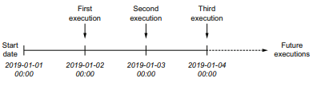
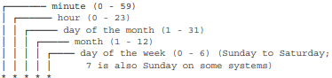
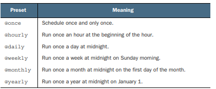
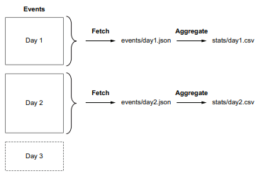
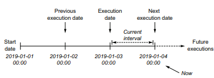
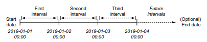
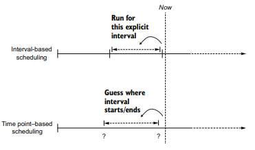
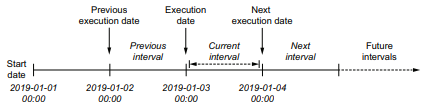
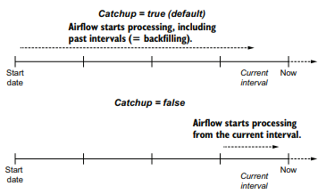
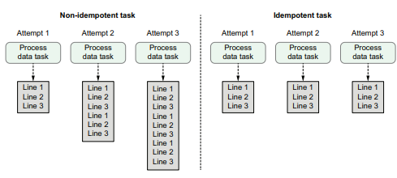

# Chapter 3. Airflow의 스케쥴링

- Airflow의 스케줄 개념
- 스케쥴 간격 증분 데이터 처리 방법
- 백필

## 3.1 예시: 사용자 이벤트 처리하기

> 사례  
웹 사이트에서 사용자 동작을 추적하고 사용자가 웹사이트에서 액세스한 페이지를 분석할 수 있는 서비스가 존재한다.  
이때, 사용자들이 얼마나 많은 페이지에 접근하고 얼마나 많은 시간을 소비하는지 통계를 계산하고자한다.

※ 과거 데이터 보존을 위해 S3 같은 클라우드 스토리지 서비스에 저장하는것이 합리적이나, 책의 예제에서는 로컬스토리지에 저장하는 것으로 한다.

```sh
# 사용자 이벤트 목록을 events.json으로 반환하는 API
curl -o /tmp/events.json http://localhost:5000/events
```

<태스크>  
1) 사용자 이벤트 가져오기 : BashOperator
2) 통계 및 계산 : PythonOperator (Pandeas)

```python
'''
(예약 안된 이벤트 DAG의 버전 초기화
'''
from datetime import datetime
from pathlib import Path

import pandas as pd
from airflow import DAG
from airflow.operators.bash import BashOperator
from airflow.operators.python import PythonOperator

dag = DAG(
    dag_id="01_unscheduled", 
    start_date=datetime(2019, 1, 1), # DAG의 시작 날짜 정의
    schedule_interval=None # 스케쥴 정의 X
)

fetch_events = BashOperator(
    task_id="fetch_events",
    # /data/events 디렉토리 생성 후 API를 통해 events.json을 받아온다.
    bash_command=(
        "mkdir -p /data/events && " 
        "curl -o /data/events.json http://events_api:5000/events"
    ),
    dag=dag,
)


def _calculate_stats(input_path, output_path):
    """이벤트 통계처리"""
    Path(output_path).parent.mkdir(exist_ok=True)

    events = pd.read_json(input_path) # pandas라이브러리를 활용해 json파일 read
    stats = events.groupby(["date", "user"]).size().reset_index()  # 통계 계산
    stats.to_csv(output_path, index=False) # csv로 출력


calculate_stats = PythonOperator(
    task_id="calculate_stats",
    python_callable=_calculate_stats,
    op_kwargs={
        "input_path": "/data/events.json", 
        "output_path": "/data/stats.csv"
        },
    dag=dag,
)

fetch_events >> calculate_stats
```
기본 DAG에서는 정기적으로 실행되는지 확인이 필요하다.  
3.2에서 매일 업데이트 되도록 수정한다.


## 3.2 정기적으로 실행하기
### schedul_interval : DAG초기화 시, 스케쥴 간격 정의를 위한 인자. (default = None)
### 1. 스케쥴 간격 정의하기
```python
dag = DAG(
    dag_id="02_scheduled", 
    start_date=datetime(2019, 1, 1), # DAG의 시작 날짜 정의
    schedule_interval="@daily"  # 매일 자정에 실행되도록 스케쥴링
)
```    
DAG은 시작날짜를 기준으로 첫번째 실행을 스케쥴한다.
(시작날짜 + 간격)

  
  여기서 시작일자는 2019-01-01 이고, 간격은 매 자정이므로, 다음 작업은 2019-01-0 3 자정이다.

```python
dag = DAG(
    dag_id="03_with_end_date", 
    start_date = dt.datetime(year=2019, month=1, day=1), # DAG의 시작 날짜 정의
    end_date = dt.datetime(year=2019, month=1, day=5), # DAG의 종료 날짜 정의
    schedule_interval="@daily"  # 매일 자정에 실행되도록 스케쥴링
)
# 2019-1-5가 end_date로 설정되어 있어, 2019-1-6일 자정까지 실행
```    


## 2. Cron기반의 스케쥴 간격 정의하기.
#### **cron** : macOS 및 리눅스와 같은 유닉스 기반 OS에서 사용하는 시간 기반 작업 스케쥴러

Airflow에서는 복잡한 스케쥴 간격 설정 지원을 위해 cron표현식을 사용한다.
cron표현식의 구성은 아래 그림과 같다.


\# 크론을 활용한 매시, 매일, 매주 간격 정의  
* 0 * * * *  : 매시간 (정시 실행)
* 0 0 * * *  : 매일 (자정 실행)
* 0 0 * * 0  : 매주 일요일마다

\# 크론을 활용한 복잡한 간격
* 0 0 1 * * : 매월 1일 자정
* 45 23 * * SAT : 매주 토요일 23시 45분

\# , 나 -를 활용한 사용
* 0 0 * * MON, WED, FRI : 매주 월, 수, 금 자정 실행
* 0 0 * * MON-FRI : 매주 월요일부터 금요일 자정에 실행
* 0 0,12 * * * : 매일 자정, 정오에 실행

\# 스케쥴 간격을 의미하는 약어  


※ https://crontab.guru 에서 cron표현식 테스트 가능

### 3. 빈도 기반의 스케쥴 간격 설정하기
> cron식의 단점 : 특정 빈도마다 스케쥴 정의 불가  
ex) 3일에 한번씩 실행하는 경우

→ **timedelta**인스턴스를 사용하여 표현.

```python
dag = DAG(
    dag_id="04_time_delta", 
    start_date = dt.datetime(year=2019, month=1, day=1), # DAG의 시작 날짜 정의
    end_date = dt.datetime(year=2019, month=1, day=5), # DAG의 종료 날짜 정의
    schedule_interval=dt.timedelta(days=3)  # 3일마다 수행
)
```

## 3.3 데이터 증분 처리하기
> 문제상황 

- DAG가 매일 실행 된다고 가정하지만, 매일 이벤트 사용자 카탈로그 전체를  
다운로드하고 다시 계산하는 작업은 비효율적이다.  
또한, 30일 동안 이벤트만 다운로드하기에 그 이상 과거 시점 이벤트는 미존재한다.

### 1. 이벤트 데이터 증분으로 가져오기


날짜별로 분리된 단일 파일 저장하여 매일 순차적으로 파일을 저장할 수 있다.
증분 처리를 위해 API호출 조정이 필요하다

시작 날짜와 종료날짜를 매개변수로 함께 정의하여 해당 날짜 데이터 가져오기.
```bash
curl -O http://localhost:5000/events?start_date=2019-01-01&end_date=2019-01-02
```

```python
fetch_events = BashOperator(
    task_id="fetch_events",
    bash_command=(
        "mkdir -p /data/events && "
        "curl -o /data/events.json "
        "http://events_api:5000/events?"
        "start_date=2019-01-01&"
        "end_date=2019-01-02"
    ),
    dag=dag,
)
```

### 2. 실행 날짜를 사용하여 동적 시간 참조하기 
- **execution_date** : DAG이 실행되는 날짜와 시간을 나타내는 매개변수
DAG를 시작하는 시간의 특정 날짜가 아니라 스케쥴 간격으로 실행되는 시작 시간을 나타내는 타임스탬프이다.  
- **prev_execution_date** : 과거 스케쥴 간격의 시작을 정의  
- **next_execution_date** :  스케쥴 간격의 종료시간  


이를 이용해 BashOperator에서 템플릿 기능을 사용하여 실행될 날짜를 동적으로 정할 수 있다.

```python
# {{변수명}} 구문을 통해 Jinja템플릿 사용 가능
fetch_events = BashOperator(
    task_id="fetch_events",
    bash_command=(
        "mkdir -p /data/events && "
        "curl -o /data/events.json "
        "http://events_api:5000/events?"
        "start_date={{execution_date.strftime('%Y-%m-%d')}}&" # Jinja템플릿으로 execution_date삽입
        "end_date={{next_execution_date.strftime('%Y-%m-%d')}}" # 다음 실행 간격 날짜 정의
    ),
    dag=dag,
)
```
>  ds, ds_nodash : execution_date의 다른 표헌  
>  next_ds, next_ds_nodash, prev_ds, prev_ds_dash 등등 축약 표현법 존재

```python
fetch_events = BashOperator(
    task_id="fetch_events",
    bash_command=(
        "mkdir -p /data/events && "
        "curl -o /data/events.json "
        "http://events_api:5000/events?"
        "start_date={{ds}}&" # YYYY-MM-DD 형식의 execution_date제공
        "end_date={{next_ds}}" # next_execution_date 와 동일
    ),
    dag=dag,
)
```

### 3. 데이터 파티셔닝
위 방식대로 하게 된다면 events.json에 계속 덮어쓰기가 된다.
그렇기에 s날짜별로 개별 파일에 이벤트를 쓰는 구현이 필요하다.
```python
fetch_events = BashOperator(
    task_id="fetch_events",
    bash_command=(
        "mkdir -p /data/events && "
        "curl -o /data/events/{{ds}}.json " # 반환된 값이 템플릿 파일 이름에 기록되게끔...
        "http://events_api:5000/events?"
        "start_date={{ds}}&"
        "end_date={{next_ds}}"
    ),
    dag=dag,
)
```
**파티셔닝** : 데이터 세트를 더 작고 관리하기 쉬운 조각으로 나누는 작업.  
**파티션** : 데이터세트의 작은 부분

위와 같이 저장된 json파일이 동적으로 변함에 따라 calculate_stats 코드도 동적으로  
 변경되게끔 해야하는데, 이때, 보일러 플레이트 코드로 작성을 한다.

 ```python
 def _calculate_stats(**context):
    input_path = context["templates_dict"]["input_path"]
    output_path = context["templates_dict"]["output_path"]

    events = pd.read_json(input_path)
    stats = events.groupby(["date", "user"]).size().reset_index()

    Path(output_path).parent.mkdir(exist_ok=True)
    stats.to_csv(output_path, index=False)


calculate_stats = PythonOperator(
    task_id="calculate_stats",
    python_callable=_calculate_stats,
    templates_dict={
        "input_path": "/data/events/{{ds}}.json", # 템플릿이 되는 값 전달
        "output_path": "/data/stats/{{ds}}.csv",
    },
    dag=dag,
)
 ```
templates_dict 매개변수를 사용해 템플릿화 해야 하는 모든 인수를 전달한다.

## 3.4 Airflow의 실행 날짜 이해
### 1. 고정된 스케쥴 간격으로 태스크 실행
  
시작날짜, 스케쥴간격, 종료날짜 세 가지 매개변수를 사용하여 DAG이 실행되는 시점을 제어할 수 있다.
이 세가지 매개 변수를 사용하여 시간을 스케쥴 간격으로 나눈다.  
-> 이런 방식은 증분 데이터 처리 유형 수행 시 적합하다.
-> Cron의경우 이전 실행이 중단된 위치를 계산하거나 추측해야 하기 때문....

  
- 간격 기반 스케쥴링 방식 : 각 간격에 대해 실행할 태스크를 명시적으로 스케쥴링하는 동시에 간격의 시작 및 종료와   
관련된 정확한 정보 제공
- 시점기반 스케쥴링(Cron) : 주어진 시간에만 작업을 수행하므로 작업이 실행되는 간격은 작업 자체에 달려 있음.  

  
컨텍스트에서 실행 날짜는 DAG이 실행되는 시간이 아니라, 해당 스케쥴 간격의 시작시간으로 정의된다.  
단, 수동으로 실행하는 경우, 이전 스케쥴 간격에 대한 정보를 확인할 수 없기에 매개변수 값이 정의되지 않아 사용할 수 없다.

## 3.5 과거 데이터 간격을 메꾸기 위한 백필 사용하기
스케쥴 간격에 대한 정보로 확인하기에, 과거의 시작 날짜부터 과거 간격을 정의할 수 도 있다.  
이 속성을 이용해 과거 데이터 셋을 로드하거나 분석하기 위해 과거 시점을 지정해 실행할 수 있다.  
이를 **백필** 작업이라고 한다.


### 1. 과거 시점의 작업 실행하기
```python
dag = DAG(
    dag_id="09_no_catchup",
    schedule_interval="@daily",
    start_date=dt.datetime(year=2019, month=1, day=1),
    end_date=dt.datetime(year=2019, month=1, day=5),
    catchup=False, # 현재시간 이전에 과거 시작 ㅅ이후의 모든 스케쥴 간격 생성하는 매개변수
)
```
  
catchup=True(default)일 경우, 시작날짜부터 과거의 스케쥴 간격을 포함하여 처리한다.  
catchup=False 일 경우, 현재 스케쥴 간격부터 작업 처리를 시작한다.

But, 원천 시스템의 데이터 가용성에 따라 제한되기도 한다.

## 3.6 태스크 디자인을 위한 모범사례
### 1. 원자성
- 모두 발생하거나 전혀 발생하지 않는, 나눌 수 없고, 돌이킬 수 없는 일련의 DB와 같은 작업

```python
def _calculate_stats(**context):
    """Calculates event statistics."""
    input_path = context["templates_dict"]["input_path"]
    output_path = context["templates_dict"]["output_path"]

    events = pd.read_json(input_path)
    stats = events.groupby(["date", "user"]).size().reset_index()

    Path(output_path).parent.mkdir(exist_ok=True)
    stats.to_csv(output_path, index=False)

    _email_stats(stats, email="user@example.com")


def _email_stats(stats, email):
    """Send an email..."""
    print(f"Sending stats to {email}...")
```
위 경우에 통계데이터를 만드는 것과 메일 보내는 것을 하나의 태스크에 묶어서 처리를 하였는데,  
이 경우, 통계데이터 생성은 완료 되었지만, Email을 전송하는 것에서 실패하더라도, 작업이 성공한 것 처럼 보이게 된다.  

이런 상황을 방지하기 위에 메일을 보내는 작업은 별도의 태스크로 분리하면 된다.
```python
def email_stats(stats, email):
    """Send an email..."""
    print(f"Sending stats to {email}...")


def _send_stats(email, **context):
    stats = pd.read_csv(context["templates_dict"]["stats_path"])
    email_stats(stats, email=email)


send_stats = PythonOperator(
    task_id="send_stats",
    python_callable=_send_stats,
    op_kwargs={"email": "user@example.com"},
    templates_dict={"stats_path": "/data/stats/{{ds}}.csv"},
    dag=dag,
)
```

이렇게 함으로써, 통계계산 하는 것과 이메일 태스크는 독립적으로 구성되어  
두 작업 모두 원자성을 유지할 수 있다.

### **하나의 작업 = 하나의 태스크**

### 2. 멱등성
- 동일한 입력으로 여러번 실행을 해도 동일한 결과가 나오게끔 해야 한다.
  

데이터를 쓰는 태스크에서는 이전 태스크 결과를 덮어쓰는지 여부를 확인하여 멱등성을 유지할 수 있다.
