# Chapter 4. Airflow 콘텍스트를 사용하여 태스크 템플릿 작업하기
- 오퍼레이터가 무엇을 나타내는지
- 오퍼레이터가 무엇이고 어떻게, 언제 동작하는지
- 훅을 통해 원격 시스템과 통신하는 방법

## 4.1 Airflow로 처리할 데이터 검사하기
> 가정상황  
StockSense라는 감성분석이 적용된 가상의 주식시장 예측도구를 사용하여 오퍼레이터를 알아본다.
### 1. 증분 데이터를 적재하는 방법 결정하기
위키미디어 재단에서 2015년 이후 모든 페이지 뷰를 컴퓨터가 읽을 수 있는 형식으로 제공한다.  
위 데이터를 토대로 증분 적재하는 방법과 데이터 적재하는 방법을 알아본다.


```sh
# 7월 7일 10:00~11:00에 가장 일반적으로 사용된 도메인 코드가 무엇인지 확인한다면
# URL은 https://dumps.wikimedia.org/other/pageviews/{year}/{year}-{month}/pageviews-{year}{month}{day}-{hour}0000.gz  (hour은 끝시간을 표현)
$ wget https://dumps.wikimedia.org/other/pageviews/2019/2019-07/pageviews-20190701-210000.gz  
$ gunzip pageviews-20190701-210000.gz
$ head pageviews-20190701-210000

도메인코드, 페이지 제목, 조회수, 응답크기
aa Main_Page 1 0
aa Special:GlobalUsers/sysadmin 1 0
aa User_talk:Qoan 1 0
aa Wikipedia:Community_Portal 1 0
aa.d Main_Page 2 0
aa.m Main_Page 1 0
ab 1005 1 0
ab 105 2 0
ab 1099 1 0
ab 1150 1 0
```
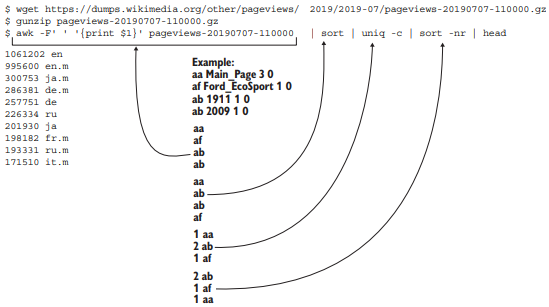  
위키피디아 페이지 뷰 데이터에 대한 간단한 첫 번째 분석

## 4.2 태스크 콘텍스트와 Jinja 템플릿 작업
- 데이터를 다운로드
- 데이터 추출
- 데이터 읽기  
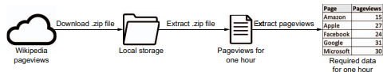  

페이지 뷰 다운로드는 BashOperator와 PythonOperator 중심적으로 설명한다.
런타임 시 변수를 삽입하는 방법은 다른 오퍼레이터들도 동일하다.

### 1. 오퍼레이터의 인수 템플릿 작업
1) BashOperator
```python
import airflow
from airflow import DAG
from airflow.operators.bash import BashOperator

dag = DAG(
    dag_id="listing_4_01",
    start_date=airflow.utils.dates.days_ago(3),
    schedule_interval="@hourly",
)

get_data = BashOperator(
    task_id="get_data",
    bash_command=(
        "curl -o /tmp/wikipageviews.gz "
        "https://dumps.wikimedia.org/other/pageviews/"
        "{{ execution_date.year }}/"  # 이중 중괄호는 런타임 시 삽입될 변수를 의미
        "{{ execution_date.year }}-{{ '{:02}'.format(execution_date.month) }}/"
        "pageviews-{{ execution_date.year }}"
        "{{ '{:02}'.format(execution_date.month) }}"
        "{{ '{:02}'.format(execution_date.day) }}-"
        "{{ '{:02}'.format(execution_date.hour) }}0000.gz" # 모든 파이썬 변수 또는 표현식에 대해 제공
    ),
    dag=dag,
)
```
Jinja템플릿 : 런타임 시에 템플릿 문자열의 변수와 and 및 or표현식을 대체하는 템플릿 엔진.  
런타임 시에 값을 할당하기 위해 사용한다. {{ 변수 }} 형식으로 작성한다.  
  
excution_date는 Pendulum의 datetime객체이므로, datetime객체와 동일하게 작동한다.

{{ '{:02}'.format(execution_date.hour) }}  
빈 앞자리를 0으로 채우는 경우 패딩 문자열 형식을 적용한다.

```
모든 오퍼레이터 인수가 템플릿이 될 수 있는 것은 아니다.  
{{변수명}} 이 Jinja에서 템플릿 가능한 속성 리스트에 포함되지 않으면 문자열 그대로 해석한다.  
이 리스트는 template_fields 속성에 의해 설정된다.  
일반적으로 __init__에 제공된 인수 이름은 클래스 속성 이름과 일치하므로, __init__인수에 1:1 매핑된다.
```
  


### 2. 템플릿에 무엇이 사용가능할까요?
```python
import airflow.utils.dates
from airflow import DAG
from airflow.operators.python import PythonOperator

dag = DAG(
    dag_id="listing_4_03",
    start_date=airflow.utils.dates.days_ago(3),
    schedule_interval="@daily",
)


def _print_context(**kwargs):
    print(kwargs)


print_context = PythonOperator(
    task_id="print_context", python_callable=_print_context, dag=dag
)
```

**모든 태스크 콘텍스트 변수**   
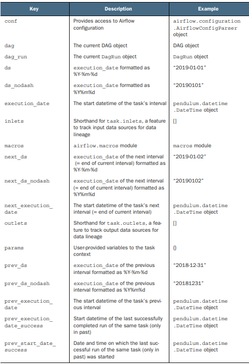  
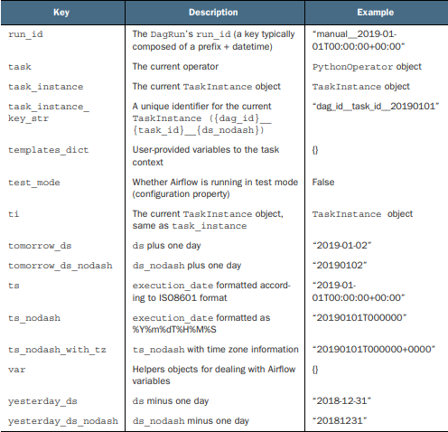  


### 3. PythonOperator 템플릿
- BashOperator를 사용하여 런타임에 자동으로 템플릿이 지정되는 bash_command인수 에 문자열 제공  
- PythonOperator : 런타임 컨텍스트로 템플릿화 할 수 있는 인수를 사용안하고, 콜러블을 제공한다.
```python
from urllib import request

import airflow.utils.dates
from airflow import DAG
from airflow.operators.python import PythonOperator

dag = DAG(
    dag_id="listing_4_05",
    start_date=airflow.utils.dates.days_ago(1),
    schedule_interval="@hourly",
)


def _get_data(execution_date):
    year, month, day, hour, *_ = execution_date.timetuple()
    url = (
        "https://dumps.wikimedia.org/other/pageviews/"
        f"{year}/{year}-{month:0>2}/pageviews-{year}{month:0>2}{day:0>2}-{hour:0>2}0000.gz"
    )
    output_path = "/tmp/wikipageviews.gz"
    request.urlretrieve(url, output_path)


get_data = PythonOperator(
    task_id="get_data", 
    python_callable=_get_data, # BashOperator와는 달리 Python함수를 이용해 실행한다.
    dag=dag)
```

함수로 수행하기 때문에, 함수 내 코드를 자동으로 템플릿화 할 수는 없지만,  
컨텍스트 변수 재공 함으로 이를 이용하면 된다.  
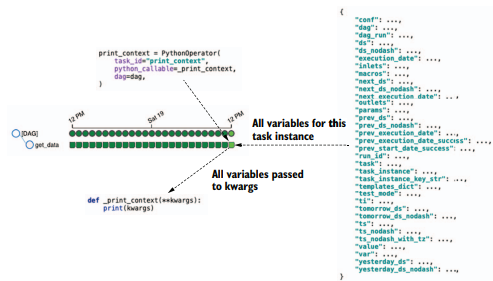  

```python
def _print_context(**context):
    print(context) # 키워드인수를 딕셔너리 타입으로 출력한다
```

```python
def _print_context(**context):
    start = context["execution_date"] # 컨텍스트로부터 execution_date를 추출한다.
    end = context["next_execution_date"]
    print(f"Start: {start}, end: {end}")
```
컨텍스트 변수 : 모든 컨텍스트 변수의 집합이다.  
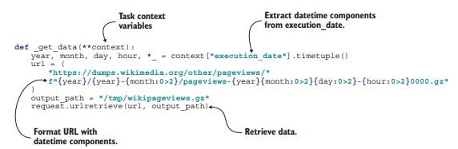  

```python
def _get _date(execution_date, **context):
    year, month, day, hour, *_ = execution_date.timetuple()
    #...
    # ceontext에는 execution_date를 제외한 나머지 컨텍스트 변수를 포함한다.
```
- 명시적인 인수 정의를 통해 린터와 타입 헌팅과 같은 도구를 사용하는 이점을 얻을 수 있다.  
  
### 4. PythonOperator에 변수 제공
```python
get_data=PythonOperator(
    task_id = "get_date",
    python_callable = _get_data,
    op_args= ["/tmp/wikipageviews.gz"], # op_args를 사용해 콜러블 함수에 추가변수를 제공한다.
    dag=dag,
)
```
```python
get_data=PythonOperator(
    task_id = "get_date",
    python_callable = _get_data,
    # op_kwargs로도 딕셔너리 타입으로 추가변수 제공이 가능하다
    op_kwargs= {"output_path":"/tmp/wikipageviews.gz"},
    dag=dag,
)
```
```python
def _get_data(year, month, day, hour, output_path, **_):
    url = (
        "https://dumps.wikimedia.org/other/pageviews/"
        f"{year}/{year}-{month:0>2}/pageviews-{year}{month:0>2}{day:0>2}-{hour:0>2}0000.gz"
    )
    request.urlretrieve(url, output_path)


get_data = PythonOperator(
    task_id="get_data",
    python_callable=_get_data,
    op_kwargs={ 
        # 사용자 정의 키워드 인수는 콜러블 함수에 전달되기 전에 템플릿화 된다.
        "year": "{{ execution_date.year }}", 
        "month": "{{ execution_date.month }}",
        "day": "{{ execution_date.day }}",
        "hour": "{{ execution_date.hour }}",
        "output_path": "/tmp/wikipageviews.gz",
    },
    dag=dag,
)
```

### 5. 템플릿의 인수 검사
- Airflow UI는 템플릿 인수 오류를 디버깅하는데 유용하다.
- 작업 실행 후 그래프 또는 트리 보기에서 'Rendered Template' 버튼을 클릭하여 템플릿 인수 값을 검사할 수 있다.
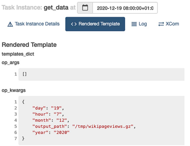

개발중엔 CLI에서도 확인이 가능하다
```Bash
airflow tasks render [dag id] [task id] [desired execution date]
```
```Bash
airflow tasks render stocksense get_data 2019-07-19T00:00:00
# ----------------------------------------------------------
# property: templates_dict
Listing 4.13 Providing templated strings as input for the callable function
Listing 4.14 Rendering templated values for any given execution date
User-defined keyword
arguments are templated
before passing to the
callable.
76 CHAPTER 4 Templating tasks using the Airflow context
# ----------------------------------------------------------
None
# ----------------------------------------------------------
# property: op_args
# ----------------------------------------------------------
[]
# ----------------------------------------------------------
# property: op_kwargs
# ----------------------------------------------------------
{'year': '2019', 'month': '7', 'day': '19', 'hour': '0', 'output_path':
'/tmp/wikipageviews.gz'}
```


## 4.3 다른 시스템과 연결하기
```python
extract_gz = BashOperator(
    task_id="extract_gz", bash_command="gunzip --force /tmp/wikipageviews.gz", dag=dag
)


def _fetch_pageviews(pagenames):
    result = dict.fromkeys(pagenames, 0)
    with open("/tmp/wikipageviews", "r") as f: # 이전 태스크에서 작성한 파일 열기
        for line in f:
            domain_code, page_title, view_counts, _ = line.split(" ") #필요 요소 추출
            # 도메인이 en이고 page_title이 유효한것만 조회
            if domain_code == "en" and page_title in pagenames: 
                result[page_title] = view_counts

    print(result)
    # Prints e.g. "{'Facebook': '778', 'Apple': '20', 'Google': '451', 'Amazon': '9', 'Microsoft': '119'}"


fetch_pageviews = PythonOperator(
    task_id="fetch_pageviews",
    python_callable=_fetch_pageviews,
    op_kwargs={"pagenames": {"Google", "Amazon", "Apple", "Microsoft", "Facebook"}},
    dag=dag,
)

get_data >> extract_gz >> fetch_pageviews
```
```
# Prints e.g. "{'Facebook': '778', 'Apple': '20', 'Google': '451', 'Amazon': '9', 'Microsoft': '119'}"
```
위와 같이 나온 결과를 Postgre DB에 넣고 질의를 한다고 가정해보자.
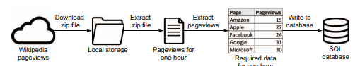  

이를 위해서 page_counts라는 테이블을 생성한다
```sql
CREATE TABLE pageview_counts (
    pagename VARCHAR(50) NOT NULL,
    pageviewcount INT NOT NULL,
    datetime TIMESTAMP NOT NULL
);
```

또한 추출된 데이터를 Insert하는 쿼리도 작성한다.
```sql
INSERT INTO pageview_counts VALUES ('Google', 333, '2019-07-17T00:00:00');
```

태스크간 데이터를 전달하기 위해서는
1) XCom을 사용한다.
2) 디스크 혹은 데이터페이스에 태스크 결과를 저장한다.

위와같은 두 방식이 있는데, 

XCom과 같은 경우 직렬화하여 디스크에 저장하여 변환 한다. 그리고 해당 데이터를 다시 읽어온다.
크기가 작은 오브젝트일때는 XCom을 이용한 피클링이 적합하다.
  
한편, 큰 데이터를 태스크 간 전송하기 위해서는 외부에 데이터를 유지하는것이 좋다.  
(책에서는 디스크에 저장하는 것으로 예시가 적혀 있다.)
  
만약 Postgre와 같은 DBMS에 저장을한다면, PostgreOperator를 사용해 데이터를 입력하고 접근하도록한다.

외부 오퍼레이터를 사용하기 위해서는 추가 패키지 설치가 필요하다.
```python
pip install apache-airflow-providers-postgres
```

Postgre는 CSV데이터로 입려하는 것을 지원하지 않으므로  SQL쿼리를 임시 데이터로 작성한다.

```python
def _fetch_pageviews(pagenames, execution_date, **_):
    result = dict.fromkeys(pagenames, 0) # result[페이지명] = 0 으로 세팅
    with open("/tmp/wikipageviews", "r") as f:
        for line in f:
            domain_code, page_title, view_counts, _ = line.split(" ")
            if domain_code == "en" and page_title in pagenames:
                result[page_title] = view_counts # 페이지 뷰 저장

    with open("/tmp/postgres_query.sql", "w") as f:
        for pagename, pageviewcount in result.items():
            f.write( # Insert쿼리 작성
                "INSERT INTO pageview_counts VALUES ("
                f"'{pagename}', {pageviewcount}, '{execution_date}'"
                ");\n"
            )


fetch_pageviews = PythonOperator(
    task_id="fetch_pageviews",
    python_callable=_fetch_pageviews,
    op_kwargs={"pagenames": {"Google", "Amazon", "Apple", "Microsoft", "Facebook"}},
    dag=dag,
)
```

```python
dag = DAG(
    dag_id="listing_4_20",
    start_date=airflow.utils.dates.days_ago(1),
    schedule_interval="@hourly",
    template_searchpath="/tmp", # sql파일 탐색 경로
    max_active_runs=1,
)

...

write_to_postgres = PostgresOperator(
    task_id="write_to_postgres",
    postgres_conn_id="my_postgres", # 커넥션 인증정보 id
    sql="postgres_query.sql", # SQL쿼리 파일 경로
    dag=dag,
)
```

최종적으로는

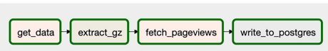  
이런 데이터 파이프라인 DAG이 형성된다.


커넥션 인증정보 id를 저장하는 것은 CLI, Web UI 방식 둘 다 가능하다
```bash
airflow connections add \
--conn-type postgres \
--conn-host localhost \
--conn-login postgres \
--conn-password mysecretpassword \
my_postgres 
```
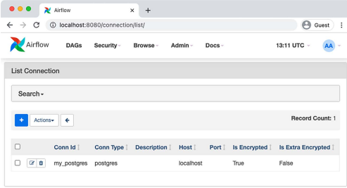

추가로, template_searchpath인수를 설정하므로서 파일탐색 시, 기본 경로와, 추가된 경로를 모두 탐색한다.

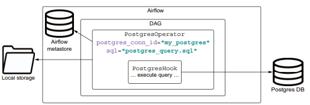
PostgresOperator에 적합한 설정을 제공하면 PostgresHook이 내부적인 작업을 수행한다.
최종적으로 Postgre에서 분석 쿼리를 질의 함으로써 원하는 결과를 얻을 수 있게 된다.