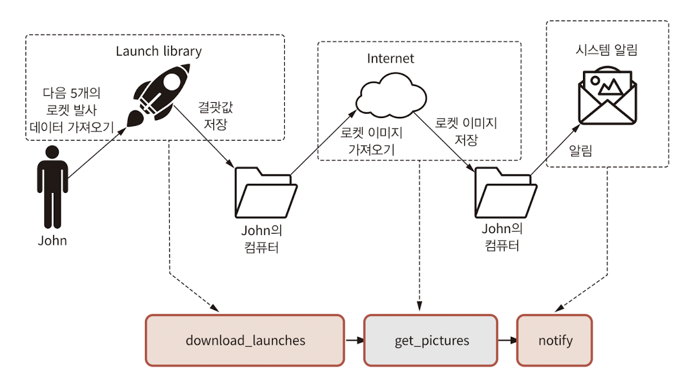

# Chapter 5. 태스크 간 의존성 정의하기

주차: 3주차
발표: 예선님
생성 일시: 2024년 8월 17일 오후 9:05
선택: 파트1. 기본편

# 5.1 기본 의존성 유형

## 선형 체인 유형

```python
download_launches=BashOperator(...)
get_pictures=PythonOperator(...)
notify=BashOperator(...)

download_launches >> get_picutures >> notify
```



- 테스크 의존성을 통해 Airflow는 업스트림 의존성이 성공적으로 실행된 후에 지정된 다음 태스크 실행을 시작할 수 있다.

<aside>
✅ *태스크 의존성을 명시적으로 지정하여 얻는 이점*
**여러 태스크에서 암묵적인 순서가 명확하게 정의된다는 것**

</aside>

## 팬인/팬아웃 (Fan-in/Fan-out) 의존성


```python
fetch_weather >> clearn_weather
fetch_sales >> clean_sales
```

- 팬아웃 : 여러개의 입력 태스크 연결 수 제한
- 팬아웃 종속성 : 한 태스크를 여러 다운스트림 태스크에 연결하는 것

```python
from airflow.operators.dummy import DummyOperator

start=DummyOperator(task_id="start") # 더미 시작 태스크 생성
start >> [fetch_weather, fetch_sales] # 팬아웃(일대 다) 의존성 태스크 생성
```

<aside>
✅ **팬 인 구조**
하나의 태스크가 여러 업스트림 태스크에 영향을 받는 구조는 단일 다운스트림 태스크가 여러 업스트림 태스크에 의존성을 갖는다.

</aside>


- 시작 태스크가 완료되면 `fetch_sales` 및 `fetch_weather` 태스크가 병렬로 실행한다. (여러 작업 실행이 가능하도록 Airflow가 설정되어 있다는 가정)

# 5.2 브랜치하기

> *변경사항이 존재하는데, 모델 학습이 중단되어서는 안된다 !
이전 시스템과 새로운 시스템 모두 정상 동작하기를 바랄 경우, 이 문제를 어떻게 해결할까?*
> 

## 태스크 내에서 브랜치하기

- 수집 태스크를 다시 작성하여 실행 날짜를 통해 판매 데이터 수집 및 처리를 위한 두개의 개별 코드로 분리

```python
def _clean_sales(**context) : 
		if context["exectuion_date"] < ERP_CHANGE_DATE :
				_clean_sales_old(**context)
		else 
				_clean_sales_new(**context)
...
clean_sales_date=PythonOperator(
		task_id="clean_sales",
		python_callable=_clean_sales,
)
```

- `_clean_sales_old` : 이전 판매 형식에 대한 데이터 정제하는 함수
- `_clean_sales_new` : 새 형식에 대해 동일한 태스크를 수행하는 함수

```python
def _fetch_sales(**context) : 
		if context["exectuion_date"] < ERP_CHANGE_DATE :
				_fetch_sales_old(**context)
		else 
				_fetch_sales_new(**context)
...
```

- DAG는 초기 데이터 수집/정제 작업을 수행하면 데이터 소스와 무관하게 일관된 형식으로 판매 데이터 처리 가능

> *만약 새로운 데이터 소스가 완전히 다른 태스크 체인이 필요할 경우 어떻게 해야할까?*
> 


<aside>
💡 데이터 수집을 두 개의 개별 태스크 세트로 분할하는 것이 나을 수 있다.
단점은 특정 DAG 실행 중 Airflow에서 어떤 코드 분기를 사용하고 있는지 확인하기 어렵다

</aside>

## DAG 내부에서 브랜치하기

> 두 개의 개별 태스크 세트를 개발하고 DAG가 이전 또는 새로운 데이터 수집 작업 실행을 선택할 수 있도록 하는 것
> 


- BranchPythonOperator : 다운 스트림 태스크 세트 중 선택할 수 있는 기능
    - PythonOperator 처럼 callable 인수를 사용할 수 있다.
    - BranchOperator에 전달된 콜러블 인수는 작업 결과로 다운스트림 태스크의 ID를 반환한다.
    - 반환된 ID는 브랜치 태스크 완료 후 실행할 다운스트림 태스크를 결정한다.

```python
def _pick_erp_system(**content) :
    if context["execution_date"] < ERP_CHANGE_DATE :
        return "fetch_sales_old"
    else :
        return "fetch_sales_new"

pick_erp_system=BranchPythonOperator(
    task_id = 'pick_erp_system',
    python_callabe = _pick_erp_system
)

pick_erp_system >> [fetch_sales_old, fetch_sales_new]
```

### Airflow의 트리거 규칙

- 태스크 실행 시기를 제어한다.
- 모든 오퍼레이터에게 전달할 수 있는 `trigger_rule` 인수를 이용해 개별 태스크에 대해 트리거 규칙을 정의할 수 있다.
- 모든 상위 태스크가 성공해야 해당 태스크를 실행할 수 있기 때문에 트리거 규칙은 `all_success` 로 설정한다.
- BranchPythonOperator를 사용 시, 선택하지 않은 브랜치 작업을 모두 건너뛰기 때문에 Airflow는 join_datesets 태스크와 모든 다운스트림 태스크 또한 실행하지 않는다.


- `join_datasets` 의 트리거 규칙을 변경하여 업스트림 태스크 중 하나를 건너뛰더라도 계속 트리거가 진행되도록 할 수 있다. → 트리거 규칙을 `none_failed` 로 변경
- `none_failed` : 모든 상위 항목이 실행 완료 및 실패가 없을 시 즉시 작업 실행

```python
join_datasets = PythonOperator(
	...
	trigger_rule="none_failed"
)
```

이 접근 방법의 단점 : join_datasets 태스크에 연결되는 태스크가 3개

본래 판매/날씨 데이터를 가져온 다음 두 데이터 소스를 `join_datasets` 태스크에 입력하는 플로 특성이 잘 반영되지 않는다. → DAG에 서로 다른 브랜치를 결합하는 더미 태스크를 추가하여 브랜치 조건을 명확하게 한다.


- `join_datasets` 태스크에 대한 트리거 규칙을 더 이상 변경할 필요가 없기 때문에 브랜치를 좀 더 독립적으로 유지 가능

# 5.3 조건부 태스크

- 데이터 정제 코드를 일부 변경 후, 백필을 이용해 변경 사항을 전체 데이터 세트에 적용하면 모델 또한 필요한 인스턴스에 다시 배포되어야 함

## 태스크 내에서 조건

- 최근 실행된 DAG에 대해서만 모델을 배포하도록 DAG를 변경하여 해결 가능
- 특정 버전만 배포 가능
- PythonOperator를 사용하여 배포 구현 후 배포 함수 내에서 DAG의 실행날짜를 명시적으로 확인

```python
def _deploy(**context) :
    if context["execution_date"] = ...:
        deploy_model()
        
deploy = PythonOperator(
    task_id = "deploy_model",
    python_callable = _deploy
)
```


- 최신 실행에 대해서만 수행하도록 하는 deploy_model 작업 내부 조건이 있는 DAG
- *But → 의도대로 동작하지만, 배포 로직 조건이 혼용되고, PythonOperator 이외의 다른 기본 제공 오퍼레이터를 더 이상 사용할 수 없음*
- *Airflow UI에서 태스크 결과를 추적할 때 혼란스러울 수 있음*

## 조건부 태스크 만들기

- 배포 태스크 자체를 조건부화 하는 방법
- 미리 정의된 조건에 따라서만 실행 가능
- Airflow에서 해당 조건을 테스트하고 조건이 실패할 경우 모든 다운스트림 작업을 건너뛰는 태스크를 DAG에 추가해 태스크를 조건부화할 수 잇음

```python
def _latest_only(**context) :
    ...
    latest_only = PythonOperator(
        task_id = "latest_only",
        python_callable = _latest_only
    )
    
latest_only >> deploy_model
```


- 실행 날짜를 확인하고 필요한 경우 `AirflowSkipException` 함수 실행
- Airflow가 조건과 모든 다운스트림 태스크를 건너뛰라는 것

```
def _latest_only(**context) :
    
    left_window = context["dag"].following_schedule(context["execution_date"])
    right_window = context["dag"].following_schedule(left_window)   
    
    now = pendulum.now("UTC")
    if not left_window < now <= right_window:
        raise AirflowSkipException("Not the most recent run!")
```

## 내장 오퍼레이터 사용하기

```python
from airflow.operator.latest_only import LatestOnlyOperator

latest_only = LatestOnlyOperator(
    task_id = "latest_only",
    dag = dag
)

join_datasets >> train_model >> deploy_model
latest_only >> deploy_model
```

- `LatestOnlyOperator` : 조건부 배포 구현

# 5.4 트리거 규칙에 대한 추가 정보

> Airflow는 태스크 실행 시기를 어떻게 결정하는가? ← 트리거 규칙 필요
> 

## 트리거 규칙

<aside>
📌 태스크의 의존성 기능(=DAG 안에서 선행 태스크 조건)과 같이 Airflow가 태스크가 실행 준비가 되어 있는 지 여부를 결정하기 위한 필수적 조건

</aside>

- Airflow의 기본 트리거 규칙은 `all_success` → 태스크 실행 시 모든 의존적인 태스크가 모두 성공적으로 완료되어야 함

## 실패의 영향

- 실행 중 태스크 하나가 오류를 발생시키면?
- 태스크에 실패로 기록되고, 다운스트림을 더 이상 진행할 수 없음을 나타낸다.

<aside>
📌 ***전파***
업스트림 태스크 결과가 다운스트림 태스크에도 영향을 미치는 동작 유형

</aside>

- 업스트림의 실패가 다운스트림 태스크로 전파된다.
- 건너뛴 태스크 효과로 디폴트 트리거 규칙에 의해 다운스트림 모두 태스크도 건너뛸 수 있다.
- 모든 의존성이 성공적으로 완료되어야 하는 `all_success` 트리거 규칙 정의로 인한 결과

## 기타 트리거 규칙

| 트리거 규칙 | 동작 | 사용사례 |
| --- | --- | --- |
| all_success(default) | 모든 상위 태스크가 성공적으로 완료되면 트리거 | 일반적인 워크플로에 대한 기본 트리거 규칙 |
| all_failed | 모든 상위 태스크가 실패했거나 상위 태스크의 오류로 인해 실패했을 경우 트리거 | 태스크 그룹에서 하나 이상의 실패가 예상되는 상황에서 오류 처리 코드를 트리거 |
| all_done | 결과 상태에 관계없이 모든 부모가 실행을 완료하면 트리거 | 모든 태스크가 완료되었을 때 실행할 청소 코드를 실행 (시스템 종료 또는 클러스터 중지) |
| one_failed | 하나 이상의 상위 태스크가 실패하자마자 트리거되며 다른 상위 태스크의 실행 완료를 기다리지 않는다 | 알림 또는 롤백과 같은 일부 오류 처리 코드를 빠르게 트리거 |
| one_success | 한 부모가 성공하자마자 트리거되며 다른 상위 태스크의 실행 완료를 기다리지 않는다 | 하나의 결과를 사용할 수 있게 되는 즉시 다운 스트림 연산/알림을 빠르게 트리거 |
| none_failed | 실패한 상위 태스크가 없지만, 태스크 성공 또는 건너뛴 경우 트리거 | Airflow DAG 상 조건부 브랜치의 결합 |
| none_skipped | 건너뛴 상위 태스크가 없지만 태스크가 성공 또는 실패한 경우 트리거 | 모든 업스트림 태스크가 실행된 경우, 해당 결과를 무시하고 트리거 |
| dummy | 업스트림 태스크의 상태와 관계없이 트리거 | 테스트 시 |

# 5.5 태스크 간 데이터 공유

## XCom 을 사용한 데이터 공유

- xcom_push : Xcom 값 등록
- xcom_pull : 다른 태스크에서 XCom 값 확인가능

```python
def _train_model(**context) :
    model_id = str(uuid.uuid4())
    context["task_instance"].xcom_push(key = "model_id", value = model_id)
    
train_model = PythonOperator(
    task_id = "train_model",
    python_callable = _train_model
)
```

```python
def _deploy_model(**context) :
    model_id = context["task_instance"].xcom_pull(
        task_ids = "train_model", key = "model_id"
    )
    print(f"Deploying model {model_id}")
    
deploy_model = PythonOperator(
    task_id = "deploy_model",
    python_callable = _deploy_model
)
```

## XCom 사용 시 고려사항

### XCom 사용의 단점

- 풀링 태스크는 필요한 값을 사용하기 위해 태스크 간에 묵시적인 의존성 필요
- DAG에 표시되지 않으며 태스크 스케줄 시에 고려되지 않음
- 오퍼레이터의 원자성을 무너뜨리는 패턴이 될 가능성 존재
- XCom 오퍼레이터의 원자성을 무너뜨리는 패턴이 될 수 있음
    - Airflow 사용자는 오퍼레이터를 사용해 특정 태스크에서 API 접근 토큰을 가져온 후에 다음 태스크에 XCom을 이용해 전달하려 한다. → 해당 토큰 사용 시간이 만료되어 두번째 태스크를 실행하지 못할 수 있음
- 직렬화를 지원해야 한다.
    - 람다 및 여러 다중 멀티프로세스 관련 클래스 같은 일부 파이썬 유형은 저장 불가능
- 사용되는 백엔드에 의해 XCom의 저장 크기 제한 될 수 있음
- Airflow 메타스토어에 저장됨
    - SQLite : BLOB 유형 / 2GB 제한
    - PostgreSQL : BYTEA 유형 / 1GB 제한
    - MySQL : BLOB 유형 / 64KB 제한

## 커스텀 XCom 백엔드

- 메타스토어 사용하여 XCom 저장 시 큰 데이터 볼륨을 저장할 때 확장 불가
- Airflow2에서는 유연하게 활용을 위해 커스텀 XCom 백엔드 지정 옵션 추가됨

```python
from typing import Any
from airflow.models.xcom import BaseXCom

class CustomXComBackend(BaseXCom) : 
    @staticmethod
    def serialize_value(value : Any):
        ...
    @staticmethod
    def deserialize_value(result) -> Any:
        ...
```

# 5.6 Taskflow API로 파이썬 태스크 연결하기

- Airflow2 부터 파이썬 태스크 및 의존성을 정의하기 위한 새로운 데코레이터 기반 API
- PythonOperators 를 사용하고 XCom 으로 데이터를 전달하는 경우 코드 ㅏㄴ순화 가능

```python
def _train_model(**context) :
    model_id = str(uuid.uuid4())
    context["task_instance"].xcom_push(key = "model_id", value = model_id)

# XCom 사용하여 모델 ID 공유
def _deploy_model(**context) : 
    model_id = context["task_instance"].xcom_pull(
        task_ids = "train_model", key = "model_id"
    )
    print(f"Deploying model {model_id}")
    
    
with DAG(...) as dag :
    ...
    # 훈련 태스크 생성
    train_model = PythonOperator(
        task_id = "train_model",
        python_callable = _train_model
    )
    
    # 배포 태스크 생성
    deploy_modek = PythonOperator(
        task_id = "deploy_model",
        python_callable = _deploy_model
    )
    ...
    join_datasets >> train_model >> deploy_model # 태스크 간 의존성 설정 
```

- `train_model` 태스크 정의를 비교적 단순한 함수로 변경 가능
- Taskflow API로부터 추가된 새로운 `@task` 라는 데커레이터로 변환

```python
from airflow.decorators import task
...

with DAG(...) as dag:
    ...
    @task
    def train_model():
        model_id = str(uuid.uuid4())
        return model_id
```

- Taskflow API를 사용해 Airflow가 train_model 함수로 래핑하도록 파이썬 태스크의 정의가 가능
- 모델 ID를 함수로부터 반환하여 다음 태스크로 전달

```python
@taks
def deploy_model(mode_id : str) :
	print(f"Deploying model {model_id}")
```

- 모델 ID는 더 이상 `xcom_pull` 을 사용하여 검색되지 않고, 단순히 파이썬 함수에 인수로 전달된다.

```python
model_id = train_model()
deploy_model(model_id)
```

- 다음처럼 두 태스크 간 의존성 연결

## Taskflow API를 사용하지 않는 경우

### Taskflow API의 단점

- PythonOperator를 사용하여 구현되는 파이썬 태스크로 제한된다.
- 다른 Airflow 오퍼레이터와 관련된 태스크는 일반API를 사용하여 태스크 및 태스크 의존성을 정의해야 한다.
- 두 스타일을 혼용하여 사용하는 것은 문제 없지만, 주의하지 않으면 완성된 코드가 복잡해 보일 수 있다.
- 훈련/배포 작업을 원래 DAG로 재결합할 때 join_datasets 태스크와 model_id 값 참조 간의 의존성을 정의해야 하며 직관적이지 않다.

```python
with DAG(...) as dag :
    start = DummyOperator(task_id = "start")
    ...
    [clean_sales, clean_weather] >> join_datasets
    
    @task
    def train_model() :
        model_id=str(uuid.uuid4())
        return model_id
    
    @task
    def deploy_model(model_id : str) :
        print(f"Deploying model {model_id}")
        
    model_id = train_model()
    deploy_model(model_id)
    
    join_datasets >> model_id
```