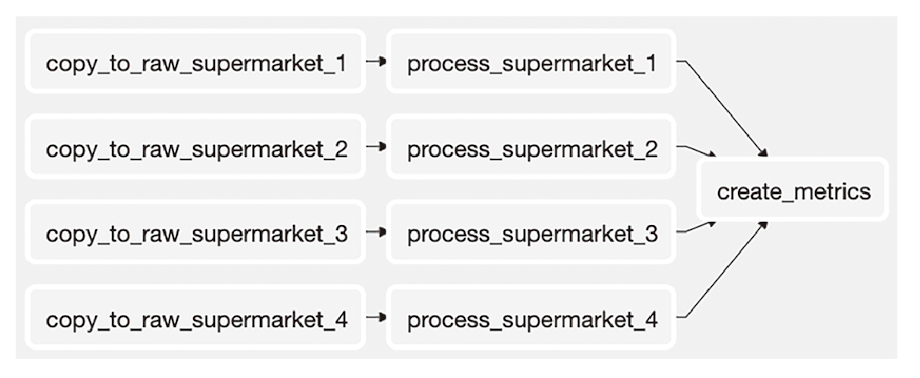

# Chapter 6. 워크플로 트리거

주차: 3주차
발표: 예선님
생성 일시: 2024년 8월 17일 오후 9:05
선택: 파트2. 중급편

# 6.1 센서를 사용한 폴링 조건

- 워크플로를 시작하는 일반적인 사례 → 새로운 데이터의 도착
    - 회사가 다른 회사와 공유 스토리지 시스템에 매일 데이터 덤프를 제공하는 경우!
    - 데이터는 언제든지 도착할 수 있지만, 프로모션 집행일이 존재할 때




- 대기 시간 많이 소요
- Airflow 오퍼레이터 특수 타입 → 센서의 도움
- **센서는 특정 조건이 true인지 지속적으로 확인하고 true라면 성공**
- 만약 false인 경우, 센서는 상태가 true가 될 때까지 또는 타임아웃이 될 때까지 계속 확인한다.

```python
from airflow.sensors.filesystem import FileSensor

wait_for_supermarket_1 = FileSensor(
    task_id = "wait_for_supermarket_1",
    filepath = "/data/supermarket1/data.csv"
)
```

- FileSensor는 `/data/supermarket1/data.csv` 파일이 존재하는지 확인하고 파일이 있으면 true를 반환, 그렇지 않으면 false를 반환한 후 해당 센서는 지정된 시간(기본값 60초) 동안 대기했다가 다시 시도한다.
- 오퍼레이터와 DAG는 모두 타임아웃의 설정 가능
- 센서 오퍼레이터는 제한 시간에 도달할 때까지 상태를 확인하며 대기
- 포크 : 센서는 주어진 파일이 있는지 포크
- **Poking : 센서를 실행하고 센서 상태를 확인하기 위해 Airflow에서 사용하는 이름**
- 예상되는 데이터 전달 시점까지 불필요하게 기다릴 필요 없이 바로 데이터를 처리할 수 있다.

## 사용자 지정 조건 폴링

- 와일드 카드 사용하여 여러 파일 처리 시 주의할 점
    - 대상 파일이 업로드 되는 동안 다른 파일 데이터가 제공되면 FileSensor는 true를 반환
    - 원치 않는 태스크를 이어 진행하여 잘못된 결과가 생성될 수 있음
- Globbing을 사용하여 파일 또는 디렉터리 이름과 패턴을 일치시킨다.

```python
from pathlib import Path
from airflow.sensors.python import PythonSensor

def _wait_for_supermarket(supermarket_id) :
    supermarket_path = Path("/data/" + supermarket_id)
    data_file = supermarket_path.glob("data-*.csv")
    success_file = supermarket_path / "_SUCCESS"
    return data_files and success_file.exists()

wait_for_supermarket_1 = PythonSensor(
    task_id = "wait_for_supermarket_1",
    python_callable = _wait_for_supermarket,
    op_kwags = {"supermarket_id" : "supermarket1"},
    dag = dag,
)
```

- PythonSensor에 제공된 콜러블이 실행되고 Boolean 형식의 true, false가 결과값으로 반환됨

## 원활하지 않은 흐름의 센서 처리

- 센서는 최대 실행 허용 시간을 지정하는 timeout인수를 허용
- 다음 포크의 시작 실행 시간이 타임아웃 설정값보다 초과된다면 센서는 실패를 반환
- 센서 타임아웃 default : 7일
- DAG schedule_interval을 하루에 한번 실행하도록 설정하면, 원하지 않는 눈덩이 효과 발생
- 이런 문제를 해결하기 위해 Airflo가 실행 태스크 수를 제한함

```python
DAG = DAG (
    Dag_id = "couponing_app",
    start_date = datetime(2019, 1,1),
    schedule_interval = "0 0 * * *",
    concurrency = 50,
)
```

### 센서 데드락


- 슈퍼마켓 DAG는 실행할 수 있는 최대 태스크 수에 도달해 차단된다.
- Airflow 전역 설정의 최대 태스크 제한에 도달하면 전체 시스템이 정지될 수 있다.
- 센서 클래스는 poke 또는 reschedule을 설정할 수 있는 mode 인수가 존재
- 기본적으로 poke가 설정되어 있어 최대 태스크 제한에 도달하면 새로운 태스크가 차단된다.

# 6.2 다른 DAG를 트리거하기

```python
import airflow.utils.dates
from airflow import DAG
from airflow.operators.dummy import DummyOperator
from airflow.operators.trigger_dagrun import TriggerDagRunOperator

dag1=DAG(
    dag_id = "ingest_supermarket_data",
    start_date = airflow.utils.dates.days_ago(3),
    schedule_interval = "0 16 * * *",
)

for supermarket_id in range(1,5) :
    # ...
    trigger_create_metrics_dag = TriggerDagRunOperator(
        task_id = f"trigger_create_metrics_dag_supermarket_{supermarket_id}",
        trigger_dag_id = "create_metrics",
        dag = dag1,
    )
    
dag2 = DAG(
    dag_id = "create_metrics",
    start_date = airflow.utils.dates.days_ago(3),
    schedule_interval = None,
)
```

## TriggerDagRunOperator 백필 작업

- `process_*` 태스크의 일부 로직을 변경하고 변경된 부분부터 DAG를 다시 실행하려면 어떻게 해야하나?
    - 단일 DAG에서는 `process_*` 및 해당 다운 스트림 태스크의 상태를 삭제하면 된다.

## 다른 DAG의 상태 폴링하기

- `ExternalTaskSensor` 의 작동 방식은 다른 DAG의 태스크를 지정하여 해당 태스크의 상태를 확인하는 것


## REST/CLI를 이용해 워크플로 시작하기

- DAG를 트리거 하는 방법 외에도 REST API 및 CLI를 통해 트리거 가능