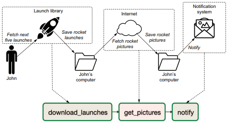

# Chapter5 태스크 간 의존성 정의하기
- 작업간 의존성 정의
- 조건부 태스크 분기, 조인
- XCom
- Taskflow API

## **5.1 기본 의존성 유형** 
### **5.1.1 선형 의존성 유형**
**선형 의존성 유형** : 연속적으로 실행되는 작업  
  
발사 데이터 다운로드 -> 이미지 다운로드 -> 메시지 알림  
➡️ 이전 작업이 완료되어야 다음 태스크로 이동 ' >> ' 연산자로 의존성 표현
```python
task1 >> task2
task2 >> task3

or

task1 >> task2 >> task3
```


### **5.1.2 팬인/팬아웃(Fan-in/Fan-out)의존성**
**팬인/팬아웃** : 하나의 태스크가 여러 다운 스트림 태스크에 연결되거나 그 반대 동작을 수행하는 유형  
  
- 날씨 데이터와 판매 데이터는 서로 독립적
- 날씨 데이터와 판매 데이터에 관한 task는 각각 선형적
```python
fetch_weather >> clean_weather
fetch_sales >> clean_sales
```
- Dummy오퍼레이터를 통해 암묵적인 팬아웃 구성도 가능
```python
from airflow.operators.dummy import DummyOperator
start = DummyOperator(task_id="start")
start >> [fetch_weather, fetch_sales] # 팬아웃
```
- 하나의 태스크가 여러 업스트림 태스크에 영향을 받는 구조 : 팬인구조
```python
[clean_weather, clean_sales] >> join_datasets
```
  
- start 태스크가 먼저 시작
- fetch_weather와 fetch_sales는 병렬로 수행
- 각 작업중 하나가 완료되면 clean 태스크 수행
- clean태스크가 모두 완료되면 join_datasets 태스크 수행
- 이후 순차적으로 train_model, deploy_model 수행


## **5.2 브랜치하기**
```
가정상황
- ERP시스템 전환으로 인해 판매 데이터가 1~2주 내에 다른 소스에서 제공될 예정
- 모델학습 다운타임 없어야 함.
- 전환 이후에도 분석을 위해 과거 데이터 유지 필요
```
### **5.2.1 태스크 내에서 브랜치하기**
```python
def _fetch_sales(**context):
    if context["execution_date"] < ERP_CHANGE_DATE:
        _fetch_sales_old(**context)
    else:
        _fetch_sales_new(**context)
```
- if 분기를 통해 태스크 내에서 브랜치 수행
- 장점 : DAG 수정하지 않고도 유연성 허용
- 단점1 : 코드로 분기가 가능한 경우에만 동작
- 단점2 : DAG실행 중에 Airflow에서 어떤 코드 분기를 사용하는지 확인 어렵다.


### **5.2.2 DAG 내부에서 브랜치하기**
  
- 두 개의 개별 태스크를 개발하고 DAG에서 선택할 수 있도로 ㄱ하는 구조.
```python
def _pick_erp_system(**context):
    if context["execution_date"] < ERP_CHANGE_DATE:
        return "fetch_sales_old"
    else:
        return "fetch_sales_new"

pick_erp_system = BranchPythonOperator(
    task_id="pick_erp_system", 
    python_callable=_pick_erp_system
)

start >> [pick_erp_system, fetch_weather]
pick_erp_system >> [fetch_sales_old, fetch_sales_new]
```
- pick_erp_system를 통해 다운스트림 태스크를 선택할 수 있는 기능을 BranchPythonOperator로 제공
- 다운스트림 태스크ID를 리턴하며 이후 실행할 다운스트림 태스크를 결정한다.

```python
 [clean_sales_old, clean_sales_new, clean_weather] >> join_datasets
```
이 작업 뒤에는 모든 다운 스트림 작업을 스킵한다.
-> 두 clean태스크를 join_datasets에 연결하므로써, 둘 중 하나만 완료되는 경우에는
조인을 할 수 없다.

➡️ 트리거 규칙에 의해 새롭게 정의를 할 수 있다.(by trigger_rule)
trigger_rule의 기본값은 all_success이기에, 업스트림 작업이   
모두 성공해야만 다음 태스크가 수행한다.  
  

```python
# none_failed를 주므로써 상위 항목 실행이 완료되고, 실패가 없을시 수행 할 수 있게한다.
join_datasets = PythonOperator(
 ...,
 trigger_rule="none_failed",
) 
```

> 하지만 위 이미지에서 보듯 join_datasets에 연결된 태스크가 3개 이므로  
더미 태스크를 추가하여 브랜치 조건을 명확하게 한다.
  
```python
# join_datasets태스크에 대한 트리거 규칙 수정 없이, 브랜치를 좀 더 독립적으로 유지 가능
from airflow.operators.dummy import DummyOperator
join_erp = DummyOperator(
    task_id="join_erp_branch", 
    trigger_rule="none_failed"
)
[clean_sales_old, clean_sales_new] >> join_erp
[join_erp, clean_weather] >> join_datasets
```

## **5.3 조건부 태스크**
> 특정 조건에 따라 DAG에서 특정 태스크를 건너 뛸 수 있는 방법도 제공한다.  
특정 데이터 세트를 사용할 수 있을때에만 실행하거나 최근 실행된 DAG인 경우만 태스크 실행하게 가능


### **5.3.1 태스크 내에서 조건**
```python
def _is_latest_run(**context):
    now = pendulum.now("UTC")
    left_window = context["dag"].following_schedule(context["execution_date"])
    right_window = context["dag"].following_schedule(left_window)
    return left_window < now <= right_window

def _deploy_model(**context):
    if _is_latest_run(**context):
        print("Deploying model")

deploy_model = PythonOperator(
    task_id="deploy_model", 
    python_callable=_deploy_model
)
```
> clean 코드 변경후 백필을 이용해 변경 사항 전체데이터를 적용하려고 하면서 모델 또한 배포가 되어야 하는 상황에서는 가장 최근 실행된 DAG에 대해서만 모델 배포하도록 DAG을 변경하여 문제를 해결 할 수 있다.
  
하지만 DAG에서는 확인을 할수 가 없다.

### **5.3.2 조건부 태스크 만들기**
> 다른 방법으로는, 배포 태스크 자체를 조건부화 하는 것이다.
```python
def _latest_only(**context):
    now = pendulum.now("UTC") #현재시간
    left_window = context["dag"].following_schedule(context["execution_date"]) # 실행윈도우 경계
    right_window = context["dag"].following_schedule(left_window)

    if not left_window < now <= right_window:
        raise AirflowSkipException()

join_datasets >> train_model >> deploy_model
latest_only >> deploy_model
```
  

execution_date가 가장 최근 실행에 속하지 않는 경우, 다운스트림을 건너뛰도록 함수를 작성한다.

  
모든 실행 태스크에서 마지막 태스크를 제외하고 배포 태스크르를 건너 뛴다.  
AirflowSkipException() 가 발생한 이후 건너뛴 상태로 표시되며 태스크가 종료된다.
이후 다운스트림은 트리거룰에 의거해서 수행여부 판단한다.
(디폴트 값이 all_success이므로 업스트림에서 스킵된 경우 현재 작업은 수행하지 않는다.)
### **5.3.3 내장 오퍼레이터 사용하기**
> 가장 최근 실행한 DAG만 실행하는 경우에는 LatestOnlyOperator클래스를 사용할 수도 있다.
```python
latest_only = LatestOnlyOperator(
    task_id="latest_only", 
    dag=dag
)
```


## **5.4 트리거 규칙에 대한 추가 정보**
> Airflow 는 DAG을 실행할 때, 각 태스크를 지속적으로 확인하여 실행 여부를 확인한다.  
태스크 실행이 가능하다고 판단하면 그 죽시 스케줄러에 의해 선택된 후 실행 예약이 된다.
태스크 실행 시기를 결정하는 것은 트리거 규칙에 의해 결정된다.
### **5.4.1 트리거 규칙이란?**
**트리거규칙** : 태스크의 으존성 기능과 같이 Airflow가 태스크 실행 준비가 되어 있는지 여부를 결정하기 위한 필수적인 조건이다. 기본 값은 all_success이며, 태스크를 실행하려면 앞선 의존적인 태스크가 모두 성공적으로 완료되어야만 수행을 하게 된다.


### **5.4.2 실패의 영향**
> 업스트림의 실패는 다운스트림 태스크를 진행 할 수 없게 된다.  
  
전파 : 업스트림 태스크 결과가 다운스트림 태스크에도 영향을 미치는 동작 유형


### **5.4.3 기타 트리거 규칙**
| 트리거 규칙 (Trigger Rule)      | 동작                                                                 | 사용 사례                                                                                              |
|---------------------------------|----------------------------------------------------------------------|---------------------------------------------------------------------------------------------------------|
| `all_success`                   | 모든 부모 태스크가 성공한 경우에만 트리거됩니다.                       | 파이프라인의 모든 이전 단계가 성공해야 다음 단계로 진행해야 하는 경우에 사용합니다.                    |
| `all_failed`                    | 모든 부모 태스크가 실패한 경우에만 트리거됩니다.                       | 에러 처리를 위해 모든 이전 태스크가 실패했을 때만 수행해야 하는 정리 작업에 사용됩니다.               |
| `all_done`                      | 모든 부모 태스크가 완료된 경우 (성공 또는 실패) 트리거됩니다.          | 성공/실패에 관계없이 모든 작업이 완료된 후에 진행되어야 하는 후처리 작업에 유용합니다.                 |
| `one_failed`                    | 하나 이상의 부모 태스크가 실패한 경우 트리거됩니다.                    | 중요한 작업이 실패했을 때 알림을 보내거나 롤백 작업을 수행할 때 사용됩니다.                          |
| `one_success`                   | 하나 이상의 부모 태스크가 성공한 경우 트리거됩니다.                    | 병렬 작업 중 하나라도 성공하면 후속 작업을 수행할 수 있는 경우에 사용됩니다.                          |
| `none_failed`                   | 부모 태스크 중 하나도 실패하지 않은 경우 (성공 또는 스킵) 트리거됩니다. | 특정 조건을 만족하면 모든 작업이 성공하지 않아도 다음 단계로 넘어가야 할 때 유용합니다.              |
| `none_failed_or_skipped`        | 부모 태스크 중 하나도 실패하지 않고, 스킵되지 않은 경우 트리거됩니다.  | 실패 또는 스킵 없이 모든 이전 작업이 정상적으로 완료된 후에만 진행되어야 하는 작업에 사용됩니다.     |
| `none_skipped`                  | 부모 태스크 중 하나도 스킵되지 않은 경우 트리거됩니다.                | 모든 태스크가 스킵되지 않고 수행된 후에만 진행해야 하는 작업에 사용됩니다.                           |
| `dummy`                         | 항상 트리거됩니다.                                                   | 특정 조건에 관계없이 무조건 실행되어야 하는 경우, 혹은 테스트 시 사용됩니다.                           |


## **5.5 태스크 간 데이터 공유**
XCom : 태스크 간 메시지를 교환하여 특정 상태를 공유할수 있게 한다.


### **5.5.1 XCom을 사용하여 데이터 공유하기**
- 태스크 간 데이터를 공유하기 위해 XCom을 사용한다.
```python
def _train_model(**context):
    model_id = str(uuid.uuid4())
    context["task_instance"].xcom_push(key="model_id", value=model_id) # 키값 형식으로 전달

train_model = PythonOperator(
    task_id="train_model", python_callable=_train_model
)
```
  
```python
def _deploy_model(**context):
    model_id = context["task_instance"].xcom_pull(task_ids="train_model", key="model_id")
    print(f"Deploying model {model_id}")

deploy_model = PythonOperator(
    task_id="deploy_model", 
    python_callable=_deploy_model
)
```
>xcom_push(key="키", value=데이터)  
xcom_pull(task_ids="push한 태스크 id", key="키")

```python
# xcom_pull 대신 템플릿딕셔너리를 통해 가져오는 방법도 있다.
def _deploy_model(templates_dict, **context):
    model_id = templates_dict["model_id"]
    print(f"Deploying model {model_id}")


deploy_model = PythonOperator(
    task_id="deploy_model",
    python_callable=_deploy_model,
    templates_dict={
        "model_id": "{{task_instance.xcom_pull(task_ids='train_model', key='model_id')}}"
    },
)
```

### **5.5.2 XCom 사용 시 고려사항**
1) 태스크간 묵시적인 의존성이 필요하다.
2) 원자성을 해치지 않도록 해야한다.
3) 데이터가 직렬화를 지원해야한다.
    - SQLite : BLOB유형, 2GB 제한
    - PostgreSQL : BYTEA유형, 1GB 제한 
    - MySQL : BLOB유형, 64KB 제한
4) 주로 작은 값이나 결과값을 저장하는데 사용한다.

### **5.5.3 커스텀 XCom 백엔드 사용하기**
- 커스텀 XCom 백엔드를 사용할 시, 저장 및 검색할 수 있다.
- BaseXCom 기본 클래스 상속되고, 직렬화/역직렬화 하기 위한 정적 매서드 구현이 필요하다.


## **5.6 Taskflow API로 파이썬 태스크 연결하기**
Taskflow API : 파이썬 태스크 및 의존성 정의를 위한 데코레이터 기반 API를 제공

### **5.6.1 Taskflow API로 파이썬 태스크 단순화하기**
```python
# 훈련 함수 정의
def _train_model(**context):
    model_id = str(uuid.uuid4())
    context["task_instance"].xcom_push(key="model_id", value=model_id) # 모델ID공유

# 배포 함수 정의
def _deploy_model(**context):
    model_id = context["task_instance"].xcom_pull(
        task_ids="train_model", key="model_id"
    )# 모델ID공유
    print(f"Deploying model {model_id}")


with DAG(
    dag_id="10_xcoms",
    start_date=airflow.utils.dates.days_ago(3),
    schedule_interval="@daily",
) as dag:

    train_model = PythonOperator(task_id="train_model", python_callable=_train_model)

    deploy_model = PythonOperator(task_id="deploy_model", python_callable=_deploy_model)

 join_datasets >> train_model >> deploy_model # 태스크간 의존성 설정
```

단점
- 함수 정의 후 PythonOperator이용해 태스크를 생성해야한다.
- 모델ID공유를 위해 xcom_push, xcom_pull을 명시적으로 사용한다.
- 고로 의존성 정의하는것이 번거롭고 공유된 키 값을 변경하면 중단될 수 있다.

해결책
- Taskflow API를 통해 파이썬함수를 태스크로 쉽게 변환하고, DAG정의에서 태스크간 데이터공유를 명확하게 할 수 있다.

```python
with DAG(
    dag_id="12_taskflow",
    start_date=airflow.utils.dates.days_ago(3),
    schedule_interval="@daily",
) as dag:

    @task
    def train_model():
        model_id = str(uuid.uuid4())
        return model_id

    @task
    def deploy_model(model_id: str):
        print(f"Deploying model {model_id}")

    model_id = train_model()
    deploy_model(model_id)
```
파이썬 함수 인수로 전달하여 관리할 수 있도록한다.
  

### **5.6.2 Taskflow API를 사용하지 않는 경우**
- PythonOperator를 사용하여 구현되는 파이썬 태스크에만 제한이 된다.
- 일반API와 혼용해서 사용해도 되지만, 코드가 깔끔하게 보이지 않는다는 단점이 있다.
```python

    join_datasets = DummyOperator(task_id="join_datasets")
    
    @task
    def train_model():
        model_id = str(uuid.uuid4())
        return model_id

    @task
    def deploy_model(model_id: str):
        print(f"Deploying model {model_id}")

    model_id = train_model()
    deploy_model(model_id)

    join_datasets >> model_id
```