# Chapter6 워크플로 트리거
- 특정 태스크 수행 후 트리거 해야 하는 경우 트리거

## 6.1 센서를 사용한 폴링 조건
- 새로운 데이터 도착 시 워크플로 시작하기
> 사례:  
프로모션 데이터는 종종 비정규적인 시간에 도착한다.  
데이터는 하루 중 언제든지 도착할 수 있지만, 다음날 16:00~02:00 사이에
공유저장소로 들어오는 것을 확인한다.

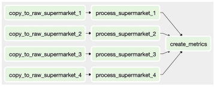  
슈퍼마켓 프로모션 데이터를 처리하기 위한 로직을 위 그림과 같이 작성할 수 있다.

copy_to_raw_supermarket_{1,4} :  슈퍼마켓 1~4에서 제공한 데이터를 로우 스토리지에 복사하는 태스크
processing_supermarket_{1,4}: 앱에서 데이터를 읽을 수 있도록 DB상 모든 데이터를 변환하고 저장  
create_metrics : 추가적인 분석을 위해 프로모션에 대한 다양한 지표 계산 및 집계  

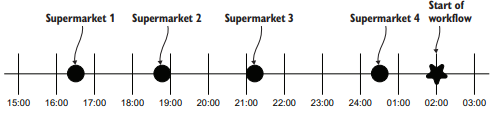  
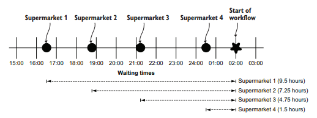  
워크플로가 시작되기까지 슈퍼마켓1의 데이터는 99.5시간이나 대기를 하기에 대기시간이 많이 소요된다.  
➡️ 이를 해결하기 위해 센서의 도움을 받는다.  
센서는 특정 조건이 true인지 지속적으로 확인하고 true라면 성공을 한다.   
만약 false라면 true가 될때까지 혹은 타임아웃이 될 때까지 계속 확인한다.

```python
# 파일 센서는 파일 경로가 생성 될때까지 기다린다.
from airflow.sensors.filesystem import FileSensor
wait = FileSensor(
    task_id="wait_for_supermarket_1",
    filepath="/data/supermarket1/data.csv", 
    dag=dag
)
# 파일패스에 데이터가 존재하면 true를 반환하고, 아니면 false를 반환한 후, 
# 지정 시간동안 대기를 한다.
```
- 1분에 한번씩 센서는 주어진 파일이 있는지 포크(poke)를 한다.
- Poking : 센서를 실행하고 센서 상태를 확인하기 위해 Airflow에서 사용하는 이름  

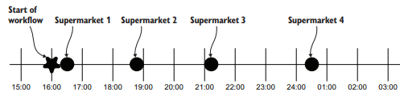  
이제 02:00까지 기다리지 않고, 데이터가 사용 가능한지 지속적으로 확인을 한다.  
때문에, 워크플로 DAG 시작 시간을 데이터가 도착하는 경계의 시작 부분에 배치를 한다.  

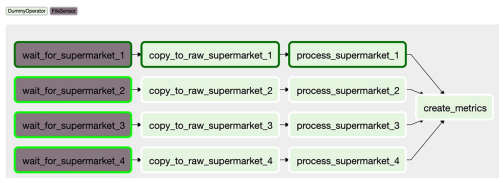  
이제, 슈퍼마켓1의 데이터가 제공되면 센서 상태가 true를 반환하면서 다운스트림태스크가 처리된다.

### 6.1.1  사용자 지정 조건 폴링
데이터 세트가 많을 시, data-*.csv로 처리를 하게 되는 경우는 주의를 해야 한다.  
data-01.csv가 업로드 되는 과정중에 다른 파일 데이터가 들어오면 FileSensor는 true를 반환하므로,  
다음 작업인 copy_to_raw태스크를 계속 진행하게 되고, 원치않는 결과가 나오게 된다.  
때문에, 최종 업로드파일은 _SUCCESS라는 접미사를 붙이기로 합의한다.

> 최종적으로는 1개 이상의 data-*.csv파일과 _SUCCESS접미사를 가진 파일이 있으면,  
데이터 이관이 완료 되었다고 가정하도록한다.  

이때, 글로빙을 사용해 파일/디렉토리 이름과 패턴을 일치시킬 수 도 있지만,
PythonSensor를 활용하여 조건을 확인하는 것이 가독성에 더 좋다.
```python
def _wait_for_supermarket(supermarket_id_):
    supermarket_path = Path("/data/" + supermarket_id_) # Path객체 초기화
    data_files = supermarket_path.glob("data-*.csv") # csv파일 수집
    success_file = supermarket_path / "_SUCCESS" # _SUCCESS파일 수집
    return data_files and success_file.exists() # 데이터 파일과 성공 파일이 있는지 확인 후 리턴


wait_for_supermarket_1 = PythonSensor(
    task_id="wait_for_supermarket_1",
    python_callable=_wait_for_supermarket,
    op_kwargs={"supermarket_id": "supermarket1"},
    dag=dag,
``` 
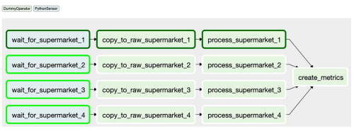  
PythonSensor를 활용한 DAG

### 6.1.2 원활하지 않는 흐름의 센서 처리  
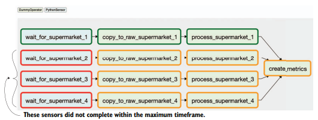    
만약 슈퍼마켓 데이터가 더 이상 제공되지 않는다면 다른 오퍼레이터와 마찬가지로 실패하게 된다.  
지정된 timeout시간을 초과하게 되는 경우에도 센서는 false를 반환한다.  
- 기본적으로 센서 타임아웃은 7일로 설정되어 있다.
    -  만약 schedule_interval이 하루 한번으로 설정되있다면... 큰 문제가 발생할 수 있다.

```python
dag = DAG(
    dag_id="listing_6_03",
    start_date=airflow.utils.dates.days_ago(3),
    schedule_interval="@daily",
    concurrency=50, #최대 태스크 실행 수를 50으로 제한한다.
)
```
이렇게 제한을 둠으로써, 많은 태스크가 쌓이는 문제를 해결할 수 있다.

<센서 데드록>  
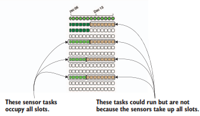  
- 실행중인 태스크 조건이 true가 될때까지 다른 태스크가 되기하게 되므로 모든 슬롯이 데드록 상태가 된다.

> 만약, 슈퍼마켓 1은 성공하고, 2,3,4에 데이터가 없다면  
1일차에는 2,3,4에 대해 태스크 3개가 차지하며 폴링을 하고,  
2일차에는 2,3,4에 대해 태스크 6개가 차지하며 폴링을 하고,  
...  
6일 차에는 16개 태스크가 차지하고 폴링할 수 가 있다.  
- 실행할 수 있는 최대 태스크 수에 도달해 차단되며, 전체 시스템이 정지될 수 도 있다.  
➡️ rechedule 혹은 poke를 설정함으로서 문제를 해결할 수 있다.  

> poke(기본) : 최대 태스크 도달 시 새로운 태스크 차단. 센서 태스크 실행중인 동안 태스크 슬롯 차지  

> reschedule : 포크 동작을  실행할때만 슬롯을 차지, 대기시간 동안은 슬롯을 차지하지 않는다.


## 6.2 다른 DAG를 트리거하기
> 현재까지는 process_supermarket_{1,2,3,4} 태스크 성공여부에 따라 create_metrics단계가 결정된다.  
하지만 추가적인 슈퍼마켓 데이터를 받아서 데이터 처리 직후 통계 지표를 사용할 수 있기를 원하는 경우... 아래와 같은 작업들을 할 수 있다.  

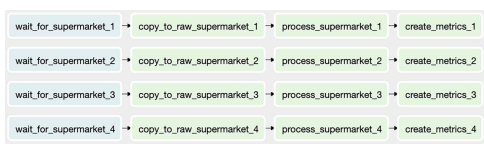  
하지만 이 경우,  create_metrics_* 단계가 확장되어 DAG구조가 복잡해지고, 더 많은 반복 태스크가 발생하게 된다.  
이 경우, 로직이 더 많아지게 되면 DAG에서 분할될 가능성이 있다.

이렇게 DAAG을 분리함으로써 DAG1이 DAG2를 여러번 호출할 수 있다는 장점이 있다.
워크플로가 스케쥴에 따라 완료될때까지 기다리지 않고 언제든지 수동으로 트리거할 수 있는 통계 지표를 생성하기 위해 DAG을 분할하는 것이 좋다.

```python

dag1 = DAG(
    dag_id="listing_6_04_dag01",
    start_date=airflow.utils.dates.days_ago(3),
    schedule_interval="0 16 * * *",
)
dag2 = DAG(
    dag_id="listing_6_04_dag02",
    start_date=airflow.utils.dates.days_ago(3),
    schedule_interval=None,
)


def _wait_for_supermarket(supermarket_id_):
    supermarket_path = Path("/data/" + supermarket_id_)
    data_files = supermarket_path.glob("data-*.csv")
    success_file = supermarket_path / "_SUCCESS"
    return data_files and success_file.exists()


for supermarket_id in range(1, 5):
    wait = PythonSensor(
        task_id=f"wait_for_supermarket_{supermarket_id}",
        python_callable=_wait_for_supermarket,
        op_kwargs={"supermarket_id_": f"supermarket{supermarket_id}"},
        dag=dag1,
    )
    copy = DummyOperator(task_id=f"copy_to_raw_supermarket_{supermarket_id}", dag=dag1)
    process = DummyOperator(task_id=f"process_supermarket_{supermarket_id}", dag=dag1)
    trigger_create_metrics_dag = TriggerDagRunOperator(
        task_id=f"trigger_create_metrics_dag_supermarket_{supermarket_id}",
        trigger_dag_id="listing_6_04_dag02", #트리거 시킬 DAG ID
        dag=dag1,
    )
    wait >> copy >> process >> trigger_create_metrics_dag

compute_differences = DummyOperator(task_id="compute_differences", dag=dag2)
update_dashboard = DummyOperator(task_id="update_dashboard", dag=dag2)
notify_new_data = DummyOperator(task_id="notify_new_data", dag=dag2)
compute_differences >> update_dashboard
```
TriggerDagRunOperator를 통해 다른 DAG을 트리거 할 수 있다.
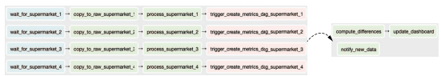  
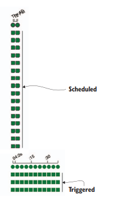  
자동으로 스케쥴된 경우, 검은색 테두리로 표시가 되고, 수동으로 트리거 한 경우 테두리 없이 표현된다.  
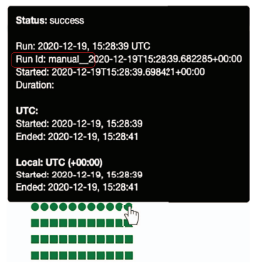  
또한 마우스를 올려 확인해보면, run id필드를통해 확인을 할수 있다.
- schedule__ : 스케쥴되어 DAG이 실행된 경우
- backfill__ : 백필 태스크에 의해 DAG이 실행 시작된 경우
- manual__ : 수동으로 시작된 경우.


### 6.2.1 TriggerDagRunOperator로 백필 작업
- process_* 태스크 일부 로직을 변경하고 변경된 부분부터 DAG을 다시 실행시키려면,
- 단일 DAG에서는 다운스트림 태스크 상태를 삭제하면 된다.
    - 하지만, 또다른 DAG안에서 TriggerDagRunOperator 의 다운스트림 태스크는 안지워진다.
    - 이 경우, TriggerDagRunOperator가 포함된 DAG에서 태스크를 삭제하면 된다.  
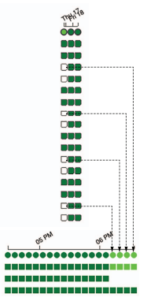  


### 6.2.2 다른 DAG의 상태를 폴링하기
  
이 경우는, 트리거를 하는 DAG과 트리거 되는 DAG의 의존성이 없는 예시이다.  
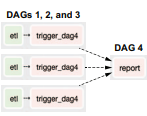   
DAG이 아주 복잡해지는 경우, 태스크를 명확하게 하기 위해 첫번째 DAG을 여러개의 DAG으로 분할하고,  
각각의 해당 DAG에 대해 TriggerDagRunOperator태스크를 수행할 수도 있다.  
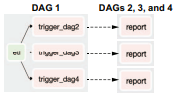  
여러 다운스트림 DAG을 트리거하는 하나의 DAG의 TriggerDagRunOperator를 사용할 수 도 있다.  

> 다른 DAG이 실행되기 전에 여러개의 트리거 DAG이 완료되어야 한다면 어떻게 해야 할까?  
 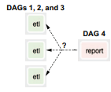  
 위 그림과 같이, DAG1,2,3이 모두 완료된 경우에만 DAG4를 실행하려면?  
 ➡️ DAG간 의존성을 관리하는 방법은 제공되지 않는다.  

하지만, DAG에서 태스크 상태를 포크하는 센서인 ExternalTaskSensor를 적용하면  
원하는 상황을 구현할 수 있다.  
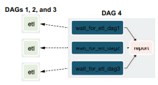  

```python
dag1 = DAG(
    dag_id="figure_6_20_dag_1",
    start_date=airflow.utils.dates.days_ago(3),
    schedule_interval="0 16 * * *",
)
dag2 = DAG(
    dag_id="figure_6_20_dag_2",
    start_date=airflow.utils.dates.days_ago(3),
    schedule_interval="0 18 * * *",
)

DummyOperator(task_id="copy_to_raw", dag=dag1) >> DummyOperator(task_id="process_supermarket", dag=dag1)

wait = ExternalTaskSensor(
    task_id="wait_for_process_supermarket",
    external_dag_id="figure_6_20_dag_1",
    external_task_id="process_supermarket",
    execution_delta=datetime.timedelta(hours=6),
    dag=dag2,
)
report = DummyOperator(task_id="report", dag=dag2)
wait >> report
```
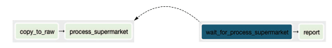  

DAG2는 DAG1의 태스크 상태 확인할때 몇가지 단점이 발생한다.
1) Airflow는 DAG가 다른 DAG을 고려하지 않는다. 그렇기에 ExternalTaskSensor사용시 정렬이 필요하다.
2) ExternalTaskSensor가 자신과 정확히 동일한 실행날짜를 가진 태스크에 대한 성공 여부만 확인한다.
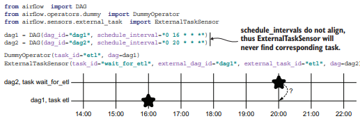  

스케쥴 간격이 맞지 않는경우 다른 태스크를 검색할 수 있도록 오프셋을 설정할 수 있다.  
오프셋은 ExternalTaskSensor의 execution_delta인수로 설정가능하다.
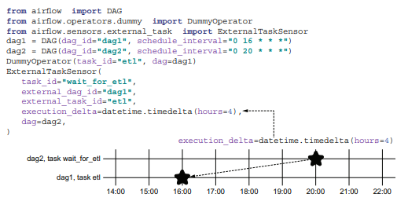  

  
  
  
DAG1은 하루에 한번 실행되고, DAG2는 5시간마다 실행되는 경우, 스케쥴 간격이 서로 다른 경우,
태스크 확인하기 위해 execution_date_fn인수를 통해 timedelta의 목록을 반환하는 함수를 사용할 수 있다.

## 6.3 REST/CLI를 이용해 워크플로 시작하기
<CLI로 워크플로 시작하기>

```sh
airflow dags trigger dag1 # dag1 트리거 하기.
airflow dags trigger -c '{"supermarket_id":1}' dag1
airflow dags trigger --conf '{"supermarket_id":1}' dag1 # 추가 구성으로 DAG트리거 하기
```

```python

def print_conf(**context):
    print(context["dag_run"].conf) # 태스크 콘텍스트에서 트리거 되는 DAG에 접근할때 제공되는 구성 파일


copy_to_raw = PythonOperator(task_id="copy_to_raw", python_callable=print_conf, dag=dag)
process = PythonOperator(task_id="process", python_callable=print_conf, dag=dag)
```

<REST API로 워크플로 시작하기>
```sh
curl \
-u ID:PW \
-X POST \
"url" \
-H "Content-Type: application/json" \
-d '{"conf":{}}' #추가 구성 설정이 최공되지 않는 경우에도 엔드포인트에는 데이터가 필요하다.
```