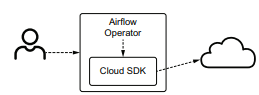
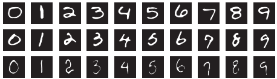
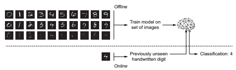
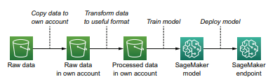
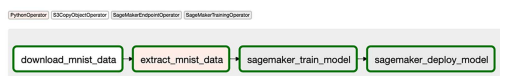
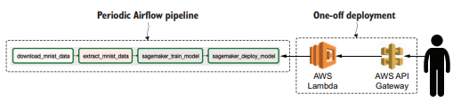
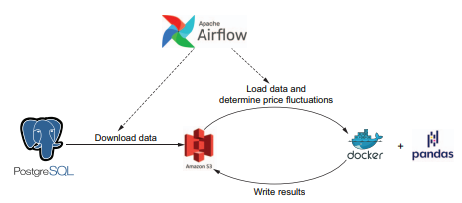
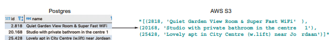

# Chapter7 외부 시스템과 통신하기
- 더욱 구체적인 목적을 위한 오퍼레이터 사용해보기
- 외부시스템 : Airflow및 Airflow가 구동되는 시스템 이외의 모든 기술을 의미

## 7.1 클라우드 서비스에 연결하기
- 클라우드 공급자가 제공하는 API를 통해 클라우드 서비스 제어가 가능.
    - AWS : boto3
    - GCP : Cloud SDK
    - Azure : Azure SDK for Python  

- Airflow 에서 프로그래머에게 제공되는 인터페이스는 오퍼레이터이다.
- 오퍼레이터는 입력한 인수의 값을 토대로 클라우드 SDK태스크로 변환을 한다.  
  

### 7.1.1 추가 의존성 패키지 설치하기
|클라우드 서비스 | pip 철치 명령어 |
|---------------|---------------|
|AWS            |  pip install apache-airflow-providers-amazon|
|GCP            |  pip install apache-airflow-providers-google|
|Azure          |pip install apache-airflow-providers-microsoft-azure|
|PostgresOperator|    pip install apache-airflow-providers-postgres |  


- S3CopyObjectOperator
```python
from airflow.providers.amazon.aws.operators.s3_copy_object import S3CopyObjectOperator

S3CopyObjectOperator(
 task_id="...",
 source_bucket_name="databucket", # 복사할 버킷 이름
 source_bucket_key="/data/{{ ds }}.json", # 복사할 오브젝트 이름
 dest_bucket_name="backupbucket", # 북사될 버킷 이름
 dest_bucket_key="/data/{{ ds }}-backup.json", # 대상 오브젝트 이름
)
```
- 위 오퍼레이터는 AWS의 boto3클라이언트에 대해 자세히 알 필요 없이 S3오브젝트를 다른 S3로 복사하는 방법을 제공한다.

### 7.1.2 머신러닝 모델 개발하기
<MNITST 예제>  

  
  
- 위 표에서 Offline으로 학습 시키는 것을 Airflow로 수행할 수 있다.
- 데이터 로드 -> 전처리 -> 모델 학습 -> 주기적으로 모델 재학습
  
> 1) 샘플데이터를 S3 버킷으로 복사한다.
> 2) 데이터를 모델에서 사용할 수 있는 형식으로 변환한다.
> 3) AWS SageMaker를 이용해 모델을 학습한다
> 4) 모델을 배포하여 새로 입력 되는 손글씨 숫자를 분류한다.  
  
  


```python
# S3CopyObjectOperator를 활용하여 두 S3 버킷 간 오브젝트 복사를 수행한다.
download_mnist_data = S3CopyObjectOperator(
    task_id="download_mnist_data",
    source_bucket_name="sagemaker-sample-data-eu-west-1", 
    source_bucket_key="algorithms/kmeans/mnist/mnist.pkl.gz",
    dest_bucket_name="your-bucket",
    dest_bucket_key="mnist.pkl.gz",
    dag=dag,
)
```

### 7.1.3 외부 시스템을 이용하여 개발하기
- AWS의 경우 액세스 키를 사용해 사용자 개발 시스템에서 클라우드 리소스를 액세스 할 수 있기 때문에,  
로컬에서 Airflow 태스크를 실행할 수 있다.
- airflow task test 를 통해 미리 지정된 실행 날짜에 단일 태스크를 실행 테스트 해볼 수 있다.
로컬에서 AWS오퍼레이터를 테스트하기 위해 설정해야할 것
```sh
# 자격증명
# Add secrets in ~/.aws/credentials:
 # [myaws]
 # aws_access_key_id=AKIAEXAMPLE123456789
 # aws_secret_access_key=supersecretaccesskeydonotshare!123456789
export AWS_PROFILE=myaws # boto3에서 인증확인을 위해 사용하는 환경변수
export AWS_DEFAULT_REGION=eu-west-1
export AIRFLOW_HOME=[프로젝트 dir]
airflow db init # 로컬의 Airflow메타스토어를 초기화한다. 로그 저장을 위해...
airflow tasks test chapter7_aws_handwritten_digits_classifier
download_mnist_data 2020-01-01 # 단일 태스크를 실행한다.
```
```
➥ $ airflow tasks test \
        chapter7_aws_handwritten_digits_classifier \
        download_mnist_data \
        2019-01-01


INFO - Using executor SequentialExecutor
INFO - Filling up the DagBag from .../dags
➥ INFO - Dependencies all met for <TaskInstance:
    chapter7_aws_handwritten_digits_classifier.download_mnist_data 2019-01-
    01T00:00:00+00:00 [None]>
---------------------------------------------------------------------------
INFO - Starting attempt 1 of 1
---------------------------------------------------------------------------
➥ INFO - Executing <Task(PythonOperator): download_mnist_data> on 2019-01-
    01T00:00:00+00:00
INFO - Found credentials in shared credentials file: ~/.aws/credentials
INFO - Done. Returned value was: None
➥ INFO - Marking task as SUCCESS.dag_id=chapter7_aws_handwritten_digits
    _classifier, task_id=download_mnist_data, execution_date=20190101T000000,
    start_date=20200208T110436, end_date=20200208T110541
```
이 명령어를 통해, 자신의 버킷에 데이터가 복사된 것을 확인할 수 있다.

이후, SageMaker KMeans 모델을 위해 MNIST데이터를 RecordIO형식으로 변환한다.
```python
import gzip
import io
import pickle
from airflow import DAG
from airflow.operators.python import PythonOperator
from airflow.providers.amazon.aws.hooks.s3 import S3Hook
from sagemaker.amazon.common import write_numpy_to_dense_tensor

def _extract_mnist_data():
    s3hook = S3Hook() # S3과 통신하기 위해 S3Hook을 초기화한다.

    """ S3의 데이터 세트를 메모리에 다운로드"""
    mnist_buffer = io.BytesIO() 
    mnist_obj = s3hook.get_key( # 데이터를 인메모리 바이너리스트림으로 다운로드한다.
        bucket_name="your-bucket", 
        key="mnist.pkl.gz"
    )
    mnist_obj.download_fileobj(mnist_buffer)

    """ gzip압축 해제 후 데이터 셋을 추출, 변환 후 S3로 다시 데이터 업로드 """
    mnist_buffer.seek(0)
    with gzip.GzipFile(fileobj=mnist_buffer, mode="rb") as f: # 압축해제 및 피클링 해제
        train_set, _, _ = pickle.loads(f.read(), encoding="latin1")
        output_buffer = io.BytesIO() 
        write_numpy_to_dense_tensor(  # Numpy배열을 RecordIO 레코드 포맷으로 변환한다.
            file=output_buffer, 
            array=train_set[0], 
            labels=train_set[1]
        )
        output_buffer.seek(0)
        s3hook.load_file_obj(  # S3 에 결과 업로드
            output_buffer, 
            key="mnist_data", 
            bucket_name="your-bucket", 
            replace=True
        )


extract_mnist_data = PythonOperator(
    task_id="extract_mnist_data", 
    python_callable=_extract_mnist_data, 
    dag=dag
)
```
- 데이터를 다운로드 하고, 결과를 추출, 변환 및 S3에 업로드하는 기능은 별도로 구현을 해야한다.
- 위 예시에서는 인메모리 바이너리 스트림(io.BytesIO)로 다운 받는다. 그러기에 파일 시스템에 저징이 되지 않는다.

이후, SageMaker 모델을 학습한 후 배포한다.

```python
# SageMakerTrainingOperator 는 SageMaker 학습 작업을 생성한다
sagemaker_train_model = SageMakerTrainingOperator(
    task_id="sagemaker_train_model",
    config={ # 학습작업에 대한 config JSON
        "TrainingJobName": "mnistclassifier-{{ execution_date.strftime('%Y-%m-%d-%H-%M-%S') }}",
        "AlgorithmSpecification": {
            "TrainingImage": "438346466558.dkr.ecr.eu-west-1.amazonaws.com/kmeans:1",
            "TrainingInputMode": "File",
        },
        "HyperParameters": {"k": "10", "feature_dim": "784"},
        "InputDataConfig": [
            {
                "ChannelName": "train",
                "DataSource": {
                    "S3DataSource": {
                        "S3DataType": "S3Prefix",
                        "S3Uri": "s3://your-bucket/mnist_data",
                        "S3DataDistributionType": "FullyReplicated",
                    }
                },
            }
        ],
        "OutputDataConfig": {"S3OutputPath": "s3://your-bucket/mnistclassifier-output"},
        "ResourceConfig": {
            "InstanceType": "ml.c4.xlarge",
            "InstanceCount": 1,
            "VolumeSizeInGB": 10,
        },
        "RoleArn": (
            "arn:aws:iam::297623009465:role/service-role/"
            "AmazonSageMaker-ExecutionRole-20180905T153196"
        ),
        "StoppingCondition": {"MaxRuntimeInSeconds": 24 * 60 * 60},
    },
    wait_for_completion=True,
    print_log=True,
    check_interval=10,
    dag=dag,
)

# SageMakerEndpointOperator 는 학습된 모델을 배포하여 HTTP엔드포인트를 후에 사용할 수 있도록한다.
sagemaker_deploy_model = SageMakerEndpointOperator(
    task_id="sagemaker_deploy_model",
    operation="update",
    wait_for_completion=True,
    config={
        "Model": {
            "ModelName": "mnistclassifier-{{ execution_date.strftime('%Y-%m-%d-%H-%M-%S') }}",
            "PrimaryContainer": {
                "Image": "438346466558.dkr.ecr.eu-west-1.amazonaws.com/kmeans:1",
                "ModelDataUrl": (
                    "s3://your-bucket/mnistclassifier-output/mnistclassifier"
                    "-{{ execution_date.strftime('%Y-%m-%d-%H-%M-%S') }}/"
                    "output/model.tar.gz"
                ),  # 모델과 학습 작업이 연결된다.
            },
            "ExecutionRoleArn": (
                "arn:aws:iam::297623009465:role/service-role/"
                "AmazonSageMaker-ExecutionRole-20180905T153196"
            ),
        },
        "EndpointConfig": {
            "EndpointConfigName": "mnistclassifier-{{ execution_date.strftime('%Y-%m-%d-%H-%M-%S') }}",
            "ProductionVariants": [
                {
                    "InitialInstanceCount": 1,
                    "InstanceType": "ml.t2.medium",
                    "ModelName": "mnistclassifier",
                    "VariantName": "AllTraffic",
                }
            ],
        },
        "Endpoint": {
            "EndpointConfigName": "mnistclassifier-{{ execution_date.strftime('%Y-%m-%d-%H-%M-%S') }}",
            "EndpointName": "mnistclassifier",
        },
    },
    dag=dag,
)
```
```python
sagemaker_train_model = SageMakerTrainingOperator(
    task_id="sagemaker_train_model",
    config={ 
        "TrainingJobName": (
            "mnistclassifier-"
            "{{ execution_date.strftime('%Y-%m-%d-%H-%M-%S') }}"
        ),
    },
    wait_for_completion=True,
    print_log=True,
    check_interval=10,
    dag=dag,
```
- TrainingJobName은 AWS계정과 리전 내 공유해야 한다.
- 정기적으로 재학습을 위해 고유한 TrainingJobName를 제공해야 하므로 execution_date를 이용해 지정해서 수행한다.
- wait_for_completion 값이 False이면 단순히 명령 실행만하고 그 외의 것은 신경을 안쓴다.  
그래서 학습 작업 시작을 하기는 하지만, 완료 여부는 확인할 수 없게 된다.
- check_interval 내부적으로 오퍼레이터가 x초마다 태스크가 실행중인지 확인한다.

  
SageMaker 의 엔드포인트는 AWS API등을 사용해 접근할 수는 있지만, 외부에서 접근할 순 없다.  
손글씨 숫자를 입력하기 위해선 별도의 인터페이스나 API가 필요하다.   
이를 위해 별도의 Lambda와 API Gateway를 생성, 연결해서 외부에서 접속할 수 있는 엔드포인트를 만든다.

```python
import json
from io import BytesIO

import boto3
import numpy as np
from PIL import Image
from chalice import Chalice, Response
from sagemaker.amazon.common import numpy_to_record_serializer

app = Chalice(app_name="number-classifier")


@app.route("/", methods=["POST"], content_types=["image/jpeg"])
def predict():
    """
    28x28 사이즈의 jpeg 포맷의 이미지를 제공해야한다.
    """
    # 입력 이미지를 그레이스케일의 numpy 배열로 변환
    img = Image.open(BytesIO(app.current_request.raw_body)).convert("L")
    img_arr = np.array(img, dtype=np.float32)
    runtime = boto3.Session().client(
        service_name="sagemaker-runtime", 
        region_name="eu-west-1"
    )
    # Airflow DAG에서 배포한 SageMaker엔드포인트를 호출한다.
    response = runtime.invoke_endpoint(
        EndpointName="mnistclassifier",
        ContentType="application/x-recordio-protobuf",
        Body=numpy_to_record_serializer()(img_arr.flatten()),
    )
    # 리스폰스는 바이트로 반환된다.
    result = json.loads(response["Body"].read().decode("utf-8"))
    return Response(
        result, status_code=200, headers={"Content-Type": "application/json"}
    )
```

```sh
curl --request POST \
    --url http://localhost:8000 \
    --header 'content-tpy: image/jpeg' \
    --data-binary @'/path/to/image.jpeg'
```
위와 같이 요청을 하게 되면 AWS Chalice에서 결과를 반환한다.


## 7.2 시스템간 데이터 이동하기
- 매일 데이터를 다운로드하고 다른곳에서 변환한다.
- 프로덕션 DB에서 데이터를 내보내고 나중에 처리할 수 있도록 준비하는 등의 분석 목적으로 사용된다.  
  
- Postgres : Airbnb데이터로 채워진 DB이미지
- S3 : Postgre 데이터를 얻어 S3에 저장
- Pandas : S3 데이터를 읽고 처리

- 보통 A-to-B 오퍼레이터들이 존재한다.
    - SqlToGoogleCloudStorageOperator
    - SFTPToS3Operator
    - SimpleHttpOperator
    - MongoToS3Operator
    - ...

### 7.2.1 PostgreToS3Operator 구현하기
- PostgreToS3Operator는 기존에 존재하지 않으므로 별도 구현이 필요하다.
- 참조를 위해 MongoToS3Operator를 참조하기로한다.

```python
def execute(self, context):
    s3_conn = S3Hook(self.s3_conn_id) # S3Hook 인스턴스 객체 생성

    results = MongoHook(self.mongo_conn_id).find( # MongoHook는 인스턴스화되고, 쿼리시 사용
        mongo_collection=self.mongo_collection,
        query=self.mongo_query,
        mongo_db=self.mongo_db
    )

    docs_str = self._stringify(self.transform(results)) # 결과를 변환 한다

    s3_conn.load_string( # 변환된 결과를 가져오기 위해 S3Hook에서 load_string()을 호출한다.
        string_data=docs_str,
        key=self.s3_key,
        bucket_name=self.s3_bucket,
        replace=self.replace
    )
```

MongoDB → Airflow 오퍼레이터 메모리 → AWS S3   
형식으로 되어있다.
- 위와 같은 경우, 쿼리 결과가 크면 Airflow 시스템에서 사용가능한 메모리 부족할 수 있음에 유의하자.


다음으로 S3ToSFTOperator에 대해 살펴보자
```python
def execute(self, context):
    ssh_hook = SSHHook(ssh_conn_id=self.sftp_conn_id) 
    s3_hook = S3Hook(self.s3_conn_id)

    s3_client = s3_hook.get_conn()
    sftp_client = ssh_hook.get_conn().open_sftp()

    with NamedTemporaryFile("w") as f: # 다운 받은 파일을 임시적으로 사용하기 위해 사용한다.
        s3_client.download_file(self.s3_bucket, self.s3_key, f.name)
        sftp_client.put(f.name, self.sftp_path)
```
위 오퍼레이터는 SSHHook과 S3Hook 두 훅을 인스턴스화 하여 사용하고, 중간 결과를 로컬파일시스템인 임시 위치에 NamedTemporaryFile을 통해 저장한다.

> 일반적으로 두 오퍼레이터는 공통적으로 두 개의 훅을 가지고 있다.  
두 시스템간 데이터를 검색하고 전송하는 방법은 다르며, 오퍼레이터를 구현하는 사람에 따라서도 달라질 수 있다.  
Postgres의 경우, 커서는 결과 청크를 가져오고 업로드하기 위한 반복 작업이 필요할 수도 있다.

<PostgresToS3Operator 구현 예시>
```python
def execute(self, context):
    postgres_hook = PostgresHook(postgres_conn_id=self._postgres_conn_id)
    s3_hook = S3Hook(aws_conn_id=self._s3_conn_id)

    results = postgres_hook.get_records(self._query) #Postgres에서 쿼리 결과 읽기
    s3_hook.load_string( # 결과 데이터를 s3에 적재하기
        string_data=str(results),
        bucket_name=self._s3_bucket,
        key=self._s3_key,
    )
```
우선 Postgres와 S3에 대한 훅을 초기화하고, PostgresHook의 경웨 DbApiHook 서브 클래스 이므로,  
쿼리 실행결과를 반환하는 get_recoreds()매서드를 상속하여 사용한다.  
쿼리 결과는 튜플 리스트이고 이것을 stringfy하고 지정된 버킷에 저장하는 형식으로 lod_string()함수를 호출한다.  
  
다양한 작업들의 조각들을 올바르게 구성되도록 서로 잘 맞춰야 하는 것이 중요하다.  
이를 위해서 결과를 Str형식으로 저장하는 것이 아닌, CSV형식으로 저장하도록 한다.  
그러므로써, Pandas나 Spark같은 데이터 처피 프레임워크를 쉽게 사용할 수 있게끔 한다.  
S3에 저장할때는 load_file_obj()를 사용하도록한다.

```python
def execute(self, context):
    # Hook 초기화
    postgres_hook = PostgresHook(postgres_conn_id=self._postgres_conn_id)
    s3_hook = S3Hook(aws_conn_id=self._s3_conn_id)

    # Postgres에 쿼리한 결과 반환
    results = postgres_hook.get_records(self.query)
    
    
    data_buffer = io.StringIO() # 문자열 버퍼 생성
    csv_writer = csv.writer(data_buffer, lineterminator=os.linesep) 
    csv_writer.writerows(results) # 데이터 작성
    data_buffer_binary = io.BytesIO(data_buffer.getvalue().encode()) #바이너리로 변환

    
    s3_hook.load_file_obj(
        file_obj=data_buffer_binary, # 바이너리 모드에서는 파일과 같은 오브젝트가 필요
        bucket_name=self._s3_bucket,
        key=self._s3_key,
        replace=True, # 기존 파일 대체해 멱등성 보장하도록 한다.
    )
```


```python
download_from_postgres = PostgresToS3Operator(
    task_id="download_from_postgres",
    postgres_conn_id="inside_airbnb",
    query="SELECT * FROM listings WHERE download_date={{ ds }}",
    s3_conn_id="s3",
    s3_bucket="inside_airbnb",
    s3_key="listing-{{ ds }}.csv",
    dag=dag,
)
```
PostgresToS3Operator의 결과적인 모습


### 7.2.2 큰 작업을 외부에서 수행하기
> 논쟁거리  
  
>Airflow를 태스크 오케스트레이션 뿐만아니라 태스크 시행 시스템으로 봐야하는지?  
vs  
Airflow를 태스크 트리거 시스템으로만 사용해야 한다.  

▶ 만약, 모든 리소스를 사용하는 매우 큰 작업이라면, 다른 곳에서 작업을 수행하고, Airflow는 대기하는것이 적절하다.
- 이경우, 오케스트레이션과 실행이 완벽하게 분리되어 있어야한다.

> ex) Spark 작업  
> 1) SparkSubmitOperator 이용하기 : Airflow에서 Spark-submit파일과 YARN클라이언트 구성 필요
> 2) SSHOperaotr : Airflow에서 Spark클라이언트 구성이 별도로 필요하지 않지만, SSH액세스가 필요하다.
> 3) SimpleHTTPOperator : Spark용 REST API인 Livy를 실행해야한다.  

Pandas작업을 위해 DockerOperator를 사용한다.
```python
crunch_numbers = DockerOperator(
    task_id="crunch_numbers",
    image="numbercruncher",
    api_version="auto",
    auto_remove=True, # 작업 완료 후 컨테이너 삭제
    docker_url="unix://var/run/docker.sock",
    network_mode="host", # localshots를 통해 호스트 컴퓨터의 다른 서비스에 ㅇ녀결하기 위해..
    environment={
        "S3_ENDPOINT": "localhost:9000",
        "S3_ACCESS_KEY": "secretaccess",
        "S3_SECRET_KEY": "secretkey",
    },
    dag=dag,
)
```
DockerOperator는 팡썬 도커 클라이언트를 랩핑하여 인수 리스트를 입력해 도커 컨테이너를 실행 시작을  
할 수 있다. dorker_url은 유닉스 소켓으로 설정되므로 로컬머신에서 도커의 실행이 필요하다.