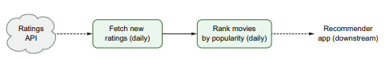
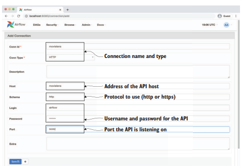
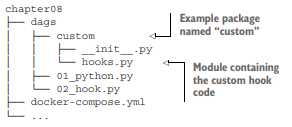
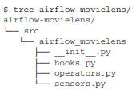
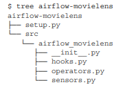
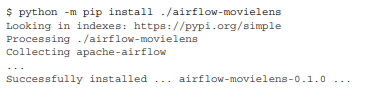
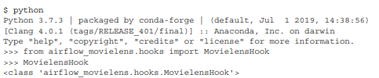

# Chapter8 커스텀 컴포넌트 빌드
- 커스텀 컴포넌트로 DAG을 모듈화하여 간결하게 만들기
- 커스텀 훅의 설계와 구현
- 커스텀 오퍼레이터의 설계와 구현
- 커스텀 센서의 설계와 구현
- 커스텀 컴포넌트를 기본 파이썬 라이브러리로 배포하기

> Airflow가 지원하지 않는 시스템에서 태스크를 실행해야할때, PythonOperator사용이 가능하지만  
> 단순 반복적인 코드가 필요해 재사용하기 힘들 때, 커스텀 컴포넌트를 사용한다.

## 8.1 PythonOperator로 작업하기
  
API를 통해 영화 평점 데이터를 받아오고, 인기 영화 랭킹을 생성하게끔 하는 프로젝트

### 8.1.1 영화 평점 API 시뮬레이션하기
데이터 출처 : https://grouplens.org/datasets/movielens/  
데이터를 API로 가져오는건 Flask를 활용해 구현한다.

```python
# 루트 화면
@app.route("/")
def hello():
    return "Hello from the Movie Rating API!"

# /ratings 요청 시 데이터를 리턴하는 API
# /ratings에 접근하기 위해선 로그인이 필요하다.
@app.route("/ratings")
@auth.login_required
def ratings():
    start_date_ts = _date_to_timestamp(request.args.get("start_date", None))
    end_date_ts = _date_to_timestamp(request.args.get("end_date", None))

    # 데이터를 받아올 시작위치 offset 
    offset = int(request.args.get("offset", 0))

    # 한번에 가져오는 레코드 수 
    limit = int(request.args.get("limit", DEFAULT_ITEMS_PER_PAGE))

    ratings_df = app.config.get("ratings")

    if start_date_ts:
        ratings_df = ratings_df.loc[ratings_df["timestamp"] >= start_date_ts]

    if end_date_ts:
        ratings_df = ratings_df.loc[ratings_df["timestamp"] < end_date_ts]

    subset = ratings_df.iloc[offset : offset + limit]

    return jsonify(
        {
            "result": subset.to_dict(orient="records"),
            "offset": offset,
            "limit": limit,
            "total": ratings_df.shape[0],
        }
    )
```

```
http://localhost:5000/ratings?offset=100
http://localhost:5000/ratings?limit=1000
http://localhost:5000/ratings?start_date=2019-01-01&end_date=2019-01-02
```
위와같이 증분 방식으로 로드하는 것이 가능하다.

### 8.1.2 API에서 평점 데이터 가져오기
파이썬으로 해당 API에 액세스하기 위해 requests라이브러리를 사용한다.  
API에 요청을 위해선 Session클래스를 사용해 requests세션을 생성해야 한다.
```python
import requests
session = requests.Session()
```
생성된 session객체는 get메소드를 사용해 평점 데이터를 받아올 수 있다.

```python
response = session.get(
    "http://localhost:5000/reatings",
    params={
        "start_date": "2019-01-01",
        "end_date": "2019-01-02, 
    },
)
```
이와 같이 호출을 하게 되면 HTTP 요청의 결과인 response객체를 반환 받을 수 있다.  
이때 response 객체의 raise_for_status 메소드를 활용해 쿼리의 정상 수행여부를 체크할 수 있다.
한편, json() 메소드를 활용해 쿼리 결과를 받아올 수도 있다.  

하지만, 위 상태로 수행하면, 로그인 인증 정보를 포함하지 않기 때문에 실패하게된다.  
로그인정보를 session에 포함시켜야한다.

```python
movielens_user = "airflow"
movielens_password = "airflw"
session.auth = (movielens_user, movielens_password)
```

_get_session함수에 인증 정보를 가진 세션의 생성과 처리 기능을 캡슐화를 진행한다.
```python
MOVIELENS_HOST = os.environ.get("MOVIELENS_HOST", "movielens") # 환경변수에서 API의 설정정보 수집
MOVIELENS_SCHEMA = os.environ.get("MOVIELENS_SCHEMA", "http") 
MOVIELENS_PORT = os.environ.get("MOVIELENS_PORT", "5000")

MOVIELENS_USER = os.environ["MOVIELENS_USER"] # 환경변수에서 사용자 이름/패스워드 가져오기
MOVIELENS_PASSWORD = os.environ["MOVIELENS_PASSWORD"]

def _get_session():
    # 세션 객체를 생성한다.
    session = requests.Session()
    session.auth = (MOVIELENS_USER, MOVIELENS_PASSWORD)

    # API Base url정보를 입력한다.
    schema = MOVIELENS_SCHEMA
    host = MOVIELENS_HOST
    port = MOVIELENS_PORT

    base_url = f"{schema}://{host}:{port}"

    return session, base_url
```
위와 같이 구현을 한다면 요청 세션에 대한 기초적인 구성은 완성된다.  
이제부터는 API결과의 페이지 처리 기능을 구현해야 한다.  
```python
def _get_with_pagination(session, url, params, batch_size=100):
    # 받은 레코드 수와 예상 레코드 수를 추적하면서 보관한다.
    offset = 0 
    total = None

    # 모든 레코드들을 다 받을때까지 반복하며, 첫번째 루프에서는 None인지 체크한다.
    while total is None or offset < total:
        # 신규 페이지를 가져올때, 주어진 오프셋에서 시작한다.
        response = session.get(
            url, 
            params={
                **params, 
                **{"offset": offset, "limit": batch_size}
            }
        )

        response.raise_for_status()
        response_json = response.json() # 결과상태를 체크하고, JSON을 파싱한다.

        yield from response_json["result"] # 가져온 레코드들을 호출자에게 yeild한다.

        #offset과 total을 업데이트한다.
        offset += batch_size
        total = response_json["total"]
```

yeild from을 통해 각 평점 레코드들의 제너레이터를 효과적으로 전달함으로써 결과 페이지 처리에 신경을 많이 안써도 된다.

```python
def _get_ratings(start_date, end_date, batch_size=100):
    session, base_url = _get_session() # API의 요청세션과 기본 URL을 가져온다.

    # 레코드들의 집합을 명확하게 가져오기 위해 페이지 처리 함수를 만들어 사용한다.
    yield from _get_with_pagination( 
        session=session,
        url=base_url + "/ratings", # 평점 API엔드포인트에 대한 URL 생성
        params={"start_date": start_date, "end_date": end_date}, #시작/종료날짜 파라미터
        batch_size=batch_size, # 한 페이지의 레코드 개수 배치사이즈 조정
    )

# 사용예시
ratings = _get_ratings(session, base_url + "/ratings") 
next(ratings) # 한페이지의 레코드만 가져오거나
list(ratings) # 배치에 대한 모든 데이터를 가져온다.
```

### 8.1.3 실제 DAG 구축하기
```python
def _fetch_ratings(templates_dict, batch_size=1000, **_):
        logger = logging.getLogger(__name__) # 로깅을 이용하여 동작에 대한 피드백 제공

        start_date = templates_dict["start_date"] # 템플릿으로 된 시작/종료날짜
        end_date = templates_dict["end_date"]
        output_path = templates_dict["output_path"] # 템플릿으로 된 아웃풋 경로

        logger.info(f"Fetching ratings for {start_date} to {end_date}")
        ratings = list( # _get_ratings함수 호출시 list로 반환
            _get_ratings(
                start_date=start_date, end_date=end_date, batch_size=batch_size
            )
        )
        logger.info(f"Fetched {len(ratings)} ratings")

        logger.info(f"Writing ratings to {output_path}")

        # Make sure output directory exists.
        output_dir = os.path.dirname(output_path) # 출력 디렉토리가 존재하지 않으면 생성
        os.makedirs(output_dir, exist_ok=True) 

        with open(output_path, "w") as file_: # JSON파일로 작성
            json.dump(ratings, fp=file_)

fetch_ratings = PythonOperator( # 파이썬 오퍼레이터 태스크 생성
    task_id="fetch_ratings",
    python_callable=_fetch_ratings,
    templates_dict={
        "start_date": "{{ds}}",
        "end_date": "{{next_ds}}",
        "output_path": "/data/python/ratings/{{ds}}.json",
    },
)
```
이후, 평점 데이터를 가져온 후 영화의 랭킹을 만들기 위해 rank_movies라는 단계를 추가하여 적용한다.

```python
import pandas as pd


# 랭킹에 대한 헬퍼 함수
def rank_movies_by_rating(ratings, min_ratings=2):
    ranking = (
        ratings.groupby("movieId")
        .agg( # 영화의 평균 평점과 평점 총 개수 계산
            avg_rating=pd.NamedAgg(column="rating", aggfunc="mean"),
            num_ratings=pd.NamedAgg(column="userId", aggfunc="nunique"),
        )
        .loc[lambda df: df["num_ratings"] > min_ratings] # 최소 평점 개수 기준으로 영화 필터링
        .sort_values(["avg_rating", "num_ratings"], ascending=False) # 평균평점기준으로 정렬
    )
    return ranking


def _rank_movies(templates_dict, min_ratings=2, **_):
    input_path = templates_dict["input_path"]
    output_path = templates_dict["output_path"]

    ratings = pd.read_json(input_path) # 지정된 입력 경로에서 평점데이터 읽기
    ranking = rank_movies_by_rating(ratings, min_ratings=min_ratings) # 헬퍼함수사용

    output_dir = os.path.dirname(output_path) # 출력 디렉토리가 없으면 생성
    os.makedirs(output_dir, exist_ok=True)

    ranking.to_csv(output_path, index=True) # csv파일로 저장


rank_movies = PythonOperator( # PythonOperator 내에서 _rank_movies 함수 사용
    task_id="rank_movies",
    python_callable=_rank_movies,
    templates_dict={
        "input_path": "/data/python/ratings/{{ds}}.json",
        "output_path": "/data/python/rankings/{{ds}}.csv",
    },
)

fetch_ratings >> rank_movies # 데이터 수집 태스크와 랭킹 태스크 연결
```
첫번째 단계는 평점 데이터를 가져오는 것이고, 두번째 단계는 영화의 랭크를 만드는 것이다.  
이 DAG을 스케쥴링하여 매일 수행되게 함으로써 랭킹을 만들 수 있다.


## 8.2 커스텀 훅 빌드하기
PythonOperator로도 작성이 가능하지만, 복잡하고, 캡슐화하여 재사용할 수 있도록 작성할 수 있다. 
그런 방법이 Hook으로 만드는 것이다.
> hook : 외부 시스템과 관리하고 시스템과 작용하는데 필요한 로직을 제공하는 컴포넌트이다.  
> 외부 DB나 클라우드 서비스, API 등 다양한 외부시스템에 연결하여 데이터를 읽거나 쓸 수 있다.

```python
hook = MovielensHook(conn_id="movieles") # 훅 생성
ratings = hook.get_ratings(start_date, end_date) # 훅을 사용해 특정 작업 수행
hook.close() # 훅을 닫고 사용된 리소스를 해제 한다.
```
- 훅을 사용하게 되면 DB와 UI를 통해 자격증명과 연결된 관리기능을 사용할 수 있다.
- 수동으로 자격증명 정보를 DAG에 넣지 않아도 된다.

### 8.2.1 커스텀 훅 설계하기
- 모든 훅은 BaseHook클래스의 서브클래스로 생성한다.

> 자격증명 정보를 등록하기  



```python
import requests

from airflow.hooks.base_hook import BaseHook

class MovielensHook(BaseHook): # 모든 Hook은 BaseHook을 상속 받는다.
    DEFAULT_SCHEMA = "http"
    DEFAULT_PORT = 5000
    
    # 생성자 메소드
    def __init__(self, conn_id, retry=3): # conn_id는 훅에게 어떤 커넥션을 사용하는지 전달한다.
        super().__init__() # BaseHook 클래스의 생성자 호출
        self._conn_id = conn_id # 커넥션 ID를 꼭 저장해야한다.
        self._retry = retry

        self._session = None    # 기본적으로 session과 base_url은 None으로 설정한다.
        self._base_url = None

    def __enter__(self):
        return self

    def __exit__(self, exc_type, exc_val, exc_tb):
        self.close()

    # _get_session메서드 부분을 재사용한다.
    # 결과적으로 API에 대해 인증된 커넥션을 만들 수 있다.
    def get_conn(self):
        # 자격증명을 위해선 메타스토어를 읽어와야하기에 
        # 싱글톤패턴(?)으로 작성한다.
        if self._session is None: # 세션이 None이면 커넥션을 새로 생성하고,
            config = self.get_connection(self._conn_id) # BaseHook에서 기본제공
            # 메타스토어에 있는 커넥션 IUD에 대한 연결 세부 정보를 가져온다.

            if not config.host:
                raise ValueError(f"No host specified in connection {self._conn_id}")

            # 스키마, 포트, base_url, 세션 등을 정의한다.
            schema = config.schema or self.DEFAULT_SCHEMA 
            port = config.port or self.DEFAULT_PORT

            self._base_url = f"{schema}://{config.host}:{port}"

            self._session = requests.Session() 

            # 자격증명을 위해 Airflow 웹UI Connection항목에서 
            # 새로운 자격증명을 입력하고 관리할 수 있다.
            if config.login:
                self._session.auth = (config.login, config.password)

        return self._session, self._base_url

    def close(self):
        if self._session:
            self._session.close()
        self._session = None
        self._base_url = None


    def get_movies(self):
        raise NotImplementedError()

    def get_users(self):
        raise NotImplementedError()

    # /ratings 엔드포인트에서 영화 평점을 가져오고 get_with_pagination을 통해 페이징 처리를 한다.
    def get_ratings(self, start_date=None, end_date=None, batch_size=100):

        yield from self._get_with_pagination(
            endpoint="/ratings",
            params={"start_date": start_date, "end_date": end_date},
            batch_size=batch_size,
        )


    def _get_with_pagination(self, endpoint, params, batch_size=100):

        session, base_url = self.get_conn() # 세션과 base_url생성
        url = base_url + endpoint

        offset = 0
        total = None
        while total is None or offset < total:
            response = session.get(
                url, params={**params, **{"offset": offset, "limit": batch_size}}
            )
            response.raise_for_status()
            response_json = response.json()

            yield from response_json["result"]

            offset += batch_size
            total = response_json["total"]
```

MovieLens API Hook역할
- get_ratings(시작일자, 종료일자, 배치사이즈) 호출시 
- 커넥션 연결 후 오프셋에서 배치사이즈만큼 데이터를 받아와 response_json를 yeild한다.

### 8.2.2 MovielensHook로 DAG 빌드하기
  
커스텀 패키지를 가지는 DAG디렉토리 구조.

다음은 MovielensHook을 사용한 예시를 살펴보자.
```python
from custom.hooks import MovielensHook


with DAG(
    dag_id="02_hook",
    description="Fetches ratings from the Movielens API using a custom hook.",
    start_date=dt.datetime(2019, 1, 1),
    end_date=dt.datetime(2019, 1, 10),
    schedule_interval="@daily",
) as dag:

    def _fetch_ratings(conn_id, templates_dict, batch_size=1000, **_):
        logger = logging.getLogger(__name__)

        start_date = templates_dict["start_date"]
        end_date = templates_dict["end_date"]
        output_path = templates_dict["output_path"]

        logger.info(f"Fetching ratings for {start_date} to {end_date}")
        hook = MovielensHook(conn_id=conn_id) # 훅 생성
        # ratings 내역을 리스트로 받아온다.
        ratings = list(
            hook.get_ratings(
                start_date=start_date, end_date=end_date, batch_size=batch_size
            )
        )
        logger.info(f"Fetched {len(ratings)} ratings")

        logger.info(f"Writing ratings to {output_path}")

        output_dir = os.path.dirname(output_path)
        os.makedirs(output_dir, exist_ok=True)

        # 결과를 json파일로 저장한다.
        with open(output_path, "w") as file_:
            json.dump(ratings, fp=file_)

    PythonOperator(
        task_id="fetch_ratings",
        python_callable=_fetch_ratings,
        op_kwargs={"conn_id": "movielens"}, # 사용할 커넥션 지정
        templates_dict={
            "start_date": "{{ds}}",
            "end_date": "{{next_ds}}",
            "output_path": "/data/custom_hook/{{ds}}.json",
        },
    )
```
이후 Movielens API와 같은 복잡한 작업은 MovielensHook에서 처리하게 된다.


## 8.3 커스텀 오퍼레이더 빌드하기
- 훅을 생성하였지만,  여전히 시작/종료날짜, 파일저장에 대해 많은 반복적인 코드작성이 필요하다.  
- 태스크 수행 시 코드 반복을 최소화 할 수 있도록 커스텀 Operator 빌드기능을 제공한다.


### 8.3.1 커스텀 오퍼레이터 정의하기
- 기본적으로 모든 오퍼레이터는 BaseOperator를 상속받는다.
```python
class MovielensFetchRatingsOperator(BaseOperator): # BaseOperator 상속
   
    template_fields = ("_start_date", "_end_date", "_output_path")

    @apply_defaults # 기본 DAG 인수를 커스텀 오퍼레이터에 전달하기 위한 데커레이터
    def __init__(
        self,
        conn_id,
        output_path,
        start_date="{{ds}}",
        end_date="{{next_ds}}",
        batch_size=1000,
        **kwargs, # BaseOperator 생성자에게 전달할 추가 키워드 인수
    ):
        super(MovielensFetchRatingsOperator, self).__init__(**kwargs)

        self._conn_id = conn_id
        self._output_path = output_path
        self._start_date = start_date
        self._end_date = end_date
        self._batch_size = batch_size
    ...
```

BaseOperator클래스는 오퍼레이터의 일반적인 동작을 정의하는 제네릭 인수들을 많이 갖고 있기   
때문에, 모두 나열하지 않기 위해 __init__ 에 인수 전달 시, **kwargs구문을 사용한다.

- 오퍼레이터가 실제로 작업해야 하는 사항을 execute메서드에 구현한다.
- execute메서드는 커스텀 오퍼레이터를 실행할 때, 호출되는 메인 메서드이다.
- 파라미터로는 context만을 전달받고 이 파라미터는 dict타입 객체이다.

### 8.3.2 평점 데이터를 가져오기 위한 오퍼레이터 빌드하기

```python
import json
import os

from airflow.models import BaseOperator
from airflow.utils.decorators import apply_defaults

from custom.hooks import MovielensHook


class MovielensFetchRatingsOperator(BaseOperator):
    # 커스텀 오퍼레이터에서 템플릿화할 인스턴스 변수들을 Airflow에게 알려준다.
    template_fields = ("_start_date", "_end_date", "_output_path")

    @apply_defaults
    def __init__(
        self,
        conn_id,
        output_path,
        start_date="{{ds}}",
        end_date="{{next_ds}}",
        batch_size=1000,
        **kwargs,
    ):
        super(MovielensFetchRatingsOperator, self).__init__(**kwargs)

        self._conn_id = conn_id
        self._output_path = output_path
        self._start_date = start_date
        self._end_date = end_date
        self._batch_size = batch_size

    def execute(self, context):
        hook = MovielensHook(self._conn_id) # 훅 인스턴스 생성

        try:
            self.log.info(
                f"Fetching ratings for {self._start_date} to {self._end_date}"
            )
            # 훅을 사용하여 평점데이터 가져오기
            ratings = list(
                hook.get_ratings(
                    start_date=self._start_date,
                    end_date=self._end_date,
                    batch_size=self._batch_size,
                )
            )
            self.log.info(f"Fetched {len(ratings)} ratings")
        finally:
            hook.close() # 훅을 닫아서 사용된 리소스 해제

        self.log.info(f"Writing ratings to {self._output_path}")

        output_dir = os.path.dirname(self._output_path) # 출력 디렉토리 없으면 생성
        os.makedirs(output_dir, exist_ok=True)

        # JSON파일로 저장
        with open(self._output_path, "w") as file_:
            json.dump(ratings, fp=file_)
```
> 위 오퍼레이터가 _fetch_rating함수와 유사하지만 다른부분은   
> 오퍼레이터 인스턴스를 생성할때 받은 변수 값을 사용하기 위해 self에서 파라미터를 가져온다는 점이다.
- BaseOperator에서는 logger를 사용할 수 있도록 제공하여 self.log로 사용이 가능하다.

위 오퍼레이터를 사용하는 것은 쉽다.
```python
with DAG(
    dag_id="03_operator",
    description="Fetches ratings from the Movielens API using a custom operator.",
    start_date=dt.datetime(2019, 1, 1),
    end_date=dt.datetime(2019, 1, 10),
    schedule_interval="@daily",
) as dag:
    MovielensFetchRatingsOperator(
        task_id="fetch_ratings",
        conn_id="movielens",
        start_date="{{ds}}",
        end_date="{{next_ds}}",
        output_path="/data/custom_operator/{{ds}}.json",
    )
```


## 8.4 커스텀 센서 빌드하기
- 커스텀 센서 또한 BaseSensorOperator를 활용해 커스텀해서 구현할 수 있다.
- execute대신 poke를 통해 구현하고, True/False를 리턴하도록한다.

```python
class MovielensRatingsSensor(BaseSensorOperator):
    # 센서가 오퍼레이터의 특정 유형이기에 오퍼레이터를 구현할 때 사용했던 것과 같은 설정을 사용한다.
    template_fields = ("_start_date", "_end_date")
    @apply_defaults

    def __init__(self, conn_id, start_date="{{ds}}", end_date="{{next_ds}}", **kwargs):
        super().__init__(**kwargs) # 이 역시 센서가 오퍼레이터 특정유형이기 때문에...
        self._conn_id = conn_id
        self._start_date = start_date
        self._end_date = end_date

    def poke(self, context):
        # 훅 객체 생성 
        hook = MovielensHook(self._conn_id)

        try:
            # 훅에서 레코드 하나 가져오는 것을 시도한 후, 가능하면 return True
            next(
                hook.get_ratings(
                    start_date=self._start_date, end_date=self._end_date, batch_size=1
                )
            )
            self.log.info(
                f"Found ratings for {self._start_date} to {self._end_date}, continuing!"
            )
            return True
        except StopIteration:
            self.log.info(
                f"Didn't find any ratings for {self._start_date} "
                f"to {self._end_date}, waiting..."
            )
            return False
        finally:
            hook.close()
```

```python
with DAG(
    dag_id="04_sensor",
    description="Fetches ratings from the Movielens API, with a custom sensor.",
    start_date=dt.datetime(2019, 1, 1),
    end_date=dt.datetime(2019, 1, 10),
    schedule_interval="@daily",
) as dag:
    # 사용 가능한 레코드를 기다리는 센서
    wait_for_ratings = MovielensRatingsSensor(
        task_id="wait_for_ratings",
        conn_id="movielens",
        start_date="{{ds}}",
        end_date="{{next_ds}}",
    )

    # 센서에서 True 리턴할 시 레코드를 가져오는 오퍼레이터
    fetch_ratings = MovielensFetchRatingsOperator(
        task_id="fetch_ratings",
        conn_id="movielens",
        start_date="{{ds}}",
        end_date="{{next_ds}}",
        output_path="/data/custom_sensor/{{ds}}.json",
    )

    wait_for_ratings >> fetch_ratings
```


## 8.5 컴포넌트 패키징하기
위에서 만든 방식은 다른 프로젝트에서 사용하거나 다른 살마에게 공유할 경우 부적합하다.  
적합한 방법으로는 파이썬 패키지에 코드를 넣는 것이다.  
Airflow 구성 환경에 커스텀 컴포넌트를 설치할 때, 다른 패키지와 비슷한 방법으로 작업할 수 있다는 장점이 있다.


### 8.5.1 파이썽 패키지 부트스트랩 작업하기
패키지를 만드는 방법
1) airflow_movielens라는 패키지를 생성한다
```bash
mkdir -p airlfow-movielens
cd airflow-movielens
```

2) src라는 하위 디렉토리를 만들고 airflow_movielens라는 디렉토리를 또 만든다.  
이후, src/airflow_movielens 안에 __init__.py파일을 생성한다.
3) src/airflow_movielens 안에 앞서 작성한 hooks과 operator, sensor파일을 넣는다.  


4) setuptools패키지를 이용해 setup.py파일을 만들어 포함시킨다.
```python
import setuptools

# 패키지에 필요한 파이썬 패키지 리스트
requirements = ["apache-airflow", "requests"] 

setuptools.setup(
    # 패키지의 이름과 버전, 설명
    name="airflow_movielens",
    version="0.1.0",
    description="Hooks, sensors and operators for the Movielens API.",
    # 패키지 개발자 세부사항(메타데이터)
    author="Anonymous",
    author_email="anonymous@example.com",
    # setuptools에게 패키지 종속성 제공
    install_requires=requirements,
    # setuptools에게 패키지의 파이썬 파일 위치 제공 
    packages=setuptools.find_packages("src"),
    package_dir={"": "src"},
    # 패키지의 홈페이지
    url="https://github.com/example-repo/airflow_movielens",
    # vozlwl roqkf zhem fkdltpstm wjdqh
    license="MIT license",
)
```

- name : 패키지의 이름을 정의
- version : 패키지의 버전 번호
- install_requires : vozlwldp vlfdygks whdthr fkdlvmfjfl ahrfhr
- packages/package_dir : 설치 시 포함되어야 할 패키지들과 위치를 setuptools에게 전달 (src Dir)
- author : 패키지 개발자
- author_email : 저자의 연락처 정보
- description : 패키지 설명(한줄로)
- url : 온라인에서 패키지를 찾을 수 있는 위치
- license : 패키지 코드를 배포할 때 적용되는 라이선스  


### 8.5.2 패키지 설치하기




> 패키지를 배포하는 방법
> 1) 깃헙 저장소에서 직접 설치  
>   python -m install git+http://github.com/~
> 2) PyPI같이 pip 패키지 피드를 사용해 설치  
>   python -m pip install airflow_movielens