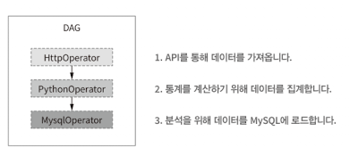

# Chapter10. 컨테이너에서 태스크 실행하기

주차: 5주차
발표: 선재님
상태: 완료
생성 일시: 2024년 9월 2일 오후 2:26
선택: 파트2. 중급편

# 다양한 오퍼레이터를 쓸 때 고려해야할 점

### 예시



- 비교적 간단한 DAG도 API를 액세스 하기 위해 3가지 오퍼레이터를 사용하고 있음

### 오퍼레이터 인터페이스 및 구현하기

- 각 태스크에 서로 다른 오퍼레이터 사용할 때 각 오퍼레이터 별 인터페이스와 내부 동작에 익숙해져야한다.
- 버그 발생시 근본적인 문제를 추적하고 수정해야 한다.
- 다수의 서로 다른 오퍼레이터를 사용하는 상황에서 모든 오퍼레이터를 함께 구성하는 것은 어려울 수 있음

### 복잡하며 종속성이 충돌하는 환경

- 오퍼레이터마다 각각의 종속성을 요구
    - 예 ) HttpOperator → HTTP 요청을 위해 request 라이브러리에 종속적
        
        MySQLOperator → MySQL 통신을 위해 파이썬 및 시스템 레벨에서 종속성
        
- 따라서 모든 종속성을 Airflow 스케줄러를 실행하는 환경뿐만아니라 Airflow 워커 자체에도 설치되어야 함
- 다양한 오퍼레이터를 사용할 때는 다양한 종속성을 위한 많은 모듈이 설치되어야 하기 때문에 잠재적 충돌 발생
- 환경 설정 및 유지 관리가 매우 복잡해짐


### 제네릭 오퍼레이터 지향

- 다양한 오퍼레이터와 그 종속성을 사용하고 유지하는 것이 어렵기 때문에 일부에서는 Airflow 태스크를 실행하기 위해 하나의 제네릭 오퍼레이터를 사용하는 것이 낫다고 주장
- 이 접근 방식의 장점 : 한 종류의 오퍼레이터만 익숙해지면 된다.
- 모든 사용자가 동일한 오퍼레이터를 사용하여 테스크를 실행하면, 이렇게 많이 사용되는 오퍼레이터에서는 그만큼 버그 발생 가능성 감소
- 하나의 오퍼레이터만 있다면, 단일 오퍼레이터에 필요한 하나의 Airflow 종속성 집합만 관리하면 된다.
- 종속성 패키지를 설치하고 관리하지 않아도 동시에 다양한 태스크 실행할 수 있는 제네릭 오퍼레이터는 ? → 컨테이너가 가능하게 함

# 컨테이너 소개하기

- 컨테이너 : 애플리케이션에 필요한 종속성을 포함하고 서로 다른 환경에서 균일하게 쉽게 배포할 수 있는 기술

### 컨테이너란 무엇인가?

- 배포할 때 운영체제 간의 차이, 설치된 종속성 및 라이브러리의 변형, 하드웨어의 차이 등을 포함하여 다양한 요소를 조정하고 고려해야함
- 이런 복잡성을 관리하는 방법 = 가상화
- 가상화 : 클라이언트 운영체제 위에서 실행되는 가상 머신 어플리케이션
    - 애플리케이션은 가상 OS만 바라봄
    - 단점 : 호스트 OS위에서 OS 전체를 실행해야하기 때문에 상당히 무거움
    - 모든 새 VM은 자체 게스트 OS를 실행하므로, 단일 시스템에서 여러개의 VM 애플리케이션을 실행하려면 매우 큰 리소스가 필요함
- 따라서 컨테이너 기반 가상화가 개발되었다.
- 컨테이너 : VM보다 훨씬 가벼움, 호스트 OS의 커널 레벨의 기능을 사용하여 애플리케이션을 가상화함
    - 애플리케이션 종속성을 분리할 수 있지만, 각 애플리케이션을 위한 자체 OS를 구동할 필요가 없어 호슻트 OS에서 간단하게 활용 가능


<aside>
⚠️

*도커에 대한 내용은 생략!*

</aside>

# 컨테이너와 Airflow

## 컨테이너 내의 태스크

- Airflow로 태스크를 컨테이너로 실행 가능
    - DockerOperator
    - KubernetesPodOperator
- 이 오퍼레이터들은 실행되면 컨테이너 실행을 시작하고 컨테이너가 정상적으로 실행 완료될 때까지 기다린다.
- (평점가져오기 HttpOperator 사용 / 영화랭킹 지정 (PythonOperator) / 결과물 게시 (MySQL 기반 Operator)
- 도커 기반 접근 방식은 DockerOperator를 사용하여 이런 다양한 태스크를 대체하고 적절한 종속성을 가진 세 개의 서로 다른 도커 컨테이너에서 명령을 실행할 수 있다.


## 왜 컨테이너를 사용하는가?

> 위 접근 방식은 각 태스크에 대해 이미지를 빌드해야 한다.
일부 스크립트나 파이썬 함수로 구현하는 대신 도커 이미지로 구성하고 유지하는 것은 번거롭고 왜?해야하는지 이해 못할 수도!
> 

### 간편한 종속성 관리


- 여러 태스크를 위해 서로 다른 이미지를 생성하면 각 태스크에 필요한 종속성을 해당 이미지에만 설치할 수 있다.
- 태스크 간의 종속성 충돌이 발생하지 않는다.
- 태스크가 더 이상 워커 환경에서 실행될 필요가 없기 때문에 Airflow 워커 환경에 태스크에 대한 종속성을 설치할 필요가 없다.

### 다양한 태스크 실행 시에도 동일한 접근 방식을 제공

- 각 테스크가 동일한 인터페이스를 가질 수 있음
- DockerOperator로만 동일한 태스크로 운영할 수 있다
- 이미지 구성 및 실행 명령에만 약간의 차이 존재
- **획일성을 통해 하나의 오퍼레이터만 학습한 후 DAG를 손쉽게 개발할 수 있다.**
- 오퍼레이터 관련 문제가 발생할 경우, 고민할 필요 없이 해당 오퍼레이터만 문제를 확인하고 수정!

### 향상된 테스트 가능성

- 실행하는 Airflow DAG와 별도로 개발 및 유지 관리할 수 있다.
- 각 이미지는 자체적으로 개발 라이프 사이클을 가지며, 기대하는 대로 작동하는 지 확인하는 전용 테스트 환경을 구성 가능
- 태스크가 컨테이너로 분리되어 있기 때문에 Airflow의 오케스트레이션 계층을 분리해 확장 테스트가 가능하다.
    - PythonOperator를 이용한다면, 긴밀하게 연결되어있기 때문에 오케스트레이션 계층의 탄력성/확장성 테스트가 어렵다

# 도커에서 태스크 실행하기

### DockerOperator

```python
rank_movies = DockerOperator(
    task_id = "rank_movies",
    image = "manning-airflow/movielens-ranking",
    command = [
        "rank_movies.py",
        "--input_path",
        "/data/ratings/{{ds}}.json",
        "--output_path",
        "/data/ranking/{{ds}}.csv"
    ],
    volumes = ["/tmp/airflow/data:/data"] # 컨테이너 내부에 마운트할 볼륨
)
```

- 특정한 인수를 사용하여 지정된 컨테이너 이미지를 실행하고, 컨테이너가 시작 작업을 완료할 때까지 대기하는 것
- docker run 명령과 동일한 기능 수행


- Docker 오퍼레이터 실행 방법
    1. Airflow 는 워커에게 태스크를 스케줄하여 실행하도록 지시한다.
    2. DockerOperator는 적절한 인수를 사용해 워커 시스템에서 docker run 명령을 실행한다.
    3. 도커 데몬이 이미지 레지스트리에서 필요한 도커 이미지를 가져온다
    4. 도커 이미지를 실행하는 컨테이너를 생성한다
    5. 로컬 볼륨을 컨테이너에 마운트한다.
    6. 명령이 완료된 후 컨테이너는 종료되고 DockOperato는 Airflow워커의 결과를 반환한다.

## 태스크를 위한 컨테이너 이미지 생성하기

- DockerOperator를 사용해 태스크를 실행하려면 먼저, 다양한 태스크에 필요한 도커 이미지를 빌드해야 한다.
- 도커 파일 생성, docker build 명령어를 사용해 필요한 이미지를 생성해야 함

> 예시를 위 영화 추천 DAG의 첫번째 태스크인 평점 가져오는 태스크 확인
> 
- 스캐폴딩(scaffolding) : 파이썬으로 CLI 스크립트를 생성하고 필요한 로직을 추가로 작성
    - click 사용

```python
# !/usr/bin/env python # 셔뱅 라인 : linux에 파있너을 사용하여 스크립트를 실행하도록 지시

import logging
import click

logging.basicConfig(level=logging.INFO) # 사용자에게 피드백을 제공하도록 로깅 설정

@click.command() # main함수를 click CLI 명령으로 변환
@click.opation( # 해당 유형 및 주석과 함께 CLI 명령어 옵션을 추가
    "--start_date",
    type = click.DateTime(formats = ["%Y-%m-%d"]),
    required = True,
    help = "Start date for rating.",
)

# 명령에 필요한 추가적인 옵션 추가
@click.option(
    
)

def main(start_date, ...) :
    """CLI script for fetching raitings from the movielens API."""
    ...
    
if __name__ == "__main__" : 
    main()
```

### 평점 스크립트

```python
#!/usr/bin/env python

from pathlib import Path

import logging
import json

import click
import requests

logging.basicConfig(level=logging.INFO)

@click.command()
@click.option(
    "--start_date",
    type=click.DateTime(formats=["%Y-%m-%d"]),
    required=True,
    help="Start date for ratings.",
)
@click.option(
    "--end_date",
    type=click.DateTime(formats=["%Y-%m-%d"]),
    required=True,
    help="End date for ratings.",
)
@click.option(
    "--output_path",
    type=click.Path(dir_okay=False),
    required=True,
    help="Output file path.",
)
@click.option(
    "--host", type=str, default="http://movielens:5000", help="Movielens API URL."
)
@click.option(
    "--user",
    type=str,
    envvar="MOVIELENS_USER",
    required=True,
    help="Movielens API user.",
)
@click.option(
    "--password",
    type=str,
    envvar="MOVIELENS_PASSWORD",
    required=True,
    help="Movielens API password.",
)
@click.option(
    "--batch_size", type=int, default=100, help="Batch size for retrieving records."
)
def main(start_date, end_date, output_path, host, user, password, batch_size):
    """CLI script for fetching movie ratings from the movielens API."""

    # Setup session.
    session = requests.Session() # HTTP 요청을 수행하기 위해 올바른 인증 세부 정보로 세션 정보 설정
    session.auth = (user, password)

    # Fetch ratings.
    logging.info("Fetching ratings from %s (user: %s)", host, user)

    ratings = list(
        _get_ratings(
            session=session,
            host=host,
            start_date=start_date,
            end_date=end_date,
            batch_size=batch_size,
        )
    )
    logging.info("Retrieved %d ratings!", len(ratings))

    # Write output.
    output_path = Path(output_path)

    output_dir = output_path.parent
    output_dir.mkdir(parents=True, exist_ok=True)

    logging.info("Writing to %s", output_path)
    with output_path.open("w") as file_:
        json.dump(ratings, file_)

def _get_ratings(session, host, start_date, end_date, batch_size=100):
    yield from _get_with_pagination(
        session=session,
        url=host + "/ratings",
        params={
            "start_date": start_date.strftime("%Y-%m-%d"),
            "end_date": end_date.strftime("%Y-%m-%d"),
        },
        batch_size=batch_size,
    )

def _get_with_pagination(session, url, params, batch_size=100):
    """
    Fetches records using a get request with given url/params,
    taking pagination into account.
    """

    offset = 0
    total = None
    while total is None or offset < total:
        response = session.get(
            url, params={**params, **{"offset": offset, "limit": batch_size}}
        )
        response.raise_for_status()
        response_json = response.json()

        yield from response_json["result"]

        offset += batch_size
        total = response_json["total"]

if __name__ == "__main__":
    main()
```

- HTTP 요청을 수행하기 위해 요청 세션 설정
- *get_*rating 함수를 사용해 API에서 정의된 기간의 평점 검색
- 레코드 리스트이며 JSON 출력 경로에 저장

```python
FROM python:3.8-slim

RUN python -m pip install click==7.1.1 requests==2.23.0 // 필요한 종속성 설치

COPY scripts/fetch_ratings.py /usr/local/bin/fetch-ratings // fetch_ratings 스크립트를 복사하고 실행 가능하게 만든다.
RUN chmod +x /usr/local/bin/fetch-ratings

ENV PATH="/usr/local/bin:${PATH}" // 스크립트가 PATH에 있는 지. ㅘㄱ인
```

- 도커파일 생성

## 도커 태스크로 DAG 구성하기

### 평점 가져오기 컨테이너 실행하기

```python
import datetime as dt
import os

from airflow import DAG
from airflow.providers.docker.operators.docker import DockerOperator

with DAG(
    dag_id="01_docker",
    description="Fetches ratings from the Movielens API using Docker.",
    start_date=dt.datetime(2019, 1, 1),
    end_date=dt.datetime(2019, 1, 3),
    schedule_interval="@daily",
) as dag:

    fetch_ratings = DockerOperator(
        task_id="fetch_ratings",
        image="manning-airflow/movielens-fetch", # DockerOpsrator에 movielens-fetch 이미지를 사용하도록 지시
        command=[
            "fetch-ratings", # 필요 인수 사용해 컨테이너에서 스크립트 실행
            "--start_date",
            "{{ds}}",
            "--end_date",
            "{{next_ds}}",
            "--output_path",
            "/data/ratings/{{ds}}.json",
            "--user",
            os.environ["MOVIELENS_USER"], # API 및 호스트 인증 세부정보 제공
            "--password",
            os.environ["MOVIELENS_PASSWORD"],
            "--host",
            os.environ["MOVIELENS_HOST"],
        ],
        network_mode="airflow", # 컨테이너가 airflow 도커 네트워크에 연결하면 API 호출 가능
        # Note: this host path is on the HOST, not in the Airflow docker container.
        volumes=["/tmp/airflow/data:/data"], # 데이터 저장할 볼륨을 마운트
    )

    rank_movies = DockerOperator(
        task_id="rank_movies",
        image="manning-airflow/movielens-rank", # movielens-ranking 이미지 사용
        command=[
            "rank-movies", # 필요한 입력/출력 경로로 rank-movies 스크립트를 호출
            "--input_path",
            "/data/ratings/{{ds}}.json",
            "--output_path",
            "/data/rankings/{{ds}}.csv",
        ],
        volumes=["/tmp/airflow/data:/data"],
    )

    fetch_ratings >> rank_movies
```


## 도커 기반 워크 플로

- 다른 DAG를 사용한 접근방식과 가장 큰 차이점
    - 다른 태스크를 위해 먼저 도커 컨테이너를 만들어야 한다.
1. 개발자는 필요한 이미지에 대한 도커파일을 만들고, 도커 파일은 필요한 소프트웨어 및 종속성을 설치한다. 
그 다음 개발자가 도커 파일을 사용하여 이미지를 작성하도록 도커에 지시
2. 도커 데몬은 개발 머신에 해당하는 이미지 구축
3. 도커 데몬은 이미지를 나중에 사용할 수 있도록 컨테이너 레지스트리에 게시
4. 개발자는 빌드 이미지를 참조하는 DockerOperators를 사용하여 DAG를 작성
5. DAG가 활성화된 후 Airflow는 DAG 실행을 시작하고 각 실행에 대한 DockerOperator 태스크를 스케줄
6. Airflow 워커는 DokerOperator 태스크를 선택하고 컨테이너 레지스트리에서 필요한 이미지를 가져옴
7. 각 태스크를 위해 Airflow 워커는 워커에 설치된 도커 데몬을 사용하여 해당 이미지와 인수로 컨테이너를 실행


# 쿠버네티스에서 태스크 실행

- 도커는 컨테이너화된 태스크를 단일 시스템에서 실행할 수 있는 접근 방식을 제공
- 하지만 여러 시스템에서 태스크를 조정하고 분산하는데는 도움이 되지 않음
- 접근 방식의 확장성이 제한된다
- 따라서 쿠버네티스와 같은 컨테이너 오케스트레이션 시스템 개발되어 컴퓨터 클러스터 전반에 걸쳐 컨테이너 된 애플리케이션을 확장할 수 있음

## 쿠버네티스

> 컨테이너화된 애플리케이션의 배포, 확장 및 관리에 초점을 맞춘 오픈 소스 컨테이너 오케스트레이션 플랫폼
> 
- 도커에 비해 컨텐이너를 여러 작업 노드에 배치해 관리하여 확장할 수 있도록 지원
- 동시에 스케줄링 시 필요한 리소스(CPU 또는 메모리), 스토리지 및 특수한 하드웨어 요구사항 등을 고려
- 쿠버네티스 마스터와 노드 두가지 구성요소
- 쿠버네티스 마스터 : 컨테이너화된 애플리케이션을 관리하는 주요 포인트
    - API 서버, 스케줄러 및 배포, 스토리지 등을 관리하는 기타 서비스를 포함하여 다양한 컴포넌트 실행
    - 쿠버네티스 API 서버는 kubectl 또는 쿠버네티스 파이썬 SDK와 같은 클라이언트에서 쿠버네티스를 쿼리하고 명령을 실행하여 컨테이너를 배포하는 데 사용
- 쿠버네티스 워커노드 : 스케줄러가 할당한 컨테이너 애플리케이션 실행하는 역할 (파드 : 쿠버네티스의 가장 작은 단위)
    - 단일 시스템에서 함께 실행해야 하는 컨테이너가 하나 이상 포함됨
- 보안 및 스토리지 관리를 위한 내장 기능 제공


## 쿠버네티스 설정하기

```python
kubectl cluster-info

# airflow 관련 리소스 및 태스크 파드가 포함될 쿠버네티스 네임스페이스
kubectl create namespace airflow
```

```yaml
apiVersion: v1
kind: PersistentVolumeClaim
metadata:
  name: data-volume
spec:
  storageClassName: manual
  accessModes:
    - ReadWriteOnce
  resources:
    requests:
      storage: 1Gi
---
apiVersion: v1
kind: PersistentVolume
metadata:
  name: data-volume
  labels:
    type: local
spec:
  storageClassName: manual
  capacity:
    storage: 1Gi
  accessModes:
    - ReadWriteOnce
  hostPath:
    path: "/tmp/data"
```

## KubernetesPodOperator

```python
import datetime as dt
import os

from kubernetes.client import models as k8s

from airflow import DAG
from airflow.providers.cncf.kubernetes.operators.kubernetes_pod import (
    KubernetesPodOperator,
)

with DAG(
    dag_id="02_kubernetes",
    description="Fetches ratings from the Movielens API using kubernetes.",
    start_date=dt.datetime(2019, 1, 1),
    end_date=dt.datetime(2019, 1, 3),
    schedule_interval="@daily",
    default_args={"depends_on_past": True},
) as dag:

    volume_claim = k8s.V1PersistentVolumeClaimVolumeSource(claim_name="data-volume")
    volume = k8s.V1Volume(name="data-volume", persistent_volume_claim=volume_claim)

    volume_mount = k8s.V1VolumeMount(
        name="data-volume", 
        mount_path="/data", # 볼륨을 마운트할 위치
        sub_path=None, 
        read_only=False # 쓰기 가능한 볼륨으로 마운트
    )

    fetch_ratings = KubernetesPodOperator(
        task_id="fetch_ratings",
        # Airflow 2.0.0a2 has a bug that results in the pod operator not applying
        # the image pull policy. By default, the k8s SDK uses a policy of always
        # pulling the image when using the latest tag, but only pulling an image if
        # it's not present (what we want) when using a different tag. For now, we
        # use this behaviour to get our desired image policy behaviour.
        #
        # TODO: Remove this workaround when the bug is fixed.
        #       See https://github.com/apache/airflow/issues/11998.
        #
        image="manning-airflow/movielens-fetch:k8s", # 사용할 이미지
        cmds=["fetch-ratings"], # 컨테이너 내부에서 실행할 실행 파알
        arguments=[ # 실행 파일에 전달할 인수
            "--start_date",
            "{{ds}}",
            "--end_date",
            "{{next_ds}}",
            "--output_path",
            "/data/ratings/{{ds}}.json",
            "--user",
            os.environ["MOVIELENS_USER"],
            "--password",
            os.environ["MOVIELENS_PASSWORD"],
            "--host",
            os.environ["MOVIELENS_HOST"],
        ],
        namespace="airflow",
        name="fetch-ratings",
        cluster_context="docker-desktop",
        in_cluster=False,
        volumes=[volume],
        volume_mounts=[volume_mount],
        image_pull_policy="Never",
        is_delete_operator_pod=True,
    )

		# 영화 랭킹 태스크 추가하기
    rank_movies = KubernetesPodOperator(
        task_id="rank_movies",
        image="manning-airflow/movielens-rank:k8s",
        cmds=["rank-movies"],
        arguments=[
            "--input_path",
            "/data/ratings/{{ds}}.json",
            "--output_path",
            "/data/rankings/{{ds}}.csv",
        ],
        namespace="airflow", # 파드를 실행할 쿠버네티스 네임스페이스
        name="rank-movies", # 파드에 사용할 이름
        cluster_context="docker-desktop", # 사용할 클러스터 이름 (쿠버네티스 클러스터가 여러 개 등록된 경우)
        in_cluster=False, # 쿠버네티스 내에서 Airflow 자체를 실행하지 않음을 지정함
        volumes=[volume], # 파드텡서 사용할 볼륨 및 볼륨 마운트
        volume_mounts=[volume_mount],
        image_pull_policy="Never",  # Airflow가 도커허브에서 이미지를 가져오는 대신 로컬에서 빌드된 이미지 사용하도록 지정
        is_delete_operator_pod=True, # 실행이 끝나면 자동으로 파드 삭제
    )

    fetch_ratings >> rank_movies
```

### 쿠버네티스 관련 문제 진단하기

- 문제 발생 시 태스크가 올바르게 끝나지 않고 실행 상태로 멈추는 경우 확인 가능
- 왜그럴까?
    - 일반적으로 쿠버네티스가 태스크 파드를 스케줄할 수 없기 때문
- 즉, 파드가 클러스터 내에서 실행되지 않고 보류 중인 상태가 된다.
- 해결하려면?
    - 로그를 보고 클러스터의 파드 상태에 대해 자세히 알아봐야한다.


- pending 상태로 멈춰있음

```python
# 태스크 파드를 조회 
kubectl --namespace airflow get pods

# 해당 파드를 식별하면 describe 하위 명령을 사용하여 파드 상태에 대한 자세한 내용을 쿠버에 요청 가능
kubectl --namespace describe pod [NAME-OF-POD]

# 상세 문제 진단시, 누락된 리소스를 생성하여 문제 해결
# 예제에서는 영구 볼륨 할당이 제대로 생성되지 않아서 파드가 예약되지 않았었음
kubectl --namespace airflow apply -f resources/data-volume.yml

# 볼륨을 생성 후, 파드를 스케줄할 수 있음
kubectl --namespace describe pod [NAME-OF-POD]
```

## 도커 기반 워크플로우와 차이점


1. 태스크 컨테이너가 더 이상 Airflow 워커 노드에서 실행되지 않고 쿠버네티스 클러스터 내에 별도의 노드에서 실행된다는 것
즉, 워커에서 사용되는 모든 리소스는 최소화되며, 쿠버네티스의 기능을 사용하여 적절한 리소스(CPU, 메모리, GPU)가 있는 노드에 태스크가 배포되었는지 확인 가능
2. 어떤 스토리지도 더 이상 Airflow 워커가 접근하지 않지만, 쿠버네티스 파드에서는 사용할 수 있어야 한다.
= 쿠버네티스를 통해 제공되는 스토리지를 사용하는 것
→ 파드에서 스토리지에 대한 적절한 액세스 권한이 있다면, 다른 유형의 네트워크/클라우드 스토리지를 사용할 수도 있다

- 전반적으로 쿠버네티스는 도커에 비해 확장성, 유연성 및 스토리지, 보안 등과 같은 리소스 관리 관점에서 장점을 가지고 있음
- Airflow 전체를 쿠버네티스에서 실행할 수 있다.