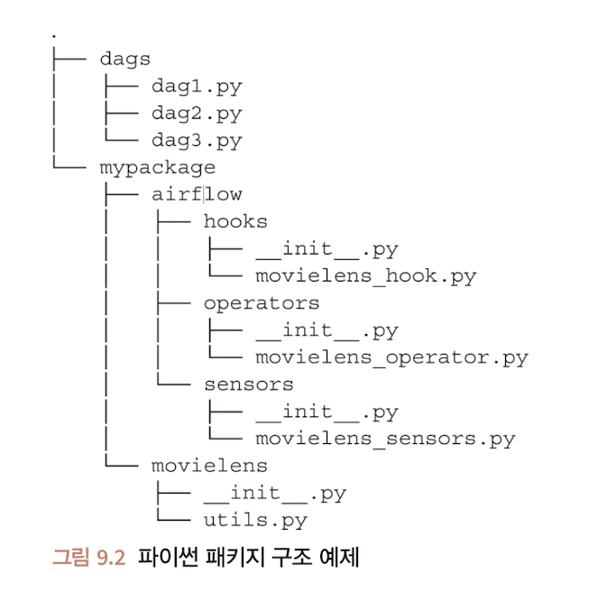

# Chapter9. 테스트하기

주차: 5주차
발표: 선재님
상태: 완료
생성 일시: 2024년 9월 2일 오후 2:03
선택: 파트2. 중급편

> 정상으로 동작하지 않는 Airflow의 로직을 어떻게 확인할 수 있는지, 어떻게 수정 및 대응해야하는지?
> 

# 테스트 시작하기

- 단위 테스트 : 올바른 동작 검증 가능 & 여러 단위로 구성된 시스템의 동작을 모두 검증하진 않는다.
- 통합 테스트 : 여러 구성 요소의 동작을 함께 검증
- 승인 테스트 : 통합 테스트 다음으로 진행하는 테스트 단계
- pytest 코드 스니펫
    - python unittest 말고 왜 pytest? → 대중적으로 많이 쓰이고, 격리 기능이 포함된 테스트 프레임워크

### 모든 DAG에 대한 무결성 테스트




```python
import glob
import importlib.util
import os

import pytest
from airflow.models import DAG

# DAG 파일을 보관하는 디렉터리 -> 반복적 탐색 
DAG_PATH = os.path.join(
    os.path.dirname(__file__), "..", "..", "dags/**/*.py"
)

DAG_FILES = glob.glob(DAG_PATH, recursive=True)

# DAG_FILE 안에 있는 모든 구성요소에 대해 테스트
@pytest.mark.parametrize("dag_file", DAG_FILES) 
def test_dag_integrity(dag_file) : 
    module_name, _ = os.path.splitext(dag_file)
    module_path = os.path.join(DAG_PATH, dag_file)
    mod_spec = importlib.util.spec_from_file_location(module_name, module_path)
    
    module = importlib.module_from_spec(mod_spec)
    mod_spec.loader.exec_module(module)
    
    dag_objects = [var for var in vars(module).values() if isinstance(var, DAG)]
    
    assert dag_objects
    for dag in dag_objects:
        dag.test_cycle()

```

- 테스트 결과는 길어지면 일반적으로 맨위 또는 맨 아래에서 결론 찾기 가능
- 윗부분 : 어떤 테스크가 실패했는지 / 아랫부분 : 실패한 이유가 무엇인지

## CI/CD 파이프라인 설정

- 지속적 배포 : 사람의 간섭없이 완전히 자동화된 코드를 프로덕션 시스템에 자동 배포
- CI/CD : 파이프라인이 정의된 YAML 구성 파일로 시작

```python
name: python static checks and test

on: [push]

jobs:
  testing:
    runs-on: ubuntu-18.04
    steps:
      - users: actions/checkout@v1
      - name: Setup python
        uses: actions/setup-python@v1
        with:
          python-version: 3.6.9
          architecture: x64

      - name: Install Flake8
        run: pip install Flake8
      - name: Run Flake8
        run: Flake8

      - name: Install Pylint
        run: pip install Pylint
      - name: Run Pylint
        run: find . -name "*.py" | xargs pylint --output-format=colorized

      - name: Install Black
        run: pip install Black
      - name: Run Black
        run: find . -name "*.py" | xargs black --check

      - name: Install dependencies
        run: pip install apache-airflow pytest

      - name: Test DAG integrity
        run: pytest tests/
```

### 단위 테스트 작성하기

- 사용자의 입력 값을 바로 전달하기 전에 해당 갑싱 유효한지 먼저 판단하는 절차를 구성한다.

```python
class MovielensPopularityOperator(BaseOperator) :
    
    def __init__(
        self,
        conn_id,
        start_date,
        end_date,
        min_rating=4,
        top_n=5,
        **kwargs,
    ):
        super().__init__(**kwargs)
        self._conn_id = conn_id
        self._start_date = start_date
        self._end_date = end_date
        self._min_rating = min_ratings
        self._top_n = top_n
        
    def execute(self, context):
        with MovielensHook(self._conn_id) as hook:
            ratings = hook.get_ratings(
                start_date = self._start_date,
                end_date = self._end_date,
            )
            
            rating_sums = defaultdict(Counter)
            for rating in ratings:
                rating_sums[rating["movieId"]].update(
                    count = 1,
                    rating=rating["rating"]
                )
            averages = {
                moivie_id: (
                    rating_counter["rating"] / rating_counter["count"],
                    rating_counter["count"]
                )
                for movie_id, rating_counter in rating_sums.items()
                if rating_counter["counter"] >= self._min_ratings
            }
            return sorted(
                avaerages.items(),
                key = lambda x: x[1],
                reverse = True
            )[:self._top_n]
```

## Pytest 프로젝트 구성하기

```python
def test_example():
    task = BashOperator(
        task_id = "test",
        bash_command = "echo hello!",
        xcom_push = True,
    )
    
result = task.execute(context={})
assert result == "hello!"
```

- BashOperator를 인스턴스화하고, 빈 콘텍스트(context = {}, 빈 dict)가 주어지며, execute() 함수를 호출함
- Airflow가 실제 운영 설정에서 오퍼레이터를 실행하면, 템플릿 변수를 확인하고, 태스크 인스턴스 콘텍스트를 설정하여 오퍼레이터에게 제공하는 등 여러 가지 작업을 실행 전후에 수행하게 된다.
- BashOperator를 실행하기 위해서 태스크 인스턴스 콘텍스트는 필요하지 않다.
- 따라서 빈 콘텍스트를 제공 & 만약 테스트에 태스크 인스턴스 콘텍스트의 처리가 필요한 경우에 필요한 키와 값으로 채워야 한다.

### 예시

```python
def test_movielenspopularityoperator() :
    task = MovielensPopularityOperator(
        task_id="test_id",
        start_date="2015-01-01",
        end_date="2015-01-03",
        top_n=5,
    )
    result = task.execute(context = {})
    assert len(result) == 5
```

- 가장 먼저 나타나는 것은 오퍼레이터에 필수 인수가 없음을 나타내는 텍스트


- 메타 스토어의 커넥션 ID를 가리키는 필수 인수 conn_id가 누락되어 테스트가 실패
- 이때, 테스트의 결괏값을 다른 쪽에 어떻게 전달할 수 있을까?
    - 테스트는 각각 격리된 환경에서 진행되어야 한다.
    - 다른 테스트의 결과가 다른 곳에 영향을 줄 수 없음
    - 테스트 사이에 발생하는 정보를 데이터 베이스를 이용해 전달하는 방법은 권장 X
- 때문에 **목업**을 이용해 해결

### 목업

- 특정 작업이나 객체를 모조로 만드는 것
- 예) 실제 운영환경에서는 예상되지만, 테스트 중에는 발생하지 않는 데이터베이스에 대한 호출을 실제 발생시키지 않는 대신, 특정 값을 반환하도록 파이썬 코드로 지시하여 임의의 값을 전달해 속이거나 모조하게 된다.
- 외부 시스템에 실제 연결하지 않고도 테스트를 개발하고 실행 가능

```python
pip install pytest-mock
```

```python
def test_movielenspopularityoperator(mocker) :
    mocker.patch.object(
        MovielensHook,
        "get_connection",
        return_value=Connection(
            conn_id="test",
            login="airflow",
            password="airflow",
        )
    )
    
    task = MovielensPopularityOperator(
        task_id = "test_id",
        conn_id = "test",
        start_date = "2015-01-01",
        end_Date = "2015-01-03",
        top_n = 5,
    )
    result = task.execute(context=None)
    assert len(result) == 5
```

> *몽키 패치 : 런타임 시에 기능을 대체하여 Airflow 메타스토어를 쿼리하는 대신 지정된 객체를 반환함*
> 
- get_connection() 호출은 몽키패치이며, 테스트 실행 시 MovielensHook.get_connection()은 실패하지 않는다.
- 테스트 중 존재하지 않는 데이터 베이스 호출은 수행하지 않고, 미리 정의된 예상 연결 객체를 반환하기 때문

```python
def test_movielenspopularityoperator(mocker) : # 목업 객체는 가져올 필요없이 런타임 시에 임의의 값으로 존재
    mock_get = mocker.patch.object(# 목업 객체로 객체의 속성을 패치
        MovielensHook, #패치할 객체
        "get_connection", # 패치할 함수
        return_Value = Connection( # 반환되는 값
            conn_id = "test", login = "ariflow", password = "airflow"),
    )
    task = MovielensPopularOperator(...)
```

- Connection 객체를 반환하여 테스트 시 외부 시스템(Airflow 메타스토어)에 대한 호출을 대체
- 테스트 시 실제로 호출이 되었는지 어떻게 확인함?
    - 패치된 객체를 여러 속성을 보유하는 변수에 할당 가능
- get_connection() 메서드가 한번만 호출 / get_connection()에 제공된 conn_id 인수가 MovielensPopularityOperator에 제공된 것과 동일한 값을 보유하고 있는지 확인

```python
mock_get = mocker.patch.object(# 목업 객체로 객체의 속성을 패치
    MovielensHook, #패치할 객체
    "get_connection", # 패치할 함수
    return_Value = Connection( # 반환되는 값
        conn_id = "test", login = "ariflow", password = "airflow"),
)
task = MovielensPopularityOperator(..., conn_id = "testconn")
task.execute(...)
assert mock_get.call_count == 1 # 한번만 호출되었는 지. ㅘㄱ인
mock_get.assert_called_with("testconn") # 예상되는 conn_id 로 호출된 것을 확인
```

- `MovielensPopularityOperator`에 실제 운영 설정에서 Airflow 메타스토어를 실수로 여러번 호출하지 않았는지 assert를 통해 확인
- `conn_id` 가 Airflow메타스토어에서 요청될 것으로 예상하며 `assert_called_with()` 를 사용하여 검증한다.

### 파이썬 목업 환경의 주의점

- 함정 : 잘못된 객체를 목업으로 구현하는 것
- **정의되는 위치가 아니라 호출되는 위치에서 목업을 구성해야한다.**

```python
from airflowbook.operators.movielens_operator import (
    MovielensPopulairtyOperator,
    MovielensHook
) # 호출되는 위치에서 목업 메서드를 가져와야 한다.

def test_movielenspopularityoperator(mocker) :
    mock_Get = mocker.patch.object(
        MovielensHook,
        "get_connection",
        return_value = Connection(...),
    )
    task = MovielensPopulairtyOperator(...) # MovielensPopularityOperator 코드 내에서 MovielkensHook.get_connection() 을 호출한다.
```

## 디스크 파일로 테스트 할 경우

- 파이썬 임시저장소와 관련된 작업을 위한 tempfile 모듈
    - 사용 후 디렉터리와 그 내용이 지워지기 때문에 파일 시스템에 해당 항목이 남지 않는다.

```python
from pathlib import Path
from airflowbook.operators.json_to_csv_operator import JsonToCsvOpeartor

def test_json_to_csv_operator(temp_path : Path) :
    # 경로 정의
    input_path = tmp_path / "input.json"
    output_path = tmp_path / "output.csv"   
    
    input_data = [
        {"name" : "bob", "age" : "41", "sex" : "M"},
        {"name" : "alice", "age" : "24", "sex" : "F"},
        {"name" : "carol", "age" : "60", "sex" : "F"}
    ]
    
    with open(input_path, "w") as f:
        f.write(json.dumps(input_data))
        
    operator = JsonToCsvOpeartor(
        task_id = "test",
        input_path = input_path,
        output_path = output_path,
    )
    
    operator.execute(context = {}) # JsonToCsvOperator 실행
    
    # 출력 파일 읽기
    with open(output_path, "r") as f:
        reader = csv.DictReader(f)
        result = [dict(row) for row in reader]
        
    assert result == input_data # 내용 확인을 위한 assert
```


- 테스트에 적용할 다양한 픽스처 생성

# 테스트에서 DAG 및 태스크 콘텍스트로 작업하기

- 일부 오퍼레이터는 실행을 위해 더 많은 콘텍스트 필요(예 : 변수 템플릿) 또는 작업 인스턴스 콘텍스트가 필요
    - `operator.execute(context={})`  형태로 오퍼레이터 실행 불가
    - 코드를 수행하는 데 필요한 어떤 태스크 콘텍스트도 오퍼레이터에게 제공되지 않기 때문


- 태스크 인스턴스 콘텍스트를 실행해야 하므로 이전 예제와 같이 테스트 할. ㅜ 없음
- 따라서 Airflow자체에서 태스크를 시작할 때 사용하는 실제 메서드인 `operator.run()` 을 호출한다.

### 이를 사용하려면 DAG에 오퍼레이터를 할당해야함

```python
# 테스트를 위한 기본인수를 가진 DAG
dag = DAG(
    "test_dag",
    default_args = {
        "owner" : "airflow",
        "start_date" : datetime.datetime(2019, 1, 1),
    },
    schedule_interval = "@daily"
)

# 템플릿 변수를 할당하기 위해 DAG로 테스트하기
def test_movielens_opeartor(tmp_path, mocker) :
    mocker.patch.object(
        MovielensHook,
        "get_connection",
        return_value = Connection(
            conn_id = "test", login = "airflow", password = "airflow"
        ),
    )
    
    dag = DAG(
        "test_dag",
        default_args = {
            "owner" : "airflow",
            "start_date" : datetime.datetime(2019, 1, 1),
        },
        schedule_interval = "@daily"
    )
    
    task = MovielensDownloadOperator(
        task_id = "test",
        conn_id = "testconn",
        start_date = "{{prev_ds}}",
        end_date = "{{ds}}",
        output_path = str(tmp_path / "{{ds}}.json"),
        dag = dag,
    )
    
    task.run(
        start_date = dag.default_args["start_date"],
        end_date = dag.default_args["start_date"]
    )
```


- 문제 : Airflow 메타스토어
- 태스크를 실행하기 위해 Airflow는 동일한 실행 날짜의 이전 태스크 인스턴스와 같은 다양한 정보를 데이터베이스에서 쿼리함
- 테스트 중 메타스토어를 처리하는 방법
    - 연결 자격 증명을 조회 시 모든 데이터베이스 호출에 대해 목업 환경 구성
        - But 번거로움
        - 보다 실용적인 접근방식은 Airflow가 테스트 실행 동안 쿼리할 수 있는 실제 메타스토어를 실행하는 것
    - `airflow db init`
        - 별도의 DB 구성이 ㅇ벗다면
        - `~/airflow/airflow.db` 에 저장된 SQLite 파일이 데이터베이스 역할을 수행
        - Airflow가 메타스토어를 찾을 수 있도록 동일한 AIRFLOW_HOME 값을 제공해야 한다.

```python
# 테스트 전체에서 DAG를 재사용하기 위핸 Pytest픽스처 예시
import datetime
import pytest
from airflow.models import DAG

@pytest.fixture
def test_dag(dag):
    return DAG(
        "test_dag",
        default_args = {
            "owner" : "airflow",
            "start_date" : datetime.datetime(2019, 1, 1)
        },
        schedule_interval = "@daily",
    )
```

```python
# 테스트에 픽스처를 포함하여 필요한 객체를 생성하기
def test_movielens_operator(tmp_path, mocker, test_dag) :
    mocker.patch.object(
        MovielensHook,
        "get_connection",
        return_value = Connection(
            conn_id = "test",
            login = "airflow",
            password = "airflow",
        ),
    )
    
    task = MovielensDownloadOpeartor(
        task_id = "test",
        conn_id = "testconn",
        start_date = "{{prev_ds}}",
        end_date = "{{ds}}",
        output_path = str(tmp_path / "{{ds}}.json"),
        dag = test_dag
    )
    task.run(
        start_date = dag.default_args["start_date"],
        end_date = dag.default_args["start_date"]
    )
```

## 외부 시스템 작업

- Movielens 평점을 읽고 결과를 Postgres 데이터베이스에 저장하는 MovielensToPostgresOperator와 같이 데이터베이스를 연결하는 오퍼레이터로 작업한다고 가정
- 소스데이터가 요청시점의 데이터만 제공하고 과거의 데이터를 제공할 수 없는 경우로, 사용자는 소스의 과거 데이터를 저장하길 원한다.

```
from airflow.hooks.postgres_hook import PostgresHook
from airflow.models import BaseOperator

from airflow.hooks.movielens_hook import MovielensHook

class MovielensToPostgresOperator(BaseOperator):
    template_fields = ("_start_date", "_end_date", "_insert_query")
    
    def __init__ (
        self,
        movielens_conn_id,
        start_date,
        end_date,
        postgres_conn_id,
        insert_query,
        **kwargs
    ):
        super().__init__(**kwargs)
        self._movielens_conn_id = movielens_conn_id
        self._start_date = start_date
        self._end_date = end_date
        self._postgres_conn_id = postgres_conn_id
        self._insert_query = insert_query
        
        
    def execute(self, context) :
        with MovielensHook(self._movielens_conn_id) as movielens_hook :
            ratings = list(movielens_hook.get_ratings(
                start_date = self._start_date,
                end_date = self._end_date)
            )
        
        postgres_hook = PostgresHook(
            postgres_conn_id = self._postgres_conn_id
        )
        insert_queries = [
            self._insert_query.format(
                ",".join([str(_[1]) for _ in sorted(ratings.items())] )
            )
            for rating in ratings
        ]
        postgres_hook.run(insert_queries)
```


- 만약 로컬PC로 운영중인 Postgres 데이터베이스에 접근할 수 없는 경우?
    - 도커로 테스트
    - 도커 컨테이너로 테스트하면 테스트를 위한 목업 환경을 구성할 필요없이 훅 메서드를 사용 가능

```python
pip install pytest_docker_tools 
```

```python
from pytest_docker_tools import fetch

postgres_image = fetch(repository = "postgres:11.1-alpine")

def test_call_fixture(postgres_image) :
		print(postgres_image.id)
```

- fetch 함수는 실행중인 시스템에서 `docker pull` 을 트리거하고, 가져온 이미지를 반환함
- fetch 함수 자체는 pytest 픽스처이므로 직접 호출할 수는 없지만 테스트 매개변수로 전달된다.


```python
from pytest_docker_tools import container

postgres_container = container(
    image = "{postgres_image.id}",
    ports = {"5432/tcp": None},
)

def test_call_fixture(postgres_container) :
    print(
        f"Running Postgres container named {postgres_container.name}",
        f"on port {postgres_container.ports['5432/tcp'][0]}."
    )
```

- fetch() 픽스처에서 반환된 이미지 ID와 노출할 포트가 필요
- 커맨드 라인에서 도커 컨테이너를 실행하는 것과 같이 환경 변수의 볼륨 등을 구성할 수 있다

```python
# 실제 데이터베이스에 대한 테스트를 위해 Postgres 컨테이너 초기화하기
postgres_image = fetch(repostiory = "postgres:11.1-alpine")
postgres = container(
    image = "{postgres_iamge.id}",
    environment = {
        "POSTGRES_USER" : "testuser",
        "POSTGRES_PASSWORD" : "testpass"
    },
    ports = {"5432/tcp" : None},
    volumes = {
        os.path.join(os.path.dirname(__file__), "postgres-init.sql") : {
            "bind" : "/docker-entrypoint-initdb.d/postgres-init.sql"
        } 
    }
)
```

```python
# 테스트 데이터베이스에 대한 스키마 초기화하기
SET SCHEMA 'public';
CREATE TABLE movielens (
    moiveId integer,
    rating float,
    ratingTimestamp integer,
    userId integer,
    scrapeTime timestamp
)
```

### 외부 시스템 테스트를 위해 도커 컨테이너를 사용해 테스트 구성하기

```python
import os
import pytest
from airflow.models import Connection
from pytest_docker_tools import fetch, container

from airflowbook.operators.movielens_operator import (
    MovielensHook,
    MovielensToPostgresOperator,
    PostgresHook
)

postgres_image = fetch(repostiory = "postgres:11.1-alpine")
postgres = container(
    image = "{postgres_iamge.id}",
    environment = {
        "POSTGRES_USER" : "testuser",
        "POSTGRES_PASSWORD" : "testpass"
    },
    ports = {"5432/tcp" : None},
    volumes = {
        os.path.join(os.path.dirname(__file__), "postgres-init.sql") : {
            "bind" : "/docker-entrypoint-initdb.d/postgres-init.sql"
        } 
    }
)

def test_movielens_to_postgres_operator(mocker, test_dag, postgres) :
    mocker.patch.object(
        MovielensHook,
        "get_connection",
        return_value = Connection(
            conn_id = "test",
            login = "airflow",
            password = "airflow"
        ),
    )
    
mocker.patch.object(
    PostgresHook,
    "get_connection",
    return_value = Connection(
        conn_id = "postgres",
        conn_type = "postgres",
        host = "localhost",
        login = "testuser",
        password = "testpass",
        port = postgres.port["5432/tcp"][0],
    ),
)

task = MovielensToPostgresOperator(
    task_id = "test",
    movielens_conn_id = "movielens_id",
    start_date = "{{prev_ds}}",
    end_date = "{{ds}}",
    postgres_conn_id = "postgres_id",
    insert_query = (
        "INSERT INTO movielens "
        "(movieId, rating, ratingTimestamp, userId, scrapeTime) "
        "VALUES ({0}, '{{macros.datetime.now()}}')"
    ),
    dag = test_dag,
)

pg_hook = PostgresHook()

row_count = pg_hook.get_first("SELECT COUNT(*) FROM movielens")[0]
assert row_count == 0

task.run(
    start_date = test_dag.default_args["start_date"],
    end_date = test_dag.default_args["start_date"]
)

row_count = pg_hook.get_first("SELECT COUNT(*) FROM movielens")[0]
assert row_count > 0
```


# 개발을 위해 테스트 사용하기

- 테스트는 코드가 정상적인 동작을 확인하는 데 도움
- 운영시스템을 사용하지 않고도 작은 코드를 실행할 수 있기 때문에 개발 중에도 유용

### Whirl을 이용한 프로덕션 환경 애뮤레이션

- 프로덕션 환경을 제현하는 접근 방식
- 도커 컨테이너에서 운영 환경의 모든 구성 요소를 시뮬레이션하고 도커 컴포즈로 구성요소를 관리
- cli 유틸리티와 함께 제공

### DTAP 환경 생성하기

- 도커를 사용해 로컬에서 운영환경을 시뮬레이션하거나 Whirl 도구로 작업하는 것이 항상 가능하진 않다.
- 왜? → 보안때문
- 보안 담당자와 협상할 수 있는 방법 → 격리된 DTAP 환경 설정
- 4개의 완전한 환경을 설정하고 관리하는 것 번거롭기 때문에
    - 소규모 플젝에서는 개발과 프로덕션 2개만 사용되기도 한다.