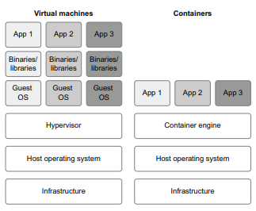
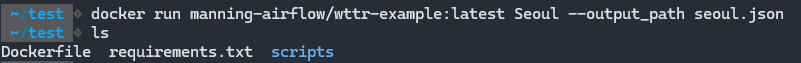

# Chapter 10 컨테이너에서 태스크 실행하기
- 다양한 오퍼레이터를 사용할 때의 문제점
- 문제점을 고려한 도커 및 쿠버네티스를 사용하여 컨테이너에서 Airflow태스크 실행하는 방법

## 10.1 다양한 오퍼레이터를 쓸 때 고려해야 할 점
- 오퍼레이터 :  다양한 유형의 시스템에서 작업을 조정할 수 있는 유연성 제공하는 기능
- 여러 오퍼레이터가 있는 DAG은 복잡하고, 관리가 어렵다.  

  
1) 영화API에서 추천 영화를 가져오고(HttpOperator),  
2) 가져온 추천에 따라 영화 순위를 지정하고(PythonOperator),  
3) 이 데이터를 MySQL 데이터베이스로 푸시(MySQLOperator)하여 다운스트림에서 사용한다.    

이렇게 단순한 작업에서도 3가지의 오퍼레이터를 사용하게 된다.

### 10.1.1 오퍼레이터 인터페이스 및 구현하기
< 서로 다른 오퍼레이터를 사용할 때 어려운 점 >
- 효율적인 구성을 위해 각 오터레이터별 인터페이스와 내부 동작에 익숙해져야 한다는 것
- 오퍼레이터에서 버그가 발생하면 근본적인 문제를 추적하고 수정하는데 시간이 오래걸림.

다수의 서로 다른 오퍼레이터를 사용하는 다양한 DAG으로 Airflow가 구성되어 있을경우,   
모든 오퍼레이터를 함 께 작업 구성하는 것은 어렵다.

### 10.1.2 복잡하며 종속성이 충돌하는 환경
- 오퍼레이터마다 종속성(파이썬이나 그 외)를 요구하는 점도 고려해야한다.   
ex ) HttpIperator 는 파이썬의 request라이프러리에 종속적이고    
ex ) PythonOperator에서 호출하는 pandes나 scikit-learn 도 종속이라고 볼 수 있고,  
ex ) MySQLOperator는 MySQL과 통신하기 위해 파이썬 및 시스템 레벨에서 종속성을 가진다.

이런 모든 종속성들을 Airflow 스케쥴러를 실행한느 환경 뿐만아니라 워커 자체에도 설치가 되어야 한다.  
이로 인해, 충돌이 발생하고 환경 설정의 유지보수가 힘들어진다.  
  


### 10.1.3 제네릭 오퍼레이터 지향하기
일부에서는 Airflow 태스크 실행을 위해 하나의 제네릭 오퍼레이터를 사용하는 것이 낫다고 주장한다.    
그에 대한 근거로  
→ 한가지 유형의 태스크로만 구성되기 때문에 이해가 쉬워진다.  
→ 버그가 발생할 가능성이 적어진다.  
→ 단일 오퍼레이터에서 필요로 하는 종속성 집합만 관리하면 된다. 

결국 컨테이너 기술을 활용해 제네릭 오퍼레이터를 구현할 수 있다.

## 10.2 컨테이너 소개하기
> 컨테이너 : 애플리케이션에 필요한 종속성을 포함하고 서로 다른 환경에 균일하게 쉽게 배포할 수 있는 기술

### 10.2.1 컨테이너란 무엇인가?

- 과거 S/W 배포 시 운영 체제 간 차이, 설치 된 종속성, 라이브러리 변형, H/W차이 등 고려해야 했다.

< 가상화 >
- 클라이언트 운영 체제 위에서실행되는 가상머신(VM)에 애플리케이션을 설치하는 방법
- 애플리케이션은 가상OS만 바라보게 된다.
- 호스트OS 위에 게스트OS를 별도로 설치하므로서 상당히 무겁다는 단점
- 모든 새 VM은 자체 게스트 OS를 실행해야 하므로, 단일 시스템에서 여러 개 VM애플리케이션 실행하기 무겁다.

<컨테이너 기반 가상화>
- 호스트 OS의 커널 레벨의 기능을 사용하여 애플리케이션을 가상화 한다.
- 애플리케이션 종속성을 분리시킬 순 있지만, 각 애플리케이션 별 별도 OS구동할 필요가 없다.
- 컨테이너 엔진에서 다양한 애플리케이션 컨테이너와 이미지를 관리하고 실행을 위한 API 제공
- 대표적인 컨테이너 엔지은 도커 이다.

### 10.2.2 첫 도커 컨테이너 실행하기

```sh
docker run debian:buster-slim echo Hello, world!
```
  

<도커 실행 단계>
1) 도커 클라이언트는 도커 데몬에 접속
2) 도커 데몬은 도커 허브 레지스트리에 기본 데비안 OS바이너리 및 라이브러리가 포함된 데비안 도커이미지 fetch  
3) 도커 데몬은 해당 이미지를 사용하여 새 컨테이너 생성
4) 컨테이너는 컨테이너 내부에서 echo Hello, world 명령어 실행
5) 도커 데몬은 명령에 대한 출력을 도커 클라이언트로 전송해 터미널에 출력

```python
# 파이썬 컨테이너 내에서 명령 실행하기
docker run python:3.8 python -c 'import sys; print(sys.version)'
```


### 10.2.3 도커 이미지 생성하기
wttr.in API로부터 날씨 예보를 가져와 파일에 쓰는 fetch_weather.py라는 스크립트를 사용한다.

```python
#! /usr/bin/env python

import click
import requests


@click.command()
@click.argument("city", type=str)
@click.option(
    "--output_path",
    default=None,
    type=click.Path(dir_okay=False, writable=True),
    help="Optional file to write output to.",
)
def fetch_weather(city, output_path):
    response = requests.get(f"https://v2.wttr.in/{city}")
    response.raise_for_status()

    if output_path:
        with open(output_path, "wb") as file_:
            file_.write(response.content)
    else:
        print(response.content.decode())


if __name__ == "__main__":
    fetch_weather()
```
```text
click
requests
```
```Dockerfile
# 기본 베이스 이미지
FROM python:3.8-slim 

# requirements파일 복사 하고 pip로 인스톨
COPY requirements.txt /tmp/requirements.txt
RUN pip install -r /tmp/requirements.txt

# fetch-weather.py 파일 폭사하고 실행권한 부여
COPY scripts/fetch_weather.py /usr/local/bin/fetch-weather
RUN chmod +x /usr/local/bin/fetch-weather

# 컨테이너 실행 시 실행할 명령어 수행
ENTRYPOINT [ "/usr/local/bin/fetch-weather" ]
CMD [ "--help" ]
```

위와 같이 fetch_weather.py, requirements.txt, Dockerfile를 모두 준비 한 다음,  
docker build 명령을 사용해서 빌드를 하면 된다.

```sh
docker build --tag manning-airflow/wttr-example .
```


```sh
docker run manning-airflow/wttr-example:latest
```


### 10.2.4 볼륨을 사용하여 데이터를 유지하기
  
- 호스트와 컨테이너 환경이 분리되어 있기 때문에 seoul.json파일이 안보인다.

호스트와 컨테이너 환경의 파일을 공유하기 위해서는 클라우드 혹은 로컬 네트워크를 통해 액세스 할 수 있는 스토리지를 사용하여 파일을 읽고 쓰는 작업이 필요하다.  

또하나로는 --volume 인자를 통해 파일, 폴더를 컨테이너에 마운트 할 수 있고,  
이 인자를 docker run 때 제공해주어야 한다.


```sh
# 실행 중인 컨테이너 조회
docker ps

# 실행중인 컨텐이너 중지 및 삭제
docker stop [container_id]
docker rm [container_id]

# 중지된 컨테이너 포함 조회
docker ps -a
```


## 10.3 컨테이너와 Airflow
### 10.3.1 컨테이너 내의 태스크
Airflow에서는 DockerOperator 및 KubernetesPodOperator 를 사용해 태스크를 정의한다.  
  
앞서 표현 했던 HttpOperator, PythonOperator, MySQLOperator 태스크를 도커 기반 접근 방식으로  
DockerOperator를 사용하면 다양한 태스크를 대체하고 적절한 종속성을 가진 서로 다른 컨테이너에 명령을 실행할 수 있다.

### 10.3.2 왜 컨테이너를 사용하는가?
우선적으로 각 태스크에 대해 이미지를 빌드해야 하므로 번거로울 수 있지만.
1) 간펴한 종속성관리
- 태스크 간 종속성 충돌이 발생하지 않게 된다.
- 더 이상 워커 환경에서 실행 될 필요가 없기에, 워커 환경에 태스크에 대한 종속성을 설치할 필요가 없다.  
    

2) 다양한 태스크 실행 시에도 동일한 접근 방식을 제공
- 컨테이너화된 각 태스크가 동일한 인터페이스(DockerOperator)를 가질 수 있다.  
  

3) 향상된 테스트 가능성
- Airflow DAG과는 별도로 개발 및 유지 관리를 할 수 있다.
- 각 이미지는 자체적으로 개발 라이프사이클을 가지고 전용 테스트환경 구성할 수 있다.
- 기존 PythonOperator를 이용한 경우 긴밀하게 연결되어 있어 오케스트레이션 계층의 탄력성/확장성 테스트가 어려웠다.

## 10.4 도커에서 태스크 실행하기
### 10.4.1 DockerOperator 소개
Airflow 로 컨테이너에서 태스크를 실행하는 가장 쉬운 방법은 apache-airflow-providers-docker 공급자 패키지의 DockerOperator를 사용하는 것 이다.

```python
    rank_movies = DockerOperator(
        task_id="rank_movies",
        # DockerOperator에게 사용할 이미지를 알려준다.
        image="manning-airflow/movielens-rank", 
        # 컨테이너에서 실행할 명령을 지정합니다.
        command=[
            "rank-movies",
            "--input_path",
            "/data/ratings/{{ds}}.json",
            "--output_path",
            "/data/rankings/{{ds}}.csv",
        ],
        # 컨테이너 내부에 마운트한 볼륨을 정의한다.
        # host_path:container_path
        volumes=["/tmp/airflow/data:/data"], 
    )
```
- DockerOperator의 기본 동작은 특수한 인수를 사용해 지정된 컨텐이너 이미지를 실행한다.
- 컨테이너가 시작 작업을 완료할때까지 대기하며 docker run명령과 같이 기능을 수행한다.
- 추가 볼륨에 대한 인수를 함께 제공하여 데이터 디렉터리를 컨테이너에 마운트 한다.

  
실제 동작은   
1) Airflow는 워커에게 태스크를 스케쥴하여 실행하게끔 지시를 내린다.
2) DockerOperator는 적절한 인수를 사용해 워커 시스템에서 docker run 명령을 수행한다.
3) 도커 데몬이 이미지 레지스트리에서 필요한 도커 이미지를 가져온다.
4) 도커 이미지를 실행하는 컨테이너를 생성한다.
5) 로컬 볼륨을 컨테이너에 마운트 한다.
6) 명령 완료 이후 컨테이너는 종료되고 DockerOperator는 Airflow 워커에게 결과를 반환한다.

### 10.4.2 태스크를 위한 컨테이너 이미지 생성하기
- 우선적으로, 다양한 태스크에 필요한 도커 이미지를 빌드 해야 한다.
- 주어진 태스크에 대한 이미지를 빌드하기 위해서는 태스크에 필요한 소프트웨어 및 종속성을 확인해야한다.
- Dockerfile을 생성하고 docker build를 이용해 이미지를 생성한다.

```python
#!/usr/bin/env python

from pathlib import Path

import logging
import json

import click
import requests


logging.basicConfig(level=logging.INFO)


@click.command()
# CLI인수 정의
@click.option(
    "--start_date",
    type=click.DateTime(formats=["%Y-%m-%d"]),
    required=True,
    help="Start date for ratings.",
)
@click.option(
    "--end_date",
    type=click.DateTime(formats=["%Y-%m-%d"]),
    required=True,
    help="End date for ratings.",
)
@click.option(
    "--output_path",
    type=click.Path(dir_okay=False),
    required=True,
    help="Output file path.",
)
@click.option(
    "--host", type=str, default="http://movielens:5000", help="Movielens API URL."
)
@click.option(
    "--user",
    type=str,
    envvar="MOVIELENS_USER",
    required=True,
    help="Movielens API user.",
)
@click.option(
    "--password",
    type=str,
    envvar="MOVIELENS_PASSWORD",
    required=True,
    help="Movielens API password.",
)
@click.option(
    "--batch_size", type=int, default=100, help="Batch size for retrieving records."
)


def main(start_date, end_date, output_path, host, user, password, batch_size):
    # HTTP 요청을 수행하기 위해 올바른 인증 세부 정보로 세션 정보 설정
    session = requests.Session()
    session.auth = (user, password)

    # 로깅을 통해 사용자에게 피드백
    logging.info("Fetching ratings from %s (user: %s)", host, user)

    ratings = list(
        _get_ratings(
            session=session,
            host=host,
            start_date=start_date,
            end_date=end_date,
            batch_size=batch_size,
        )
    )
    logging.info("Retrieved %d ratings!", len(ratings))

    
    output_path = Path(output_path)

    # 출력 디렉토리 있는 지 확인
    output_dir = output_path.parent
    output_dir.mkdir(parents=True, exist_ok=True)

    logging.info("Writing to %s", output_path)

    # 출력 디렉토리에 JSON형식으로 저장
    with output_path.open("w") as file_:
        json.dump(ratings, file_)

# HTTP 요청 수행을 위해 요청 세션 설정하고, _get_ratings 함수이용해 API에서 정의된 평점 조회
def _get_ratings(session, host, start_date, end_date, batch_size=100):
    yield from _get_with_pagination(
        session=session,
        url=host + "/ratings",
        params={
            "start_date": start_date.strftime("%Y-%m-%d"),
            "end_date": end_date.strftime("%Y-%m-%d"),
        },
        batch_size=batch_size,
    )


def _get_with_pagination(session, url, params, batch_size=100):
    offset = 0
    total = None
    while total is None or offset < total:
        response = session.get(
            url, params={**params, **{"offset": offset, "limit": batch_size}}
        )
        response.raise_for_status()
        response_json = response.json()

        yield from response_json["result"]

        offset += batch_size
        total = response_json["total"]


if __name__ == "__main__":
    main()
```

```text
click==7.1.1
requests==2.23.0
```

```Dockerfile
FROM python:3.8-slim

COPY requirements.txt /tmp/requirements.txt
RUN python -m pip install -r /tmp/requirements.txt

COPY scripts/fetch_ratings.py /usr/local/bin/fetch-ratings
RUN chmod +x /usr/local/bin/fetch-ratings

ENV PATH="/usr/local/bin:${PATH}"
```
```sh
docker build -t manning-airflow/movielens-fetch . 
```


### 10.4.3 도커 태스크로 DAG 구성하기
```python
import datetime as dt
import os

from airflow import DAG
from airflow.providers.docker.operators.docker import DockerOperator


with DAG(
    dag_id="01_docker",
    description="Fetches ratings from the Movielens API using Docker.",
    start_date=dt.datetime(2019, 1, 1),
    end_date=dt.datetime(2019, 1, 3),
    schedule_interval="@daily",
) as dag:

    fetch_ratings = DockerOperator(
        task_id="fetch_ratings",
        image="manning-airflow/movielens-fetch",
        command=[
            "fetch-ratings",
            "--start_date",
            "{{ds}}",
            "--end_date",
            "{{next_ds}}",
            "--output_path",
            "/data/ratings/{{ds}}.json",
            "--user",
            "airflow",
            "--password",
            "airflow",
            "--host",
            "http://movielens:5000",
        ],
        network_mode="airflow",
        #volumes=["/home/ubuntu/airflow/data:/data"],
        mounts=[
            {
                "source": "/home/ubuntu/airflow/data",
                "target": "/data",
                "type": "bind"
            }
        ],
    )

    rank_movies = DockerOperator(
        task_id="rank_movies",
        image="manning-airflow/movielens-rank",
        command=[
            "rank-movies",
            "--input_path",
            "/data/ratings/{{ds}}.json",
            "--output_path",
            "/data/rankings/{{ds}}.csv",
        ],
        #volumes=["/home/ubuntu/airflow/data:/data"],
        mounts=[           
            {
                "source": "/home/ubuntu/airflow/data",
                "target": "/data",
                "type": "bind"
            }
        ],
    )

    fetch_ratings >> rank_movies
```
  

### 10.4.4 도커 기반의 워크플로
  
1) 도커파일에 필요한 종속성 및 소프트웨어를 설치하고 이미지를 작성한다
2) 도커 데몬은 이미지 구축을한다.
3) 도커 데몬은 나중에 사용할 수 있도록 컨테이너 레지스트리(도커허브)에 게시한다.
4) 개발자는 빌드 이미지를 참조하는 DockerOperators를 사용하여 DAG을 작성한다.
5) DAG가 활성화 되고, Airflow는 DAG 실행을 시작하고 각 실행에 대한 DockerOperator태스크를 스케쥴한다.
6) Airflow 워커는 DockerOperator 태스크를 선택하고 컨테이너 레지스트리에서 필요한 이미지 fetch
7) Airflow 워커는 워커에 설치된 도커 데몬을 사용하여 해당 이미지와 인수로 가지는 컨테이너를 실행한다.


## 10.5 쿠버네티스에서 태스크 실행
도커는 컨테이너화된 태스크를 단일 시스템에서 실행할 수 있는 편리한 접근 방식을 제공하지만,  
여러 시스템에서 태스크를 조정하고 분산하는 데는 도움이 되지 않기 때문에 접근 방식의 확장성이 제한된다.  
이러한 한계로 쿠버네티스와 같은 컨테이너 오케스트레이션 시스템이 개발되었다.

### 10.5.1 쿠버네티스 소개
> 쿠버네티스 : 컨테이너화된 애플리케이션의 배포, 확장 및 관리에 초점을 맞춘 오픈소스 컨텐이너 오케스트레이션 플랫폼  
> 컨테이너를 여러 작업 노드에 배치하여 관리하고 확장할 수 있고, 스케쥴링을 할 수 있게 해준다.  
  
- 쿠버네티스 구성 : 쿠버네티스 마스터와 워커
    - 쿠버네티스 마스터
        - API서버, 스케쥴러, 배포,스토리지 등을 관리하는 서비스 포함하여 다양한 컴포넌트 실행
        - 쿠버네티스 클러스터에서 컨테이너화 된 애플리케이션을 관리하는 주요 포인트
    - 쿠버네티스 워커
        - 스케쥴러가 할당한 컨테이너 애플리케이션을 실행하는 역할
        - 애플리케이션을 Pod(파드) 라는 단일시스템에서 함께 실행하는 컨테이너가 포함
        - Airflow에서 태스크는 단일 파드 내부의 컨테이너로 실행
    - 쿠버네티스 보안/스토리지 관리를 위한 기본 기능 제공
        - 마스터에 스토리지 볼륨 요청하고 컨테이너 내부에 영구스토리로 마운트
        - 도커의 볼륨 마운트와 유사하지만 쿠버네티스가 관리함.

### 10.5.2 쿠버네티스 설정하기

※ kubectl 클라이언트가 로컬에 설치되어있고, 접근 권한이 있어야한다.
※ 로컬에서는 Minikube를 사용한다.

```sh
# 쿠버네티스 작동 확인
$ kubectl cluster-info
```

```sh
# Airflow 관련 리소스 및 태스크 파드가 포함될 네임스페이스 생성
$ kubectl create namespace airflow
```

```YAML
apiVersion: v1
# 영구 볼륨 정의하기 위한 쿠버네티스 명세(가상 디스크로 파드에 데이터 제공)
kind: PersistentVolume
metadata:
  #할당할 볼륨 이름
  name: data-volume
  labels:
    type: local
spec:
  storageClassName: manual
  capacity:
    # 볼륨 크기
    storage: 1Gi
  accessModes:
    # 한번에 하나의 컨테이너 읽기/쓰기 액세스 허용
    - ReadWriteOnce
  hostPath:
    # 스토리지가 보관될 호스트의 파일 경로
    path: "/tmp/data"
---
apiVersion: v1
# 특정 볼륨 내에서 일부 스토리지를 예약해 영부 볼륨을 할당하기 위한 스펙
kind: PersistentVolumeClaim 
metadata:
  # 스토리지 공간 할당할 볼륨의 이름
  name: data-volume
spec:
  storageClassName: manual
  accessModes:
    - ReadWriteOnce
  resources:
    requests:
      storage: 1Gi
```
스토리지를 위해 YAML구문을 사용해 정의한다.
- 쿠버네티스 볼륨
- 스토리지 할당
```sh
$ kubectl --namespace airflow apply -f resources/data-volume.yml
```

```YAML
apiVersion: apps/v1
kind: Deployment # 컨테이너 배포 생성을 위한 쿠버네티스 명세
metadata:
  name: movielens-deployment # 배포 이름
  labels:
    app: movielens # 배포용 레이블
spec:
  replicas: 1
  selector:
    matchLabels:
      app: movielens
  template:
    metadata:
      labels:
        app: movielens
    spec:
      containers: # 각각의 포트, 환경변수 등과 함께 배포에 포함할 컨테이너 지정
      - name: movielens
        image: himuchik/movielens-api:latest # 이미지
        imagePullPolicy: Never
        ports:
        - containerPort: 5000
        env:
        - name: API_USER
          value: airflow
        - name: API_PASSWORD
          value: airflow
---
apiVersion: v1 
kind: Service # 주어진 배포 연결할 수 있는 서비스 생성을 위한 쿠버네티스 명세
metadata:
  name: movielens
spec:
  selector: # 서비스를 배포에 연결하기 위해 배포의 레이블과 일치하는 셀렉터
    app: movielens
  ports:
    - protocol: TCP # 서비스포트(80)을 배포 컨테이너의 5000포트와 매핑
      port: 80
      targetPort: 5000
```
- DAG을 수행하는 MovieLens API에 대한 배포작업 (쿠버네티스에게 API 서비스 실행하게끔함.)
```sh
$ kubectl --namespace airflow apply -f resources/api.yml
```

### 10.5.3 KubernetesPodOperator 사용하기
apache-airflow-providers-cncf-kubernetes 패키지를 다운받는다.
```sh
$ pip install apache-airflow-providers-cncf-kubernetes
```

```python
 fetch_ratings = KubernetesPodOperator(
        task_id="fetch_ratings",

        image="himuchik/movielens-fetch:k8s", # 사용할 이미지
        cmds=["fetch-ratings"], # 컨테이너 내부에서 실행할 실행 파일
        arguments=[ # 실행파일에 전달할 인자
            "--start_date",
            "{{ds}}",
            "--end_date",
            "{{next_ds}}",
            "--output_path",
            "/data/ratings/{{ds}}.json",
            "--user",
            os.environ["MOVIELENS_USER"],
            "--password",
            os.environ["MOVIELENS_PASSWORD"],
            "--host",
            os.environ["MOVIELENS_HOST"],
        ],
        namespace="airflow", # 파드를 실행할 네임스페이스
        name="fetch-ratings", # 파드에 사용할 이름
        cluster_context="docker-desktop", # 클러스터 이름
        in_cluster=False, # 쿠버네티스 내에서 Airflow 자체를 실행하지 않음.
        volumes=[volume], # 파드에서 사용할 볼륨
        volume_mounts=[volume_mount], # 볼륨 마운트
        image_pull_policy="Never", #  로컬에서 빌드된 이미지를 사용하도록 지정
        is_delete_operator_pod=True, # 실행 끝나면 자동으로 파드 삭제
    )
```
- volumes와 volume_mounts를 통해 쿠보네티스 파드 내의 태스크에 마운트하는 방법을 지정할 수 있다.

```python

volume_claim = k8s.V1PersistentVolumeClaimVolumeSource(claim_name="data-volume")

volume = k8s.V1Volume(name="data-volume", persistent_volume_claim=volume_claim)

volume_mount = k8s.V1VolumeMount(
    name="data-volume", mount_path="/data", sub_path=None, read_only=False
)
```
위와 같이 SDK의 V1Volume및 V1VolumeMount라는 두가지 구성 클래스를 사용해 볼륨마운트를 생성한다.
- V1Volume : 쿠버네티스 리소스로 만든 영구 볼륨 data-volume을 참조한다.
- V1VolumeMount :  data-volume을 참조하고, 파드 컨테이너에서 이 볼륨을 마운트할 위치를 저장하는 객체이다.

```python
# 영화 랭킹 태스크 추가
rank_movies = KubernetesPodOperator(
        task_id="rank_movies",
        image="himuchik/movielens-rank:k8s",
        cmds=["rank-movies"],
        arguments=[
            "--input_path",
            "/data/ratings/{{ds}}.json",
            "--output_path",
            "/data/rankings/{{ds}}.csv",
        ],
        namespace="airflow",
        name="rank-movies",
        cluster_context="docker-desktop",
        in_cluster=False,
        volumes=[volume],
        volume_mounts=[volume_mount],
        image_pull_policy="Never",
        is_delete_operator_pod=True,
    )

 fetch_ratings >> rank_movies
```
DAG구현 이후, Airflow WEB UI에서 DAG을 활성화 하여 실행시킬 수 있다.  
자세한 내용은 View logs를 클릭하여 개발 로그를 확인할 수 있다.

### 10.5.4 쿠버네티스 관련 문제 진단하기
- 쿠버네티스가 태스크 파드를 스케쥴링 할 수 없을때 Pending상태로 빠지게 된다.
- 해당 태스크의 로그 확인 후 파드 상태에 대해 자세히 확인을 해봐야 한다.
```sh
# 파드 상태 얻기
$ kubectl --namespace airflow get pods
# 해당 파드에 대한 세부 정보 출력
$ kubectl --namespace describe pod [nameofpod]
```
- 우선 Airflow로그를 확인하여 문제를 진단하고, 스케쥴 문제와 유사한 내용이 확인 되면,
kubectl을 통해 쿠버네티스 클러스터 또는 구성 문제를 식별하면 된다.

### 10.5.5 도커 기반 워크플로와 차이점
 
- 도커기반 접근방식과 유사하지만, 쿠버네티스 클러스터의 설정 및 유지 관리외에도 유의해야할 점들이 존재한다.

1) 태스크는 더이상 Airflow 워커노드에서 실행되지 않고, 쿠버네티스 클러스터 내에서 실행한다.
2) 스토리지 또한 Airflow 워커에서 접근하지 않지만, 쿠버네티스 파드에서는 사용할 수 있어야한다.  
- Airflow 전체를 쿠버네티스에서 실행할 수도 있다.
