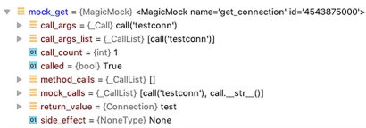

# Chapter9 테스트하기

### Airflow 테스트가 어려운 이유
- Airflow는 많은 외부 시스템과 통신하는 특성을 가지고 있다. 
- Airflow는 로직을 수행하는 시스템이 아니라 작업을 시작하고 종료하는 오케스트레이션 시스템이기 때문이다.
    - 그렇기에 Airflow에서의 로직 테스트는 어렵다.


## 9.1 테스트 시작하기
 < 테스트 종류>
 - **단위 테스트** : 개별 태스크 단위(단일 기능) 테스트
 - **통합 테스트** : 여러 단위로 구성된 시스템 동작을 모두 검증
 - 승인 테스트 : 비즈니스 요구사항에 대한 적합성 평가 

책에서는 단위 테스트와 통합테스트 측면에서만 구성되어 있고,  
pytest와 같은 프레임워크를 활용하여 테스트를 수행한다. 또한, Github Action을 이용해 테스트를 자동화하도록 한다.


### 9.1.1 모든 DAG에 대한 무결성 테스트
> DAG 무결성 테스트 (integrity test)  
> ㅇ DAG에 사이클이 포함되어있지 않는지 확인  
> ㅇ DAG의 태스크 ID가 고유한 경우

위와 같은 실수 문제 들에 대해, 

  
- t1 > t2> t3> 다시 t1로 돌아가는 사이클이 존재하기 때문에 UI에 오류를 표시한다.  
   


위와 같은 내용들을, 테스트 프레임워크를 통해 테스트해보도록 한다.
```sh
pip install pytest
# pytest [file/directory]  로 테스트를 수행할 수 있다.
```
위 명령어로 pytest를 설치한다. 

  
기존 파이썬 패키지 구조  
  
테스트 디렉토리 구조


- 프로젝트의 최상단 디렉토리에 별도 tests/ 디렉토리를 생성하여 검사 대상 코드를 그대로 복사하여 구성한다.
- 모든 테스트 대상 파일은 파일 이름 그대로 따르고 "test_" 접두사를 붙인다.
- 여러 파일들을 한꺼번에 테스트하거나 여러 종류의 테스트를 진행할 땐, 일반적으로 테스트 대상에 따라 이름이 지정된 파일에 배치가 된다.
- Pytest는 주어진 디렉토리를 스캔하고 test_접두사 혹은 _test접미사 파일을 검색한다.
- tests/ 디렉토리는 파일 간 의존성이 없기에 __init__.py파일로 만들어 모듈화 할 필요가 없다.


DAG 무결성 테스트 코드 (test_dag_integrity.py)

```python
# dags/에는 모든 DAG파일들이 보관되며 
# tests/dags/에는 test_dag_integrity.py파일이 존재한다.
# 이 무결성 테스트는 모든 DAG파일이 들어있는 폴더를 대상으로 하며, *.py파일을 반복적으로 탐색한다.
import glob
import importlib.util
import os

import pytest
from airflow.models import DAG
from airflow.utils.dag_cycle_tester import check_cycle # 사이클 체크

# DAG_PATH는 모든 DAG파일을 보관하는 디렉토리를 가리키다.
# os.path.dirname(__file__) 는 tests/dags/를 가리킨다.
# 이후, ".."를 통해 tests/와 루트 디렉토리를 탐색하고 거기서 "dags/**/*.py"패턴과 일치하는 파일을 탐색한다.
DAG_PATH = os.path.join(os.path.dirname(__file__), "..", "..", "dags/**/*.py")
DAG_FILES = glob.glob(DAG_PATH, recursive=True)


# @pytest.mark.parametrize를 통해 발견된 모든 파이썬 파일들에 대해 테스트를 실행한다.
@pytest.mark.parametrize("dag_file", DAG_FILES)
def test_dag_integrity(dag_file):
    # dag_file경로에서 파일 로드하기.
    module_name, _ = os.path.splitext(dag_file)
    module_path = os.path.join(DAG_PATH, dag_file)
    mod_spec = importlib.util.spec_from_file_location(module_name, module_path)
    module = importlib.util.module_from_spec(mod_spec)
    mod_spec.loader.exec_module(module)

    # 파일에서 발견된 모든 DAG 클래스 객체를 dag_objecs 리스트로 뽑는다.
    dag_objects = [var for var in vars(module).values() if isinstance(var, DAG)]

    """
    유효성검사 1.
        assert를 통해 파일에서 dag_objects로 DAG객체들을 찾았는지 확인한다.
        /dags 경로에 있는 모든 파이썬 파일에 DAG객체가 적어도 하나 이상 포함되어있는 지 유효성 검사
    """
    assert dag_objects

    """
    유효성검사 2.
        DAG객체가 맞다면, 
        DAG 순환 주기 존재 여부 확인  
    """
    for dag in dag_objects:
        check_cycle(dag)
```
※ 유효성검사 2에 대해 1.10 이전버전에서는 DAG구조 변경마다 순환주기 검사를 했지만, 작업 부하가 크기에, 그 이후부터는 전체 DAG 파싱 후 분석이 끝나고 캐싱되는 시점 한번만 수행되도록 변경되어 t1 >> t2 >> t1 선언 후 검사해도 오류 검출이 안되었다. 이후 Airflow 런타임 과정에서 문제확인이 되기에 배포 이전단계에서 명시적으로 test_cycle()을 호출 해야 한다.

  
위 예시에서 t3 태스크 이후 사이클이 체크됨을 알 수 있다.  
※ Airflow 버전 차이로 인해 출력 메시지가 다르다.


```python
import airflow.utils.dates
from airflow import DAG
from airflow.operators.bash import BashOperator

dag = DAG(
    dag_id="chapter8_bash_operator_no_command",
    start_date=airflow.utils.dates.days_ago(3),
    schedule_interval=None,
)
# 배시 오퍼레이터에  커맨드 명령이 없는경우
BashOperator(task_id="this_should_fail", dag=dag) 
```
  
배시 커맨드 인자가 없다고 에러가 뜬다.


### 9.1.2 CI/CD 파이프라인 설정하기
> CI/CD : 코드 저장소를 통해 코드가 변경될 때 사전 정의 된 스크립트를 실행하는 시스템  
>
> CI(지속적 통합) : 변경된 코드가 코딩 표준과 테스트 조건을 준수하는지 확인하고 검증하는 것  
> ex) Flake8, Pylint, Black 과 같은 코드 검사기 사용.  
> 
> CD(지속적 배포) : 사람의 간섭 없이 완전히 자동화된 코드를 운영환경에 배포하는 것

  
위와 같이 Airflow용 파이프라인 YAML파일을 정의하여 각 steps에 정의된 작업들이 수행될 수 있게 한다.  
- on : [push]를 통해 Github에서 push를 받을때마다 하단의 작업들을 수행하게끔 한다.
- Flake8은 정적 코드 분석을 수행하고, 사용할 수 없는 패키지를 호출하는지 검사한다.  
- Pylint 또한 코드 정적 분석 툴이지만, 코드 품질, 잠재적 버그등을 찾아낸다.
- Black은 코드 포맷터로 코드 스타일을 통일시켜주고, PEP8 버전 준수할 수 있게 해준다.
Github Actions는 위와 같은 일련의 과정들을 수행하게끔 파이프라인은 짤 수 있게 도와준다.


### 9.1.3 단위 테스트 작성하기
< Airflow 코드 개별 단위 테스트 >

```python
get_ratings(start_date, end_date, batch_size=100):
```
MovielensHook에서 get_ratings를 호출 시에 batch_size를 인자로 받는다.   
이때, 배치 사이즈를 음수로 받게 되는경우 400이나 422와 같은 HTTP오류를 반환하게 되는데,   
이런 문제가 발생되지 않게끔 하는 방법으로 사용자 입력 값을 바로 전달하기 전에 해당 값이 유효한지 체크하는 것이 있다.  
  
위와 같은 문제를 두 날짜 사이에 상위 N개의 인기영화를 반환하는 MovielensPopulityOperaotr 통해서 보자.
```python
class MovielensPopularityOperator(BaseOperator):
    def __init__(
        self,
        conn_id,
        start_date,
        end_date,
        min_ratings=4,
        top_n=5,
        **kwargs,
    ):
        super().__init__(**kwargs)
        self._conn_id = conn_id
        self._start_date = start_date
        self._end_date = end_date
        self._min_ratings = min_ratings
        self._top_n = top_n


    def execute(self, context):
        with MovielensHook(self._conn_id) as hook:
            # 각 줄에서 점수 확인
            ratings = hook.get_ratings( 
                start_date=self._start_date,
                end_date=self._end_date,
            )


            rating_sums = defaultdict(Counter)
            # movie_id마다 점수, 카운터 합산
            for rating in ratings:
                rating_sums[rating[“movieId”]].update(
                    count=1,
                    rating=rating[“rating”]
                )
            averages = {
                movie_id: (
                    rating_counter["rating"] / rating_counter["count"], 
                    rating_counter["count"]
                )
                for movie_id, rating_counter in rating_sums.items()
                if rating_counter["count"] >= self._min_ratings 
                # _min_ratings 개수 이상 의 movie_id요소들만 갖고 집계
            }
            # 점수의 평균과 점수의 개수로 정렬하여 top_n개 점수를 반환     
            return sorted(averages.items(), key=lambda x: x[1],reverse=True)[: self._top_n]
```

정확성에 대해 테스트 하기 위해선  
주어진 값으로 오퍼레이터를 실행하고, 결과가 예상대로인지 확인해본다.  
이를 위해 Airflow시스템 외부와 단위테스트 내부에서 오퍼레이터를 단독으로 실행하기 위해  
추가적인 pytest 컴포넌트가 필요하다.

### 9.1.4 Pytest 프로젝트 구성하기
- pytest를 사용하려면 테스트 스크립트에 test_ 접두사가 있어야 한다.


```python
# test_operators.py
from airflow.operators.bash import BashOperator
def test_example():
    task = BashOperator(task_id = "test", bash_command="echo 'hello~!'")
    result = task.execute(context={})
    assert result == "hello~!"
# xcom_push 생략
```


이 예제에서는 BashOperator를 인스턴스화 하고, 빈 컨텍스트가 주어지며 execute() 함수를 호출한다.  
실제로는 실행 전 후에 여러가지 작업들이 수행되지만, 위 테스트에서는 execute()를 직접 호출한다.  
테스트 태스크 인스턴스 콘텍스트의 처리가 필요한 경우 필요한 키,값으로 채워주고 테스트해야한다.  

```python
from airflow.models import Connection
from airflow.operators.bash import BashOperator

from airflowbook.operators.movielens_operator import (
    MovielensPopularityOperator,
    MovielensHook,
)


def test_movielenspopularityoperator():
    task = MovielensPopularityOperator(
        task_id="test_id",
        start_date="2015-01-01",
        end_date="2015-01-03",
        top_n=5,
    )
    result = task.execute(context={})
    assert len(result) == 5
```
```
➥ $ pytest tests/dags/chapter9/custom/test_operators.py::test
    _movielenspopularityoperator
========================= test session starts =========================
platform darwin -- Python 3.6.7, pytest-5.2.2, py-1.8.0, pluggy-0.13.0
rootdir: /.../data-pipelines-with-apache-airflow
collected 1 item

tests/dags/chapter9/custom/test_operators.py F
[100%]
=============================== FAILURES ===============================
___________________ test_movielenspopularityoperator ___________________


mocker = <pytest_mock.plugin.MockFixture object at 0x10fb2ea90>

     def test_movielenspopularityoperator(mocker: MockFixture):
        task = MovielensPopularityOperator(
➥ > task_id="test_id", start_date="2015-01-01", end_date="2015-01-03", top_n=5)
    ➥ E TypeError: __init__() missing 1 required positional argument: 'conn_id'
    tests/dags/chapter9/custom/test_operators.py:30: TypeError
========================== 1 failed in 0.10s ==========================
```
메타스토어 커넥션 ID를 가리키는 conn_id 가 누락되어 테스트가 실패한 것을 볼 수 있고,  
이때, 테스트 결과값을 다른 쪽에 전달하기 위해서는 각각 격리된 환경에서 진행되어야 한다.

이런 경우 DB를 이용해 직접 테스트하기보다는 목업을 통해 해결하도록 한다.

> 목업(mocking) : 특정 작업이나 객체를 모조로 만드는 것을 의미하며, 실제 운영환경에서는 예상되지만 테스트 중에는 발생하지 않는 데이터베이스에 대한 호출을 실제 발생시키지 않는 대신, 특정 값을 반환하도록 파이썬 코드로 지시하여 임의의 값을 전달해 속이거나 모조로 테스트하게끔 하는 방법론이다.  

이를 위해서는 pytest에 pytest-mock 을 별도로 설치를해야한다.
```sh
pip install pytest-mock
```

"mocker"라는 인수를 테스트 함수에 함께 전달하여 pytest-mock 패키지를 사용한다.

```python
def test_movielenspopularityoperator(mocker):
    mocker.patch.object(
        MovielensHook,
            "get_connection", # 몽키패치
            return_value=Connection(
                conn_id="test",
                login="airflow",
                password="airflow",
            ),
    )
    task = MovielensPopularityOperator(
        task_id="test_id",
        conn_id="test",
        start_date="2015-01-01",
        end_date="2015-01-03",
        top_n=5,
    )
    result = task.execute(context=None)
    assert len(result) == 5
```
> 몽키패치 : 런타임 시에 기능을 대체하여 Airflow 메타스토어를 쿼리하는 대신 지정된 객체를 반환되게끔 하는 것.  

위와같이 함으로써 Movielens.get_connection()은 실패하지 않는다. (실제 연결이 아닌 예상 연결 객체 리턴)

```python
def test_movielenspopularityoperator(mocker): # 목업객체는 런타임 시 임의 값으로 존재
    mock_get = mocker.patch.object( # 목업 객체로 객체의 속성을 패치한다.
        MovielensHook, # 패치할 객체
        "get_connection", # 패치할 함수
            return_value=Connection(
                conn_id="test", login="airflow",password="airflow"),
    )
    task = MovielensPopularityOperator(...)
```
이미 사전에 정의된 Commection객체를 반환하여 테스트 시 외부 시스템에 대한 호출을 대체하게끔 한다.

assert_called_with() 을 사용하여 conn_id가 Airflow메타스토어에서 요청될 것으로 예상되는지 검증할 수 있다.  
  
또한, mock_get을 통해 콜카운트와 같은 여부들을 확인 할 수 있는 많은 속성들을 담고 있다.

get_connection() 메서드를 목업으로 구현하였지만, BaseHook에도 정의가 되어 있으므로,   
테스트를 위한 MovielensHook에 있는 get_connection()을 목업으로 구현하기 위해, 
호출되는 위치에서 목업을 구성해야 한다.

### 9.1.5 디스크의 파일로 테스트하기
별도 Hook을 사용하지 않고 디스크 파일(CSV)로부터 파일을 읽어 오퍼레이터를 사용하는 예시를 들어 보겠습니다.

```python
[
        {"name": "bob", "age": "41", "sex": "M"},
        {"name": "alice", "age": "24", "sex": "F"},
        {"name": "carol", "age": "60", "sex": "F"},
]
```
이 작업의 오퍼레이터는 다음과 같다.


```python
class JsonToCsvOperator(BaseOperator):
    def __init__(self, input_path, output_path, **kwargs):
        super().__init__(**kwargs)
        self._input_path = input_path
        self._output_path = output_path
    def execute(self, context):
        with open(self._input_path, "r") as json_file:
            data = json.load(json_file)
            columns = {key for row in data for key in row.keys()}
        with open(self._output_path, mode="w") as csv_file:
            writer = csv.DictWriter(csv_file, fieldnames=columns)
            writer.writeheader()
            writer.writerows(data)
```
입력 인수로는 입력(JSON)을 위한 경로와 출력(CSV)을 위한 경로 두 가지 인수를 필요로 한다.  
이 오퍼레이터 테스트를 위해 테스트 디렉터리에 파일을 고정하고 저장하여테 테스트를 위한 입력으로   
사용한다면 출력파일은 임시 저장소와 관련된 tempfile모듈을 제공한다.

```python
import csv
import json
from pathlib import Path

from airflowbook.operators.json_to_csv_operator import JsonToCsvOperator

def test_json_to_csv_operator(tmp_path: Path): # tmp_path고정으로 사용
    input_path = tmp_path / "input.json" # 인풋 경로 설정
    output_path = tmp_path / "output.csv"    # 아웃풋 경로 설정

    input_data = [
        {"name": "bob", "age": "41", "sex": "M"},
        {"name": "alice", "age": "24", "sex": "F"},
        {"name": "carol", "age": "60", "sex": "F"},
    ]
    with open(input_path, "w") as f:
        f.write(json.dumps(input_data)) # 인풋 데이터를 인풋 경로에 json으로 저장


    operator = JsonToCsvOperator(
        task_id="test",
        input_path=input_path,
        output_path=output_path,
    )


    operator.execute(context={})  # JsonToCsvOperator 오퍼레이터 실행

    with open(output_path, "r") as f:    
        reader = csv.DictReader(f) 
        result = [dict(row) for row in reader] 

    assert result == input_data # 출력파일 == 입력파일 검증

    # 이후 tmp_path와 컨텐츠는 제거된다.
```

> 픽스처 : 테스트 수행을 위해 필요한 부분들을 혹은 조건들을 미리 준비해둔 리소스 코드.
여러 가지 조건을 합치거나 매치 시킬 수 있기 때문에 더 유연하게 사용할 수 있다.  
> 위 예시에서는 하나의 픽스쳐가 클래스의 모든 테스트의 임시 디렉토리를 초기화 시킬 수 있다.

픽스쳐는 기본적으로 모든 테스트 영역에서 적용을 가능케 한다.  
경로를 출력해 서로 다른 테스트를 실행하거나 동일한 테스트를 두 번 실행하면 이를 확인할 수 있다.

```python
print(tmp_path.as_posix())
```
위와 같은 코드는 아래와 같은 경로를 출력한다.

- /private/var/folders/n3/g5l6d1j10gxfsdkphhgkgn4w0000gn/T/pytest-ofbasharenslak/pytest-19/test_json_to_csv_operator0
- /private/var/folders/n3/g5l6d1j10gxfsdkphhgkgn4w0000gn/T/pytest-ofbasharenslak/pytest-20/test_json_to_csv_operator0


## 9.2 테스트에서 DAG 및 태스크 콘텍스트로 작업하기
일부 오퍼레이터 실행을 위해 더 많은 컨텍스트(변수 템플릿)이 필요로 한다.  
이번 장에서는 Airflow가 실제 시스템에서 태스크를 실행하여 태스크 인스턴스 콘텍스트를 생성하고   
모든 변수를 템플릿으로 만드는 것과 같은 보다 현실적인 시나리오에서 오퍼레이터의 예시를 보여준다.


  

지금까지 예제에서 실행된 것은 (5) Run operator.execute() 까지 이지만, 실제 airflow의 경우,  
그 이후의 XCom에 있는 데이터를 담당하는 부분 과 같이 더 많은 부분을 담당해야 한다.  

템플릿 변수를 통해 주어진 두 날 짜 사이의 영화 평점을 가져오는 오퍼레이터를 가정해보자.  
```python
class MovielensDownloadOperator(BaseOperator):

 template_fields = ("_start_date", "_end_date", "_output_path")

    def __init__(
        self,
        conn_id,
        start_date,
        end_date,
        output_path,
        **kwargs,
    ):
        super().__init__(**kwargs)
        self._conn_id = conn_id
        self._start_date = start_date
        self._end_date = end_date
        self._output_path = output_path


 def execute(self, context):
    with MovielensHook(self._conn_id) as hook:
        ratings = hook.get_ratings(
            start_date=self._start_date,
            end_date=self._end_date,
        )

    with open(self._output_path, "w") as f:
        f.write(json.dumps(ratings))
```
- 해당 오퍼레이터는 operator.execute(context = {} )와 같이 ds변수를 사용할 수 없다.
- 결국 오퍼레이터에게 DAG을 제공해야 한다. 그러기에 DAG을 재정의 해야 한다.

```python
dag = DAG(
    "test_dag",
    default_args={
        "owner": "airflow",
        "start_date": datetime.datetime(2019, 1, 1),
    },
    schedule_interval="@daily",
)
```
이후 오퍼레이터에서 이 결과를 확인 시에 이 값을 참조하게 되고, 다음과 같이 태스크를 정의하고, 실행한다.

```python
def test_movielens_operator(tmp_path: Path, mocker: MockFixture):
    mocker.patch.object(
        MovielensHook,
        "get_connection",
        return_value=Connection(conn_id="test", login="airflow", password="airflow"),
    )


    dag = DAG(
        "test_dag",
        default_args={"owner": "airflow", "start_date": datetime.datetime(2019, 1, 1)},
        schedule_interval="@daily",
    )

    task = MovielensDownloadOperator(
        task_id="test",
        conn_id="testconn",
        start_date="{{ prev_ds }}",
        end_date="{{ ds }}",
        output_path=str(tmp_path / "{{ ds }}.json"),
        dag=dag,
    )

    dag.clear()
    task.run(
        start_date=dag.default_args["start_date"],
        end_date=dag.default_args["start_date"],
        ignore_ti_state=True,
    )
```
위와 같이 정의한 대로 테스트를 하게 되면, Airflow 메타스토어에 문제가 있다면서 에러가 발생한다.  
이에, 테스트 진행할 때도 메타스토어가 별도로 필요하다. 
메타스토어 처리를 위해서는  

1) 연결 자격 증명을 조회 시 모든 데이터베이스 호출에 대해 목업환경을 구성하는 것.
    - 하지만 이 방법은 번거롭다.

2) Airflow가 테스트를 실행하는 동안 쿼리할 수 있는 실제 메타스토어 실행
    - airflow db init을 별도로 실행해야 한다. 별도 db가 없는 경우, SQLite 파일로 저장된다.

DAG을 사용하는 테스트가 여러번 있는 경우, pytest 픽스처를 conftest.py파일에 기입하여  
하위 디엑토리의 여러 파일을 재사용할 수 있게 한다.  
```python
import datetime

import pytest
from airflow.models import DAG, BaseOperator

@pytest.fixture
def test_dag():
    return DAG(
        "test_dag",
        default_args={"owner": "airflow", "start_date": datetime.datetime(2015, 1, 1)},
        schedule_interval="@daily",
    )
```
이후, DAG객체가 모든 테스트는 test_dag()함수 실행 시에 test_dag를 추가하여 간단하게 이스턴스화 할 수 있다.

```python

task = MovielensDownloadOperator(
        task_id="test",
        conn_id="testconn",
        start_date="{{ prev_ds }}",
        end_date="{{ ds }}",
        output_path=str(tmp_path / "{{ ds }}.json"),
        dag=test_dag,
    )
task.run(
        start_date=dag.default_args["start_date"],
        end_date=dag.default_args["start_date"],
    )
```
task.run()은 BaseOperator 클래스의 메서드로서 두개 의 날짜를 사용하며,  
DAG의 schedule_interval에 따라 지정된 두 날짜 사이에 실행할 태스크의 인스턴스 스케줄 주기를 계산한다.


### 9.2.1 외부 시스템 작업

MovieLens의 평점을 읽고 결과를 Postgres 에 저장하는 MovielensToPostgresOperator에 대해 가정해보자.  
이 경우, 소스데이터는 요청시에만 데이터를 제공하고 과거시점 데이터를 제공할 수 없지만,  
사용자는 소스의 과거 데이터를 저장하기를 원한다.

```python
from airflow.hooks.postgres_hook import PostgresHook
from airflow.models import BaseOperator
from airflowbook.hooks.movielens_hook import MovielensHook
class MovielensToPostgresOperator(BaseOperator):
    
    template_fields = ("_start_date", "_end_date", "_insert_query")
    
    def __init__(
        self,
        movielens_conn_id,
        start_date,
        end_date,
        postgres_conn_id,
        insert_query,
        **kwargs,
    ):
        super().__init__(**kwargs)
        self._movielens_conn_id = movielens_conn_id
        self._start_date = start_date
        self._end_date = end_date
        self._postgres_conn_id = postgres_conn_id
        self._insert_query = insert_query

    def execute(self, context):
        # MovielensHook을 이용해 시작일과 종료일 사이의 모든 평점을 얻는다.
        with MovielensHook(self._movielens_conn_id) as movielens_hook:
            ratings = list(movielens_hook.get_ratings(
                start_date=self._start_date,
                end_date=self._end_date),
        )
        #Postgres와 통신하기 위해 PostgresHook을 생성한다.
        postgres_hook = PostgresHook(
            postgres_conn_id=self._postgres_conn_id
        )

        # insert 쿼리 코드를 생성하고 dict 리스트로 변환한다.
        insert_queries = [
            """
            # 1
            rating = {'movieId':51935, 'userId':21127, 'rating':4.5, 'timestamp':1419984001}
            이런 dict에서 값만 뽑아내어
            
            # 2 ",".join([str(_[1]) for _ in sorted(rating.items())])를 통해
            '51935,4.5,1419984001,21127' 형식으로 바꾸고,
            
            # 3 _insert_query.format을 통해
            'INSERT INTO movielens(movieId,rating,ratingTimest amp, userId, ...) 
            VALUES(51935,4.5,1419984001,21127)' 포맷으로 바꿔준다.
            """
            self._insert_query.format(
                ",".join([str(_[1]) for _ in sorted(rating.items())])
            ) for rating in ratings
        ]

        postgres_hook.run(insert_queries)
```
위와 같은 환경에서는 도커를 활용해 로컬 Postgres 데이터베이스를 구성할 수 있다.  
pytest에서의 도커 활용을 위해 pytest-docker-tools 패키지를 활용하게 되면,  
 테스트 도커 컨테이너를 생성할 수 있는 편리한 헬퍼함수를 재공한다.


도커 컨테이너로 테스트 하면 테스트를 위한 목업 환경을 별도로 구성할 필요 없이 실제 훅 메서드를 사용할 수 있다는 이점이 있다.

```python
from pytest_docker_tools import fetch

# fetch함수를 이용해 docker pull을 트리거 하고 가져온 이미지를 반환한다.
postgres_image = fetch(repository="postgres:11.1-alpine")

# fetch함수 자체는 pytest 픽스처 이므로 직접 호출할 순 없지만 테스트에 매개변수로 전달된다.
def test_call_fixture(postgres_image):
    print(postgres_image.id)
```

```python
from pytest_docker_tools import container

postgres_container = container(
    #fetch()픽스처에서 반환된 이미지ID와 노출할 포트 필요
    image="{postgres_image.id}",
    # None으로 표기함으로써 열린 포트에 매핑 (docker run -P 와 동일)
    ports={"5432/tcp": None},
)

def test_call_fixture(postgres_container):
    print(
        f"Running Postgres container named {postgres_container.name} "
        f"on port {postgres_container.ports['5432/tcp'][0]}."
    )

```
<br><br><br><br><br>

- 컨테이너 픽스처에서 환경 변수를 통해 Postgress 사용자 이름, 암호를 제공
- *.sql, *.sql.gz , *.sh 파일을 /docker-entrypoint-initdb.d 에 위치함으로써 시작 스크립트로 컨테이너 초기화 가능.  
(컨테이너 부팅 시 실행)
```python
# 실제 데이터베이스에 대한 테스트를 위해 Postgr4es 컨테이너 초기화 하기
postgres_image = fetch(repository="postgres:11.1-alpine")

postgres = container(
    image="{postgres_image.id}",
    environment={
        "POSTGRES_USER": "testuser",
        "POSTGRES_PASSWORD": "testpass",
    },
    ports={"5432/tcp": None},
    volumes={
        # postgres-init.sql로 초기화
        os.path.join(os.path.dirname(__file__), "postgres-init.sql"): {
            "bind": "/docker-entrypoint-initdb.d/postgres-init.sql"
        }
    },
)
```
```sql
-- postgres-init.sql
SET SCHEMA 'public';
CREATE TABLE movielens (
 movieId integer,
 rating float,
 ratingTimestamp integer,
 userId integer,
 scrapeTime timestamp
);
```

```python
import os
import pytest
from airflow.models import Connection
from pytest_docker_tools import fetch, container
from airflowbook.operators.movielens_operator import MovielensHook,MovielensToPostgresOperator, PostgresHook

# postgres 이미지 fetch
postgres_image = fetch(repository="postgres:11.1-alpine")

# postgres 이미지 container 이용해서 컨테이너 생성
postgres = container(
    image="{postgres_image.id}",
    environment={
        "POSTGRES_USER": "testuser",
        "POSTGRES_PASSWORD": "testpass",
     },
    ports={"5432/tcp": None},
    volumes={
        os.path.join(os.path.dirname(__file__), "postgres-init.sql"): {
        "bind": "/docker-entrypoint-initdb.d/postgres-init.sql"
        }
    },
)

#  Movielense Hook 과 PostgresHook 의 get_connection 메서드를 mock
# 실제 데이터베이스 연결 대신 Connection 객체 반환
def test_movielens_to_postgres_operator(mocker, test_dag, postgres):
    mocker.patch.object(
        MovielensHook,
        "get_connection",
        return_value=Connection(
            conn_id="test",
            login="airflow",
            password="airflow",
        ),
    )

    mocker.patch.object(
        PostgresHook,
        "get_connection",
        return_value=Connection(
            conn_id="postgres",
            conn_type="postgres",
            host="localhost",
            login="testuser",
            password="testpass",
            port=postgres.ports["5432/tcp"][0],
    ),
 )

# 태스크 정의
 task = MovielensToPostgresOperator(
    task_id="test",
    movielens_conn_id="movielens_id", # Movielens 훅 연결 ID
    start_date="{{ prev_ds }}",
    end_date="{{ ds }}",
    postgres_conn_id="postgres_id", # PostgreSQL 훅 연결 ID
    insert_query=(
        "INSERT INTO movielens
        (movieId,rating,ratingTimestamp,userId,scrapeTime) "
        "VALUES ({0}, '{{ macros.datetime.now() }}')"
    ),
    dag=test_dag,
 )

# postgresHook 훅 인스턴스 생성
 pg_hook = PostgresHook()
 
 # 데이터 입력 전 데이터 개수 카운트
 row_count = pg_hook.get_first("SELECT COUNT(*) FROM movielens")[0]
 assert row_count == 0
 
 task.run(
    start_date=test_dag.default_args["start_date"],
    end_date=test_dag.default_args["start_date"],
 )
 
 #데이터 입력 태스크 수행 후 데이터 개수 카운트 테스트
 row_count = pg_hook.get_first("SELECT COUNT(*) FROM movielens")[0]
 assert row_count > 0
```
  
- Pytest는 픽스처를 수집하고 테스트에 사용할 픽스처를 결정한다.
- 테스트를 시작하면서 Pytest는 PostgreSQL 도커 컨테이너를 가져오고 생성한다.
(이 과정으로 인해 약간의 지연이 발생한다.)
- 테스트를 수행한다.
- 테스트가 종료되면서 Pytest는 PostgreSQL도커 컨테이너를 삭제한다.


## 9.3 개발을 위해 테스트 사용하기
- PyCharm을 이용한 중단점 설정 및 디버그  
  

IDE에서 중단점을 설정하고, 디버깅을 수행할 수 있다.

중단점 코드 라인에 도달하면 벼수의 현재 상태를 검사할 수 있을 뿐 만 아니라, 해당 시점에 코드를 실행할 수도 있다.

IDE의 중단점을 사용하는 것 외에 코드내에서 중단점을 설정할 수 있다.
```python
import pdb; pdb.set_trace()
```
중단점 생성 후, airflow tasks test 를 이용해 DAG에서 Airflow 태스크를 실행하여 커멘드라인에서 코드를 시작할 수도 있다.
```sh
$ airflow tasks test [dagid] [taskid] [execution date]
```
airflow tasks test는 메타스토어에 실행 기록을 등록하지 않고 태스크를 실행한다.  
이 방법은 운영환경에서 개별 태스크를 실행하고 테스크하는데 유용하다.  
pbd중단점에 도달하게되면 코드를 실행할 수 있고, 다음 줄로 이동하는 n 주변 줄을 표시하는 l과 같은 특정 키로   
코드를 실행하고 디버거를 제어할 수 있다.
  

### 9.3.1 DAG 완료 테스트하기
> 하나의 오퍼레이터가 제대로 실행이 되었지만, 예상치 못한 방식으로 데이터가 변환되어 후속 퍼레이터가 실패할 수도 있다.  

개발 환경에서 완벽한 운영환경을 시뮬레이션 할 수 없기 때문에 별도의 프로덕션 환경을 만들어 테스트를 진행한다.

## 9.4 Whirl을 이용한 프로덕션 환경 에뮬레이션
> Whirl 프로젝트 : 도커 컨테이너에서 운영 환경의 모든 구성요소를 시뮬레이션 하고 도커 컴포즈로 이러한 모든 구성요소를 관리하는 것

장점 
- CLI유틸리티 제공
- 도커 개발을 위한 좋은 도구

단점
- 모든 것이 도커 이미지로 제공되지 않음.(ex. Cloud Storage)
- 클라우드 환경에 대한 에뮬레이션 불가


## 9.5 DTAP환경 생성하기
- 격리된 DTAP 환경 설정 (소규모에서는 DP 만)
    - (Develop 개발 Test 테스트 Acceptance 인수 Production 프로덕션)
- 인프라에 대해 매우 구체적인 구성요소가 필요할 수 있다.
- Github저장소
    - 개발환경 > 개발 브랜치
    - 프로덕션 환경 > 프로덕션 / 메인 브랜치
    - 개발브랜치에서 병합하고 개발환경에서 DAG실행(테스트), 이후 main에 병합