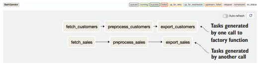
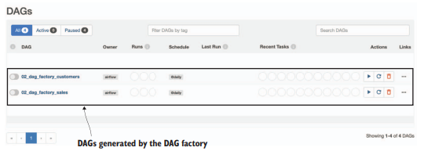
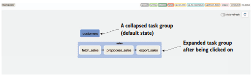
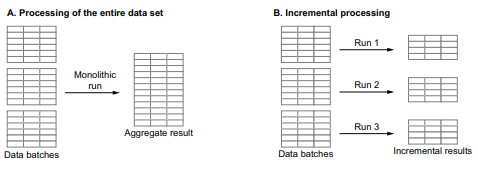
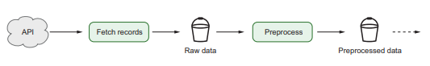

# Chapter11. 모범 사례
> 데이터와 리소스를 처리하는 관점에서 효율적인 DAG작성에 도움되는 모범사례
## 11.1 깔끔한 DAG작성
- DAG을 구성하는 태스크는 시간이 지남에 따라 점점 복잡해질 수 있다.
- DAG코드를 구조화하고 코드 스타일 규격화를 통해 가독성을 높이는 것이 중요하다.

### 11.1.1 스타일 가이드 사용
1) 스타일 가이드 따르기
    - PEP8 스타일 가이드 및 구글과 같은 회사 가이드 참조하기
2)  정적 검사기를 이요한 코드 품질 확인
    - pylint 및 flake8을 이용한 정적 코드 검사
3) 코드 포매터를 사용하여 공통 포맷 적용
    - 서로 다른 사람들이 작성한 파이썬 코드는 개별 작성자의 선호도에 따라 다른 코딩 스타일 유지될 수 있음.
    - 코드 포맷터를 사용하여 코드를 형식화 한다.(YAPF, Black)
    ```python
    # 코드 포매팅 적용 이전
    def my_function(
        arg1, arg2,
        arg3):
        """ 주석 """
        str_a='abc'
        str_b='def'
        return str_a + \
            str_b
    

    # 코드 모패팅 적용 후
    def my_function(arg1, arg2, arg3): # 인수에 대해 이로간된 들여쓰기
        """ 주석 """
        str_a="abc"
        str_b="def" #일관된 큰 따옴표 사용
        return str_a + str_b # 불필요한 줄 바꿈 제거
    ```
    ```sh
    $ pip install black
    $ black dags/
    ```
4) Airflow 전용의 코드 스타일 규칙
    - DAG정의 방법
    ```python
    with DAG(...) as dag: # 콘텍스트 매니저를 사용하는 경우
        task1=PythonOperator(...)
        task2=PythonOperator(...)
    
    dag = DAG(...) # 콘텍스트 매니저를 사용하지 않는 경우
    task1=PythonOperator(..., dag=dag)
    task2=PythonOperator(..., dag=dag)
    ```
    - 태스크 종속성 정의 하기 위해 일관된 스타일 사용하기


### 11.1.2 중앙에서 자격 증명 관리
- 다양한 시스템과 상호작용하는 DAG의 경우, 다양한 유형 서비스에 대해 자격 증명을 관리해야 한다.
- Airflow 내장 오퍼레이터에 대해 자격 증명 연결 저장소에 저장 하는것이 가장 쉬운 방법이지만,  
DAG자체 또는 외부 구성 파일에 보안 키를 하드코딩 하는 경우가 있다.
- Airflow에서 메타스토어에서 자격 증명을 가져올 수 가 있다.
```python
 from airflow.hooks.base_hook import BaseHook
 def _fetch_data(conn_id, **context)
    credentials = BaseHook.get_connection(conn_id)  # conn_id를 통해 자격 증명 가져오기
    ...
 fetch_data = PythonOperator(
    task_id="fetch_data",
    op_kwargs={"conn_id": "my_conn_id"},
    dag=dag
 )
```
### 11.1.3 구성 세부 정보를 일관성 있게 지정하기
- DAG은 파이썬으로 작성되기 때문에 구성정보 전달에 대한 다양한 옵션 제공한다.
- 구성파일 (YAML, INI, JSON), 환경변수 , 파이썬 기반 구성 모듈 등이 있다.
```python
# YAML구성
# input_path: /data
# output_path: /output

import yaml

 with open("config.yaml") as config_file:
    config = yaml.load(config_file)   # PyYAML을 사용해 구성파일을 읽는다.  
  ...

 fetch_data = PythonOperator(
    task_id="fetch_data",
    op_kwargs={
 "input_path": config["input_path"],
 "output_path": config["output_path"],
    },
    ...
 )

```
- 추가로 Airflow Variables를 사용하여 메타스토어에 구성 정보를 저장할 수 있다.  
하지만, DAG정의를 읽어올때마다 Airflow가 계속 DB에 변수를 호출하기 때문에 비효율적으로 동작한다.
```python
 from airflow.models import Variable
 input_path = Variable.get("dag1_input_path")  #Airflow변수 매커니즘 사용   
 output_path = Variable.get("dag1_output_path")
 fetch_data = PythonOperator(
    task_id="fetch_data",
    op_kwargs={
 "input_path": input_path,
 "output_path": output_path,
    },
    ...
 )
```

```python
 import yaml
 with open("config.yaml") as config_file:
    config = yaml.load(config_file)     # 전범위에서 이 구성 정보는 스케쥴러에 로드 된다.
 fetch_data = PythonOperator(...)
```
```python
import yaml
 def _fetch_data(config_path, **context):
    with open(config_path) as config_file:
        config = yaml.load(config_file)   # 워커에 로드되어 태스크 호출시점에 워커에서 동작.
    ...
 fetch_data = PythonOperator(
    op_kwargs={"config_path": "config.yaml"},
    ...
 )
```
구성 파일은 Airflwo워커가 해당 함수를 실행할 때까지 로드되지 않는다.  
Airflow 배포 구성 방법에 따라 완전히 다른 환경에 구성할 경우, 잘못된 결과가 발생하거나 태스크가  
실패할 수 있다는 문제가 있다.   
- Airflow 컴퓨넌트가 접근할 수 있는 방법을 사용하는 것이 더 좋다.


### 11.1.4 DAG구성 시 연산 부분 배제
- Airflow가 DAG의 동작 정보를 알기 위해선 파이썬 DAG파일을 실행해야 알 수 있다.
- DAG파일을 반복적으로 실행시키면서 해당 내용ㅇ을 파악하려고 하면, 시간지연의 문제가 생길 수 있다.
<비효율적인 DAG정의 내에서의 계산 수행>
```python 
 ...
 task1 = PythonOperator(...)
 my_value = do_some_long_computation()    # 긴 시간이 소요되는 계산
 task2 = PythonOperator(op_kwargs={"my_value": my_value})
 ...
```
< 보다 효율적인 태스크 내에서 계산 수행 >
```python
def _my_not_so_efficient_task(value, ...):
    ...
    PythonOperator(
    task_id="my_not_so_efficient_task",
    ...
    op_kwargs={"value": calc_expensive_value() } # 여기서 값은 DAG가 구문분석때마다 계산
 )

 def _my_more_efficient_task(...):
    value = calc_expensive_value()  # 연산 테태스크를 태스크로 옮겨놓으면 실행된때만 계산            
    ...

 PythonOperator(
    task_id="my_more_efficient_task",
    python_callable=_my_more_efficient_task,   
    ...
 )
```

- 다른 방법으로는 훅/오퍼레이터를 작성하는 것이지만, 어느정도 개발이 필요하다.
- DAG파일 안에서 구성 정보를 외부 데이터 소스 혹은 파일시스템으로부터 로드하는 경우에도 유사한 케이스 발생한다. 그런 경우 아래와 같이 처리한다.
```python
from airflow.hooks.base_hook import BaseHook
# DAG이 구문 분석이 수행될 때마다 DB에 해당 내용 확인
api_config = BaseHook.get_connection("my_api_conn")
api_key = api_config.login
api_secret = api_config.password

task1 = PythonOperator(
   op_kwargs={"api_key": api_key, "api_secret": api_secret},
   ...
)

# 위 방식 대신 
from airflow.hooks.base_hook import BaseHook

# 태스크 내에서 자격 증명을 가져오면 태스크가 실행될때만 DB에서 해당내용 확인
def _task1(conn_id, **context):
   api_config = BaseHook.get_connection(conn_id)
   api_key = api_config.login
   api_secret = api_config.password
   ...

task1 = PythonOperator(op_kwargs={"conn_id": "my_api_conn"})
```


### 11.1.5 factory 함수를 사용한 공통 패턴 생성
- 하나의 DAG을 조금씩 수정하면서 새로운 DAG을 계속 생성하는 경우 factory함수 사용
- 각 단계에 필요한 구성을 가져와 해당 DAG이나 태스크 세트를 생성하는 것이 함수 기본 개념이다.
```python
def generate_tasks(
    dataset_name, raw_dir, processed_dir, preprocess_script, output_dir, dag
): # Factory함수에 의해 생성될 태스크를 구성하느 매개변수
   # 다른 태스크에서 사용하는 파일 경로
    raw_path = os.path.join(raw_dir, dataset_name, "{ds_nodash}.json")
    processed_path = os.path.join(processed_dir, dataset_name, "{ds_nodash}.json")
    output_path = os.path.join(output_dir, dataset_name, "{ds_nodash}.json")

    # 개별 태스크 생성
    fetch_task = BashOperator(
        task_id=f"fetch_{dataset_name}",
        bash_command=f"echo 'curl http://example.com/{dataset_name}.json > {raw_path}.json'",
        dag=dag,
    )

    preprocess_task = BashOperator(
        task_id=f"preprocess_{dataset_name}",
        bash_command=f"echo '{preprocess_script} {raw_path} {processed_path}'",
        dag=dag,
    )

    export_task = BashOperator(
        task_id=f"export_{dataset_name}",
        bash_command=f"echo 'cp {processed_path} {output_path}'",
        dag=dag,
    )

   # 태스크 종속성 정의
    fetch_task >> preprocess_task >> export_task

    # 더 큰 그래프의 다른 태스크에 연결할 수 있도록 체인의 시작과 끝 태스크 반환(필요 시)
    return fetch_task, export_task


with DAG(
    dag_id="01_task_factory",
    start_date=airflow.utils.dates.days_ago(5),
    schedule_interval="@daily",
) as dag:
   # for문을 통해 다른 구성 값으로 태스크 집합을 생성
    for dataset in ["sales", "customers"]:
        generate_tasks( 
            dataset_name=dataset,
            raw_dir="/data/raw",
            processed_dir="/data/processed",
            output_dir="/data/output",
            preprocess_script=f"preprocess_{dataset}.py",
            dag=dag, # DAG인스턴스를 전달하여 태스크를 DAG에 연결
        )
```
  
- factory 함수를 사용한 반복 태스크 패턴 생성.

```python
def generate_dag(dataset_name, raw_dir, processed_dir, preprocess_script):

    with DAG(
        dag_id=f"02_dag_factory_{dataset_name}",
        start_date=airflow.utils.dates.days_ago(5),
        schedule_interval="@daily",
    ) as dag: # factory함수 내에서 DAG인스턴스 생성

        raw_file_path = os.path.join(raw_dir, dataset_name, "{ds_nodash}.json")
        processed_file_path = os.path.join(
            processed_dir, dataset_name, "{ds_nodash}.json"
        )

        fetch_task = BashOperator(
            task_id=f"fetch_{dataset_name}",
            bash_command=f"echo 'curl http://example.com/{dataset_name}.json > {raw_file_path}.json'",
        )

        preprocess_task = BashOperator(
            task_id=f"preprocess_{dataset_name}",
            bash_command=f"echo '{preprocess_script} {raw_file_path} {processed_file_path}'",
        )

        fetch_task >> preprocess_task

    return dag


for dataset in ["sales", "customers"]:
   # factory함수 이용 DAG생성
   """
   다른 구성으로 여러 DAG을 생성하고, 각 DAG이 서로 엎어쓰지 않도록 전역 네임스페이스에서
   고유한 이름을 할당해야 한다.
   """
    globals()[f"02_dag_factory_{dataset}"] = generate_dag( 
        dataset_name=dataset,
        raw_dir="/data/raw",
        processed_dir="/data/processed",
        preprocess_script=f"preprocess_{dataset}.py",
    )
```
  
- 하나의 DAG파일에 여러 DAG이 구성되어 있는 경우 혼란스러울 수 있으므로 지양 해야 한다.
- YAML파일을 입력으로 이용하고,입력된 정의된 구성 기반으로 DAG을 생성하는 경우에도 사용 가능하다.

### 11.1.6 태스크 그룹을 사용하여 관련된 태스크들의 그룹 만들기
- 태스크 그룹 : 태스크 세트를 더 작은 그룹으로 효과적으로 그룹화 하여 DAG구조를 보다 쉽게 관리하고 이해할 수 있게 해준다.
```python
with DAG(
    dag_id="04_task_groups",
    start_date=airflow.utils.dates.days_ago(5),
    schedule_interval="@daily",
) as dag:
    for dataset in ["sales", "customers"]:
      # dataset기준으로 태스크그룹화 
        with TaskGroup(dataset, tooltip=f"Tasks for processing {dataset}"):
            generate_tasks(
                dataset_name=dataset,
                raw_dir="/data/raw",
                processed_dir="/data/processed",
                output_dir="/data/output",
                preprocess_script=f"preprocess_{dataset}.py",
                dag=dag,
            )
```
  

- Task가 복잡한 구성인 경우 시각적으로 복잡성을 감소 시켜주는 데 매우 효과적이다.
### 11.1.7 대규모 수정을 위한 새로운 DAG생성
- 시작날짜 또는 스케쥴 간격 등과 같은 DAG의 변경사항이 발생하면, 스케쥴러가 의도한대로 동작하지 않는 경우가 있다.
- 태스크를 제거하거나 이름을 변경하면 UI에서 해당 테스크 기록에 액세스를 할 수 없게 된다.
- 대규모 수정이 발생하는 DAG을 복사하여 새로운 이름으로 다시 배포하면 문제를 해결할 수 있다.
- 변경 수행 전, 새 버전 복사본을 생성하면 된다.

## 11.2 재현 가능한 태스크 설계
- 태스크를 다른 시점에서 실행할 때에도 , 태스크를 간단하게 다시 실행하고 동일한 결과를 기대할 수 있어야한다.
### 11.2.1 태스크는 항상 멱등성을 가져야 합니다.
- 멱등성 : 동일한 태스크를 여러번 다시 실행하더라도 그 결과가 항상 동일해야 한다는 것.
- 실패지점부터 다시 수행해야 하는 경우가 있기에 사이드이펙트를 피할 수 있는 방법이 필요.
- 앞에 출력된 데이터를 덮어쓰도록 설정하여 멱등성을 강제할 수 있다.


### 11.2.2 태스크 결과는 결정적이어야 합니다.
- 결정적 : 태스크는 주어진 입력에 대해 항상 동일한 출력을 밪ㄴ환해야 한다.
- 비결정적 태스크 : 동일한 입력에 대해 실행할때마다 다른 결과를 제공한다.
   - 함수 내 데이터 또는 데이터 구조의 암시적 순서에 의존하는 경우.
   - 함수 내에서 임의 값, 전역 변수, 디스크에 저장된 데이터 등을 포함하여 외부상태를 사용하는 경우.
   - 결과에 대해 명시적인 순서를 지정하지 않고 병렬로 데이터 처리를 수행하는 경우
   - 다중 스레드 코드 내에서의 경쟁적 실행
   - 부적절한 예외 처리
- 랜덤을 포함하는 알고리즘문제는 테스트 수행 전 시드를 설정해 테스트를 하면 결정적으로 테스트할 수 있다.
### 11.2.3 함수형 패러다임을 사용하여 태스크를 설계합니다.
- 함수형 프로그래밍 : 계산을 처리하는 컴퓨터 프로그램을 수학적 함수의 응용으로 구현하되, 상태 변경 및 변경 가능한 데이터를 피하는 방식으로 함수를 만드는 것.
-  함수는 일반적으로 순수한 상태를 유지해야하는데, 결과를 반환하지만, 어떤 사이드이펙트도 포함하면 안된다는 것이다.
- 함수형 데이터 엔지니어링 접근은 사이드이펙트도 없고 멱등성, 결정론적 태스크 목표를 모두 달성 할 수 있다는 장점이 있다.


## 11.3 효율적인 데이터 처리
### 11.3.1 데이터의 처리량 제한하기
- 원하는 결과를 얻는 데 필요한 최소한의 데이터로 처리를 제한하는 것이 좋다.
- 필요한 데이터만 선별하여 DAG을 구성함녀 성능을 크게 향상시킬 수 있다.
- 조인 -> 필터 -> 집계  방법보다는  필터->집계 -> 조인 방법이 효율적이다.

### 11.3.2 증분 적재 및 처리
  
- 증분 처리의 기본 아이디어는 데이터를 파티션으로 분할하고 이러한 파티션을 각 DAG에서 개별적으로 처리하는 것이다.
- 실행 중 일부 과정이 오류로 인해 전체 과정이 중단된다고 하더라도 모든 데이터 세트에 대해 처음부터 다시 실행할 필요가 없다는 장점을 가지고있다.(실패한 부분만 재수행하면 된다)


### 11.3.3 중간 단계 데이터 캐싱
- 이전 단계의 결과 데이터에 추가 작업을 수행하는 경우가 있다.
- DAG을 명확히 세부적 단계로 분할하여 실행중 오류가 발생하면 오류 발생 부부만 재실행이 가능하다는 장점이 있다.
- 효율적으로 다시 실행하기 위해선 캐싱작업이 필요하다.
  
- 중간단계 데이터 캐싱의 단점은 과도한 양의 스토리가 필요할 수도 있다는 것이다.
- 따라서 데이터의 가장 원시 버전을 항상 사용 가능하게 보관하는 것이 좋다.


### 11.3.4 로컬 파일 시스템에 데이터 저장 방지
- Bash오퍼레이터와 파이썬 오퍼레이터와 같이 워커내에서 지역적으로 실행되는 오퍼레이터 사용할때 로컬 파일 시스템에 접근하는 경우가 있다.
- Airflow가 다중 태스크로 병렬처리를 위해 다중 워커에 태스크를 실행하는 경우 데이터를 읽어올 수 없는 경우도 있기 때문이다.
- 공유 저장소를 활용해 모든 워커에서 접근가능하게끔 해야 한다.
- 동일한 URL과 자격증명으로 액세스할 수 있는 클라우드 스토리지 버킷을 사용하면 된다.
### 11.3.5 외부/소스 시스템으로 작업을 이전하기
- 대량의 데이터 처리를 위한 경우 워커노드에서 직접 처리하는 것보다는 외부 spark클러스터에게 계산을 실행하도록 하면 더 좋은 성능을 얻을 수 있다.


## 11.4 자원관리
- 리소스 관리를 위한 아이디어
### 11.4.1 Pool을 이용한 동시성 관리하기
- 많은 태스크를 병렬로 실행할 때 여러 태스크가 동일 자원에 접근해야 하는 상황이 발생할 수 있다.
- 동시성 처리를 설계하지 않는 경우 자원 한도를 금방 초과해버릴 수 있다.
- 리소스 풀을 사용하여 리소스에 액세스할 수 있는 태스크 수를 제어할 수 있다.
```python
 PythonOperator( pool = "my_resource_pool")
```
태스크 예약 전, my_resource_pool에 사용 가능 슬롯이 있는지 확인하고, 사용가능 슬롯이 있는 경우, 스케줄러는 빈 슬롯을 요청하여 실행을 위해 태스크를 예약한다.  
빈 슬롯이 없는 경우, 슬롯을 사용할 수 있을때까지 태스크의 예약을 연기한다.


### 11.4.2 SLA 및 경고를 사용하여 장기 실행 작업 탐지
- 제한된 리소스 등 때문에 태스크나 DAG의 실행이 오래 걸릴 수 있다.
- SLA(service-level-agreement) 메커니즘을 사용하여 태스크의 동작을 모니터링할 수 있다.
- SLA 기능을 사용하여 DAG 또는 태스크에 SLA제한 시간을 지정할 수 있다.
- 지정된 제한 시간보다 오래 걸리는경우 경고를 표시하게 해준다.

```python
def sla_miss_callback(context):
    send_slack_message("Missed SLA!")


def send_slack_message(message):
    pass


default_args = {"sla": timedelta(seconds=10)}

with DAG(
    dag_id="03_sla_misses",
    start_date=date_utils.days_ago(2),
    schedule_interval="@daily",
    default_args=default_args,
    sla_miss_callback=sla_miss_callback,
) as dag:
   sleep_task = BashOperator(task_id="sleep", bash_command="sleep 30")

```