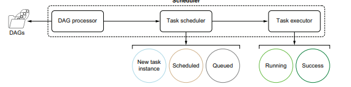

# Chatper 12. 운영환경에서 Airflow관리
- 분산 소프트웨어 아키텍처
- 로깅
- 모니터링 및 경고
> Airflow설정 순서
> 1. 환경변수
> 2. 명령환경변수
> 3. airflow.cfg
> 4. airflow.cfg 내부 명령
> 5. 기본값


## 12.1 Airflow 아키텍처
- 웹서버
- 스케줄러
- 데이터베이스  
  
- 스케줄러는 DAG정의가 있는 폴더에 액세스 할 수 있어야 한다.  
※ Airflow 1.x에서는 웹서버와 스케줄러 모두 DAG정의 폴더에 접근가능해야한다.

> 스케줄러의 역할
> 1. DAG파일 구문분석, DAG파일 읽기, 비트 및 조각 추출, 메타스토어에 저장
> 2. 실행할 태스크를 결정하고 이러한 태스크를 대기열에 배치

- 멀티 호스트 기반 설치 방법은 확장성을 고려한 환경에서 적합하지만 설치가 복잡
> 익스큐터의 유형  

| **익스큐터(Executor)**   | **분산환경 가능 여부** | **설치 난이도** | **사용에 적합한 환경**                               |
|--------------------------|------------------------|-----------------|----------------------------------------------------|
| **SequentialExecutor**    | ❌                      | 매우 쉬움        | 시연/테스트                   |
| **LocalExecutor**         | ❌                      | 쉬움             | 단일 호스트 환경 권장|
| **CeleryExecutor**        | ✅                      | 중간             | 멀티 호스트 확장 고려 시  |
| **KubernetesExecutor**    | ❌                      | 어려움           | 쿠버네티스 기반 컨테이너 환경 구성 고려시 |

### 12.1.1 어떤 익스큐터가 적합한가?
- SequentialExecutor
    - 가장 단순하게 구성할 수 있는 방법(기본값)
    - 태스크를 순차적으로 구성
    - 테스트, 데모 목적
    - 작업 처리 속도가 상대적으로 너리며, 단일 호스트 환경에서만 작동
- LocalExecutor
    - 여러 태스크를 병렬로 실행
    - 익스큐터 내부적으로 워커프로세스가 FIFO 적용방식을 통해 대기열에 실행 태스크 등록
    - 최대 32개 병렬 프로세스 실행 가능
- 분산
    - CeleryExecutor, KubernetesExecutor
    - 여러 시스템에서 병렬로 실행하여 작업 속도를 더 빠르게 실행하고자 할 때
    - CeleryExecutor
        - 내부적으로 Celery사용하여 태스크를 대기열에 등록하고 워커가 읽어와서 개별적으로 실행
        - 모든 구성 요소가 서로 다른 호스트에서 실행되어 작업 자체에 대한 부하가 낮다
        - 대기열 메커니즘을 위해 RabbitMQ, Redis, AWS SQS 사용
        - Flower라는 모니터링 도구 함께 제공
    - KubernetesExecutor
        - 쿠버네티스에서 워크로드를 실행
        - 익스큐터는 태스크를 배포하기 위해 쿠버네티스 API와 통합됨.
        - 컨테이너화된 워크로드를 실행하기 위한 사실상 표준 솔루션
        - Airflow DAG의 모든 태스크가 쿠버네티스 파드에서 실행됨.

### 12.1.2 Airflow를 위한 메타스토어 설정
- 메타스토어 : Airflow에서 일어나는 모든 일을 저장하는 데이터베이스
- 워크플로 스크립트는 스케줄러를 통해 작업 내역을 분석/관리하는 역할을 수행
- 메타스토어에 해석된 내용을 저장하는 컴포넌트로 구성된다.
- Python ORM 프레임워크인 SQLAlchemy를 사용
- 주로 MySQL과 PostgreSQL을 사용하며, 로컬환경에선 SQLite를 사용한다.
- AIRFLOW__CORE__SQL_ALCHEMY_CONN을 통해 데이터베이스 연결 설정을 할 수 있다.
> Airflow CLI에서의 데이터베이스 구성
> - airflow db init : 빈 DB에 Airflow DB 스키마 생성
> - airflow db reset : 기존 DB삭제하고 새 DB생성
> - airflow db upgrade :  변경된 DB스키마 정보를 DB에 적용
- http://localhost:8080에서 여러 example_* DAG을 확인할 수 있다.
- AIRFLOW__CORE_LOAD_EXAMPLES=False
- AIRFLOW__CORE_LOAD_DEFAULT_CONNECTION=False
- 위 두 설정 이후 airflow db init 실행 시 example DAG이 없는 DB가 생성된다.

### 12.1.3 스케줄러 자세히 살펴보기
> 스케줄러 역할
> 1. DAG 파일을 구문 부석하고 추출된 정보를 DB에 저장
> 2. 실행할 준비가 된 태스크를 결정하고 이를 대기 상태로 전환
> 3. 대기상태에서 태스크 가져오기 및 실행


- SchedulerJob 역할
    - DAG 프로세서
        - DAG디렉토리의 파이썬 파일을 주기적으로 처리한다.
        - DAG파일이 변경되지 않는 경우에도 주기적으로 각 DAG파일 확인
        - 신규 DAG파일을 메타스토어에 등록하는 역할 수행
        - DAG이 동적으로 변경되지 않는 경우, 재처리 시간을 늘려 CPU사용량을 줄여 효과를 볼 수 있다.
        - |구성항목|설명|
          |--------|---|
          | AIRFLOW__SCHEDULER__PROCESSOR_POLL_INTERVAL| 스케쥴러 루프를 완료한 후 대기하는 시간|
          |AIRFLOW__SCHEDULER__MIN_FILE_PROCESS_INTERVAL| 파일 처리되는 최소 간격(기본 0)|
          |AIRFLOW_SCHEDULER__DAG_DIR_LIST_INTERVAL| DAG폴더 파일리스트를 새로 고치는 시간(기본 300초)|
          |AIRFLOW__SCHEDULER__PARSING_PROCESSES| 모든 DAG파일을 구문 분석하는데 사용할 최대 프로세스 수 |
        - AIRFLOW_SCHEDULER__DAG_DIR_LIST_INTERVAL를 짧게 설정하는 것은 유용하다.
        - /logs/dag_processor_manager/dag_processor_manager.log에서 DAG처리 출력 확인 가능
    - 태스크 스케줄러
        - 실행할 태스크 인스턴스를 결정하는 역할을 한다.
        - 각 태스크 인스턴스에 대해 모든 태스크가 종속성이 충족되는지 확인
        - 모든 태스크가 정상적으로 마지막 단계까지 진행되었는지 확인 이후 성공여부 파악
        - 태스크가 예약된 상태에서 대기 상태로 전환되는 조건 결정(슬롯 여유 상황에 따라)
        - 태스크가 대기열에 배치되면 익스큐터가 실행을 담당한다.
    - 태스크 익스큐터
        - 태스크 스케줄러 프로세스가 태스크 인스턴스를 대기열로 보낼때 까지 기다린다.
        - 대기열의 태스크 인스턴스를 가져와 실행하고 메타스토어에 상태변경 등록
        - 태스크가 실패하더라도 Airflow가 중단되지 않게 하는 역할을 수행
        - 태스크 실행 후 하트비트 전송하여 주기적으로 확인한다.
            - 태스크가 완료되었는지 확인
            - 태스크가 종료되고, 종료코드가 0이면 작업 성공
            - 태스크가 종료되고, 종료코드가 0이 아닌 경우 작업 실패
            - 태스크가 종료되지않았다면
                - 하트비트를 등록하고 X초 동안 대기
                - 반복  

          


## 12.2 익스큐터 설치
> 익스큐터 유형
> 1. SequentialExecutor
> 2. LocalExecutor
> 3. CeleryExecutor
> 4. KubernetesExecutor
- 태스크가 실행 상태로 바뀌면 해당 태스크가 예약상태에서 대기, 실행 과정을 모두 수행 했다고 볼 수 있다.
- 실행 중 이라는 상태로 바뀔 때 해당 태스크에 대해 익스큐터가 해당 태스크를 담당하여 실행하고 있다는 것을 의미.

### 12.2.1  SequentialExecutor 설정
  
- 이 단일 하위 프로세스 내에서 작업은 순차적으로 하나씩 실행되므로 익스큐터 종류중 가장 느린 실행방법이다.
- 구성 절차가 필요 없어서 편리하게 사용가능하다.
- SQLite 데이터베이스와 함께 작동한다.
- airflow db init
- airflow scheduler
- airflow webserver

### 12.2.2 LocalExecutor 설정
  
- 여러 하위 프로세스가 있어 병렬로 태스크를 실행할 수 있으므로 SequentialExecutor에 비해 빠르게 수행 가능하다.
- MySQL 및 PostgreSQL과도 연동할 수 있다.
- AIRFLOW__CORE__EXECUTOR를 LocalExecutor로 설정해야 한다.
- AIRFLOW__CORE_PARALLEISM에 의해 구성된 최대 하위 프로세스 수까지 생성할 수 있다.
- AIRFLOW__CORE__DAG_CONCURRENCY : 기본 풀 크기
- AIRFLOW__CORE__MAX_ACTIVE_RUNS_PER_DAG 감소 하는 방법도 고려할 수 있다.
- MySQL : pip install apache-airflow[mysql]
- PostgreSQL : pip install apache-airflow[postgres]


### 12.2.3 CeleryExecutor 설정
  
- Celery : 대기열 시스템을 통해 워커에게 메시지를 배포하기 위한 프레임워크
- Celery worker는 모두 DAG와 DB에 모두 액세스할 수 있어야 한다.
- 공유 파일 시스템을 통해 모든 컴퓨터에서 DAG을 사용할 수 있도록하거나, DAG이 docker image 빌드되는 컴테이너화된 설정을 통해 구축하는 방법이 있다.
- pip install apache-airflow[celery]
- AIRFLOW__CORE__EXECUTOR=CeleryExecutor
- 대기열 시스템은 Redis, RabbitMQ, AWS SQS를 사용할 수 있다.
- AIRFLOW__CELERY__BROKER_URL을 설정하여 브로커에 대한 구성을 할 수 있다.
- AIRFLOW__CELERY__RESULT_BACKEND : 셀러리워커와 메타스토어를 연결하기 위한 설정값
- AIRFLOW__CORE__DAGS_FOLDER에서 구성한과 같은 동일 경로에 있는 워커 호스트에서도 DAG폴더에 액새스 할 수 있는지 확인한다.
- 실행순서는 webserver -> scheduler -> Celery worker 순으로 실행한다.
> 설치의 유효성을 검사하기 위해 DAG을 수동으로 트리거할 수 있다. 태스크가 성공적으로 완료되면 CeleryExecutor 설정의 모든 구성 요소를 거치게 된다.  
- 모니터링을 위해선 Flower를 사용하고 web 포트는 5555를 사용한다.
  
  
- 브로커만 설정하면 되기에 쿠버네티스 대비 설정이 비교적 쉽다.

### 12.2.4 Kubernetes Executor 설정
  
- AIRFLOW__CORE__EXECUTOR=KubernetesExecutor로 설정해서 사용할 수 있다.
- 파드(pod)가 쿠버네티스에서 가장 작은 작업 단위이며 하나 이상의 컨테이너를 실행할 수 있다.
- Airflow 관점에서 하나의 태스크는 하나의 파드에서 실행된다.
- 스케줄러가 태스크를 실행하기로 걸정하면 쿠버네티스 API에 파드 생성요청한 다음 airflow tasks run 명령을 통해 컨테이너를 실행하는 파드를 생성할 수 있다.
- 다른 익스큐터는 작업중인 워커의 정확한 위치를 항상 알 수 있다.
- Helm : 쿠버네티스에서 소프트웨어를 배포하는 데 가장 많이 사용되는 쿠버네티스용 패키지 관리자
> Airflow 프로세스 간에 DAG파일을 배포하는 방법
> 1. PersistentVolume을 사용하여 파드 간에 DAG공유
> 2. Git-sync init container를 사용해 레포지토리 최신 DAG코드 가져오기
> 3. Docker 이미지에 DAG빌드
  
    

< 컨테이너를 사용하지 않고 Airflow DAG 배포하는 방법 >  
1. FTP를 활용한 방법  
  
- 공유 파일 시스템과 같이 두 컴퓨터에서 DAG코드에 액세스할 수 있도록 하는 방법 필요  


- Airflow 스케줄러와 워커환경 간에 파일공유를 위해 NFS가 존재한다고 가정
- 개발환경에서는 코드를 개발하지만 인터넷에 대한 인터페이스가 없기에 NFS로 복사라면 FTP가 필요.

2. DAG puller DAG로 최신코드 가져오기
  
```python
import datetime
from airflow.models import DAG
from airflow.operators.bash import BashOperator

dag = DAG(
    dag_id="dag_puller",
    default_args={"depends_on_past": False},
    start_date=datetime.datetime(2020, 1, 1),
    schedule_interval=datetime.timedelta(minutes=5),
    catchup=False,
)

fetch_code = BashOperator(
    task_id="fetch_code",
    bash_command=(
    "cd /airflow/dags && "
    "git reset --hard origin/master"
    ),
    dag=dag,
)
```
- 마스터 브랜치의 최신 코드가 5분마다 Airflow머신으로 풀링된다.
- 약간의 지연을 초래하지만 제한된 환경에서는 가장 합리적인 해결방법이다.


< PersistentVolume을 사용하여 파드 간에 DAG공유 >
- PersistentVolume : 스토리지에 대한 쿠버네티스의 추상화, 공유볼륨을 컨테이너에 마운트 가능
- AIRFLOW__KUBERNETES__DAGS_VOLUME_CLAIM을 파드의 볼륨 이름으로 설정해야 한다.
- DAG코드는 푸시방법 또는 풀링 방법으로 볼륨에 복사한다.


< Git-sync init container를 사용하여 리포지토리에서 최신 DAG코드 가져오기 >
- Airflow 태스크를 실행하기 전에 사이드카 컨테이너를 이용해 Git 저장소를 가져오기 위해 구성작업이 필요하다.
- AIRFLOW_KUBERNETES_GIT_REPO
- AIRFLOW_KUBERNETES_GIT_BRANCH
- AIRFLOW_KUBERNETES_GIT_SUBPATH
- AIRFLOW_KUBERNETES_GIT_USER
- AIRFLOW_KUBERNETES_GIT_PASSWORD
- AIRFLOW_KUBERNETES_GIT_SSH_KEY_SECRET_NAME
- AIRFLOW_KUBERNETES_GIT_DAGS_FOLDER_MOUNT_POINT
- AIRFLOW_KUBERNETES_GIT_SYNC_CONTAINER_REPOSITORY
- AIRFLOW_KUBERNETES_GIT_SYNC_CONTAINER_TAG
- AIRFLOW_KUBERNETES_GIT_SYNC_INIT_CONTAINER_NAME
- GIT_REPO 및 자격증명을 설정하면 git과 동기화를 활성화할 수 있다.
- 태스크를 시작하기 전에 구성된 레포지토리에서 코드를 가져오는 동기화 컨테이너를 만든다.

< 도커 이미지에 DAG 빌드 >  
  
- DAG파일을 변경하면 새 도커 이미지가 빌드 및 배포되므로 항상 실행중인 코드 버전을 확인할 수 있다.
- 쿠버네티스이스큐터에 DAG파일을 이미지에 빌드했음을 알리려면 AIRFLOW__KUBERNETES__DAGS_IN_IMAGE=True를 설정하면 된다.
- dag코드와 Airflow이미지를 빌드하면 다음과 같은 장점이 있다.
    - 현재 배포된 코드 버전이 명확하다
    - 프로덕션에서 동일한 Airflow 환경을 로컬에서 실행할 수 있다.
    - 새로운 종속성 간의 충돌은 런타임이 아닌 빌드 타임에서 발견된다.
- DAG관리
    - 설치 종속성
    - DAG 코드만 추가
- 작은 변경이 있을 때 마다 종속성을 다시 설치하지 않으려면 별도의 단계에서 DAG코드를 이미지에 복사하는 것이 효율적이다.
- 도커 파일 구성
    - ```dockerfile
        FROM apache/airflow:2.0.0-python3.8

        USER root

        RUN apt-get update && \
            apt-get install -y gcc && \
            apt-get autoremove -y && \
            apt-get clean -y && \

        rm -rf /var/lib/apt/lists/*
        
        USER airflow
        
        COPY requirements.txt /opt/airflow/requirements.txt
        
        RUN pip install --user -r /opt/airflow/requirements.txt && \
        
        rm /opt/airflow/requirements.txt
        ```
- Airflow 이미지로 시작하고, 종속성을 설치하는 과정을 표현한 코드이다.
- docker build -f Dockerfile.base -t myrepo/airflow-base로 빌드할 수 있다.
- ```dockerfile
    FROM myrepo/airflow-base:1.2.3
    COPY dags/ /opt/airflow/dags/
    ```
- 쿠버네티스 쪽에서는 Airflow 이미지 태그가 AIRFLOW__KUBERNETES__POD_TEMPLATE_FILE에 정의된 YAML에 정의되어 있는지, AIRFLOW__KUBERNETES__WORKDER_CONTAINER_TAG가 워커 파드가 배포할 태그로 설정되어 있는지에 대해 확인하는 절차를 수행한다
- ```sh
  helm upgrade airflow ./airflow-master/chart \
    --set images.airflow.repository=yourcompany/airflow \
    --set images.airflow.tag=1234abc
    ```
- 새로 빌드된 이미지의 태그를 설정하여 Helm CLI로 배포된 버전을 업데이트 할 수 있다.


## 12.3 모든 Airflow 프로세스의 로그 확인
- 웹서버 로그 : 웹 활동에 대한 정보, 즉 웹 서버로 전송되는 요청에 대한 정보를 보관
- 스케줄러 로그 : DAG구문 분석, 예약 작업 등을 포함한 모든 스케줄러 활동에 대한 정보 보관
- 태스크 로그 : 각 로그 파일에는 단일 태스크 인스턴스의 로그가 보관
- 기본적으로 $AIRFLOW_HOME/log에 기록된다.
### 12.3.1 웹 서버 로그 저장
➥ 127.0.0.1 - - [24/Mar/2020:16:50:45 +0100] "GET / HTTP/1.1" 302 221
"-" "Mozilla/5.0 (Macintosh; Intel Mac OS X 10_14_5) AppleWebKit/537.36
(KHTML, like Gecko) Chrome/80.0.3987.149 Safari/537.36"  
➥ 127.0.0.1 - - [24/Mar/2020:16:50:46 +0100] "GET /admin/ HTTP/1.1"
200 44414 "-" "Mozilla/5.0 (Macintosh; Intel Mac OS X 10_14_5) AppleWebKit/537.36 (KHTML, like Gecko) Chrome/80.0.3987.149 Safari/537.36"  
➥ 127.0.0.1 - - [24/Mar/2020:16:50:46 +0100] "GET /static/bootstraptheme.css HTTP/1.1" 200 0 "http:/ /localhost:8080/admin/" "Mozilla/5.0
(Macintosh; Intel Mac OS X 10_14_5) AppleWebKit/537.36 (KHTML, like Gecko) Chrome/80.0.3987.149 Safari/537.36"
- 명령줄에 stdout 또는 stderr로 출력되는 것을 볼 수 있다.  

[2020-04-13 12:22:51 +0200] [90649] [INFO] Listening at: http://0.0.0.0:8080
(90649)  
[2020-04-13 12:22:51 +0200] [90649] [INFO] Using worker: sync  
[2020-04-13 12:22:51 +0200] [90652] [INFO] Booting worker with pid: 90652
- 시스템 정보도 보관하는 오류 로그 유형도 존재한다.
- airflow webserver --access_logfile [filename]
- airflow webserver --error_logfile [filename]
-  이 플래그를 적용하여 두 유형의 로그를 파일에 저장할 수 있게 한다.

### 12.3.2 스케줄러 로그 저장
- 스케줄러 로그는 기본적으로 파일에 로그를 작성한다.
-   
- DAG에서 발생하는 로그를 별도로 기록하며, 스케쥴러가 작동하는 방법을 이해하는데 도움이 된다.

```sh
... Started process (PID=46) to work on /opt/airflow/dags/hello_world.py
# hello_world.py 파일 처리를 시작한다.
... Processing file /opt/airflow/dags/hello_world.py for tasks to queue
... Filling up the DagBag from /opt/airflow/dags/hello_world.py
# DAG hello_world가 파일에서 검색 되었다.
➥ ... DAG(s) dict_keys(['hello_world']) retrieved from
        /opt/airflow/dags/hello_world.py
# DAG이 실행되고 일정에 따라 해당 태스크 인스턴스를 만들수 있는지, SLA가 누락됐는지 확인
... Processing hello_world
# 간격의 끝에 도달 했기 때문에 DagRun을 생성한다.
... Created <DagRun hello_world @ 2020-04-11 00:00:00 ...>
... Examining DAG run <DagRun hello_world @ 2020-04-11 00:00:00 ...>
# 누락된 SLA 알림을 보내야 하는지 확인
➥ ... Skipping SLA check for <DAG: hello_world> because no tasks in DAG have
SLAs
# 생성할 태스크를확인하고 예약상태로 설정한다.
➥ ... Creating / updating <TaskInstance: hello_world.hello 2020-04-11 ...>
in ORM
➥ ... Creating / updating <TaskInstance: hello_world.world 2020-04-11 ...>
in ORM
# 파일 처리 완료
... Processing /opt/airflow/dags/hello_world.py took 0.327 seconds
```
- 스케줄러가 의도한 대로 작동하는지 여부를 파악할 수 있다.
- dag_processor_manager.log 라는 이름의 단일파일이 있고, 여기에 스케줄러가 처리한 파일이 집계된 내용이 표시된다.

### 12.3.3 태스크 로그 저장
```sh
├── hello_world # dag이름
│ ├── hello # 태스크 이름
│ │ └── 2020-04-14T16:00:00+00:00  # 실행 일시
│ │ ├── 1.log # 시도횟수
│ │ └── 2.log
│ ├── world
│ │ └── 2020-04-14T16:00:00+00:00
│ │ ├── 1.log
│ │ └── 2.log
└── second_dag
 └── print_context
 ├── 2020-04-11T00:00:00+00:00
 │ └── 1.log
 └── 2020-04-12T00:00:00+00:00
 └── 1.log
```
- 웹서버 UI에서 태스크를 열 때 표시되는 내용을 반영한다.

### 12.3.4 원격 저장소로 로그 보내기
- 로그를 원격 시스템으로 전송할 수 있는 '원격 로깅'이라는 기능이 있다.
    - AWS S3 (pip install apache-airflow[amazon])
    - Azure Blob Storage (pip install apache-airflow[microsoft.azure])
    - Elasticsearch (pip install apache-airflow[elasticsearch])
    - GCS (pip install apache-airflow[google])
- 다음과 같이 설정을 해야 한다.
    - AIRFLOW__CORE__REMOTE_LOGGING=True
    - AIRFLOW__CORE__REMOTE_LOG_CONN_ID=...
    - AIRFLOW__CORE__REMOTE_BASE_LOG_FOLDER=...

## 12.4 Airflow 메트릭 시가고하 및 모니터링
- 메트릭 이라고 하는 시스템 상태에 대한 숫자 데이터로 표현한다.
- 로그, 메트릭, 추적 세 가지 항목을 조합하여 모니터링을 수행한다.  
  
- 실행중인 태스크 수의 시각화예시이다.


### 12.4.1 Airflow로부터 메트릭 수집하기
- Airflow는 StatsD를 이용해 측정한다.
- Airflow의 특정 이벤트가 이벤트에 대한 정보를 수집,집계,시각화 또는 보고하기 위해 전송하는 것을 의미한다.

< Pushing vs Pulling >
- push모델 : 메트릭이 메트릭 수집 시스템으로 전송되거나 밀어넣게 된다.
- pull모델 : 특정 엔드포인트에서 모니터링하기 위해 메트릭을 가져오는 방식을 의미한다.
- StatsD는 push모델과 함께 작동한다.

< 어떤 메트릭 수집 시스템을 써야 하는가? >
- 대표적으로 프로메테우스와 그라핏(Graphite)가 대표적이다.
- 메트릭은 StatsD형식으로 전송되고 프로메테우스로 보내기 위해선 내용을 변경해서 전달해야한다.
- 프로메테우스는 pull모델을 차용, StatsD는 Push모델을 사용하고 있다.
- StatsD와 프로메테우스 간 중간 과정을 구성해야한다.
- Grafana를 이용해 시계열 데이터를 시각화 하는 대시보드 구성을 할 수 있다.
  

### 12.4.2 측정 항목을 전송하도록 Airflow 구성
- pip install apache-airflow[statsd] 로 설치를 해준다.
- AIRFLOW_METRICS__STATSD_ON=True
- AIRFLOW_METRICS__STATSD_HOST=localhost
- AIRFLOW_METRICS__STATSD_PORT=9125
- AIRFLOW_METRICS__STATSD_PREFIX=airflow
### 12.4.3 메트릭을 수집하도록 Prometheus 구성
- 프로메테우스 : 시스템 모니터링을 위한 소프트웨어이고, pROMql이라는 언어로 쿼리할 수 있는 시계열 데이터베이스 역할을 수행한다.
- docker run -d -p 9102:9102 -p 9125:9125/udp prom/statsd-exporter
```sh
# # 각 메트릭은 HELP메시지와 함께 제공된다.
# 각 메트릭에는 게이지와 같은 유형이 있다.
# airflow_collect_dags 메트릭은 현재 값은 1.019871입니다.
# 프로메테우스는 이 값과 함께 스크랩 타임 스탬프를 등록한다.
airflow_collect_dags 1.019871
# HELP airflow_dag_processing_processes Metric autogenerated by statsd_exporter.
# TYPE airflow_dag_processing_processes counter
airflow_dag_processing_processes 35001
# HELP airflow_dag_processing_total_parse_time Metric autogenerated by
statsd_exporter.
# TYPE airflow_dag_processing_total_parse_time gauge
airflow_dag_processing_total_parse_time 1.019871
➥ # HELP airflow_dagbag_import_errors Metric autogenerated by statsd_exporter.
# TYPE airflow_dagbag_import_errors gauge
airflow_dagbag_import_errors 0
# HELP airflow_dagbag_size Metric autogenerated by statsd_exporter.
# TYPE airflow_dagbag_size gauge
airflow_dagbag_size 4
```

- 프로메테우스가 메트릭을 가져올 위치를 알 수 있도록 StatsD exporter를 프로메테우스 대상으로 구성해야 한다.
```sh
scrape_configs:
 - job_name: 'airflow'
 static_configs:
 - targets: ['localhost:9102']
```
- /tmp/prometheus.yml에 저장하고, 프로메테우스를 시작하고 파일을 도커 컨테이너에 마운트한다.
-docker run -d -p 9090:9090 -v /tmp/prometheus.yml:/etc/prometheus/prometheus.yml prom/prometheus

- http://localhost:9090에서 프로메테우스가 실행을 하게되고, /targets에서 airflow대상이 작동중인지 확인을 한다.
- Grafana에서 시각화 : 프로메테우스가 수집한 메트릭을 Grafana에서 시각화 할 수 있다.

> 메트릭 데이터 모델
> Prometheus 메트릭 데이터 모델:
> - Prometheus는 메트릭을 이름과 key-value 형식의 라벨을 사용해 식별한다. 예를 들어, task_duration이라는 메트릭에 dag_id=mydag, task_id=first_task 같은 라벨이 붙는다.
> - 이 구조는 유연하여 특정 라벨 조합을 선택해 메트릭을 조회할 수 있다. 예를 들어, task_duration{task_id="first_task"}는 특정 작업의 task_duration만을 선택할 수 있게 한다.  

> 기타 메트릭 시스템의 데이터 모델:
> - 다른 메트릭 시스템(예: StatsD)은 점(dot)으로 구분된 계층 기반의 메트릭 네이밍을 사용한다. 예를 들어, task_duration.my_dag.first_task처럼 정의되며, 이는 특정 작업의 task_duration만을 선택하는 데 불편함을 초래할 수 있다.  

> Prometheus의 StatsD Exporter:
> - StatsD Exporter는 StatsD에서 사용하는 계층적 메트릭을 Prometheus가 사용하는 라벨 기반 메트릭으로 변환한다. 하지만 이 변환 규칙이 항상 완벽하게 적용되지 않으며, 예를 들어 dag.<dag_id>.<task_id>.duration 같은 메트릭에서는 dag_id와 task_id가 자동으로 라벨로 변환되지 않을 수 있다.
>커스텀 설정 가능:
>StatsD Exporter는 특정 점(dot)으로 구분된 메트릭을 Prometheus 메트릭으로 변환하는 설정을 사용자 정의할 수 있다. Appendix C에서 해당 설정 파일 예시를 확인할 수 있으며, 자세한 내용은 StatsD Exporter 문서를 참조하면 된다.

### 12.4.4 Grafana를 이용한 대시보드 생성
- Grafana 설치
    - docker run -d -p 3000:3000 grafana/grafana
    - http://localhost:3000 에서 확인 가능하다.
    -   
- 데이터 소스 추가
    - 
    - Grafana의 첫 화면에서 'Add your first data source'를 클릭하고, Prometheus를 데이터 소스로 추가한다. Prometheus의 URL로 http://localhost:9090을 입력하여 설정한다.
   
- 메트릭 시각화
    - 
    - Prometheus가 데이터 소스로 설정되면, 대시보드를 생성하고 그 안에 패널을 추가할 수 있다. 패널의 쿼리 필드에 airflow_dag_processing_total_parse_time 메트릭을 입력하여 첫 번째 메트릭을 시각화한다.

- 시각화 설정 시 주의할 점
    - 실시간성 : 주기적으로 스크래핑하기에 1분정도 지연 발생할 수 있다.
    - 프로메테우스 한계 : Airflow 개별 이벤트에 대한 보고가 필요하다면 InfluxDB같은 시계열 DB 고려가 필요


### 12.4.5 무엇을 모니터링해야 하는가?
Airflow 모니터링에서 중요한 네 가지 신호와 메트릭을 통해 시스템의 성능과 상태를 파악할 수 있습니다.

  - 1. 지연 시간(Latency)
    - 요청 처리에 소요되는 시간
    - 예: "웹서버 응답에 걸리는 평균 시간", "작업이 대기에서 실행 상태로 전환되는 시간"

  - 2. 트래픽(Traffic)
    - 시스템이 처리해야 할 작업의 양
    - 예: "분당 실행 중인 작업 수", "초당 열린 풀 슬롯 수"

  - 3. 에러(Errors)
    - 발생한 오류 수
    - 예: "좀비 작업 수", "HTTP 200 이외의 웹서버 응답 수", "시간 초과된 작업 수"

  - 4. 포화 상태(Saturation)
    - 시스템 용량의 사용률
    - 예: "현재 CPU 부하", "현재 실행 중인 작업 수"


- Prometheus 익스포터

  Airflow와 관련된 다양한 메트릭을 모니터링하기 위해 다음의 Prometheus 익스포터를 설치합니다.

  - Node Exporter: Airflow가 실행되는 머신(CPU, 메모리, 디스크 I/O 등) 모니터링
  - PostgreSQL/MySQL Server Exporter: 데이터베이스 모니터링
  - Celery Exporter: CeleryExecutor 모니터링
  - Blackbox Exporter: 지정된 HTTP 코드 반환 여부 확인
  - Kubernetes Exporter: Kubernetes 리소스 모니터링


- 주요 Airflow 메트릭

  - DAG 관련 메트릭
    - `dag_processing.import_errors`: DAG 처리 중 발생한 오류 수. **값이 0 이상이면 문제 발생**
    - `dag_processing.total_parse_time`: DAG 추가/변경 후 이 값이 갑자기 증가하면 문제 발생
    - `ti_failures`: 실패한 작업 인스턴스 수

  - 성능 관련 메트릭
    - `dag_processing.last_duration.[filename]`: DAG 파일 처리 시간. **값이 높으면 문제가 발생**
    - `dag_processing.last_run.seconds_ago.[filename]`: 스케줄러가 파일을 마지막으로 확인한 후 경과 시간. **값이 높으면 스케줄러 과부하 상태**
    - `dagrun.[dag_id].first_task_scheduling_delay`: DAG 실행 일정과 실제 실행 사이의 지연 시간
    - `executor.open_slots`: 남은 실행 슬롯 수
    - `executor.queued_tasks`: 대기 상태인 작업 수
    - `executor.running_tasks`: 현재 실행 중인 작업 수


## 12.5 실패한 태스크에 대한 알림을 받는 방법
- 비즈니스에 중요한 파이프라인 실행 시, 문제가 발생할 경우 즉시 알림을 받아야 한다.
    - 예: 실패한 태스크, 예상 시간 내 완료되지 않은 태스크로 인해 다른 프로세스가 지연됨.
- Airflow는 조건을 감지하고 알림을 보내는 다양한 옵션을 제공한다.
    - 문제 발생 시 이를 감지하는 방법.
    - 실제 알림을 보내는 방식.
### 12.5.1 DAG 및 오퍼레이터에서 경고
- Airflow에서 알림 구성
  - DAG 및 오퍼레이터 정의 내에서 알림을 구성할 수 있음
    - 예: 특정 이벤트 발생 시 호출할 콜백 함수 설정
      ```python
      def send_error():
          print("ERROR!")

      dag = DAG(
          dag_id="chapter12",
          on_failure_callback=send_error,
          ...
      )
      ```
    - `on_failure_callback`은 DAG 실행이 실패할 때 실행됨
      - Slack 메시지 전송, PagerDuty 알림, 이메일 발송 등 가능
  - 태스크 수준에서는 더 많은 구성 옵션 제공
    - 모든 태스크를 개별적으로 구성할 필요 없이 DAG의 `default_args`를 통해 설정 전파 가능
      ```python
      def send_error():
          print("ERROR!")

      dag = DAG(
          dag_id="chapter12_task_failure_callback",
          default_args={"on_failure_callback": send_error},
          on_failure_callback=send_error,
          ...
      )

      failing_task = BashOperator(
          task_id="failing_task",
          bash_command="exit 1",
          dag=dag,
      )
      ```
    - `BaseOperator`의 `on_failure_callback` 인수를 통해 모든 오퍼레이터에서 설정 가능
    - `on_success_callback` 및 `on_retry_callback`도 설정 가능

- 이메일 알림 구성
  - `on_failure_callback`에서 이메일을 직접 전송할 수 있지만, Airflow는 `email_on_failure` 인수를 제공하여 쉽게 이메일 전송 가능
    - SMTP 구성 필요 (예: Gmail 설정)
      ```
      AIRFLOW__SMTP__SMTP_HOST=smtp.gmail.com
      AIRFLOW__SMTP__SMTP_MAIL_FROM=myname@gmail.com
      AIRFLOW__SMTP__SMTP_PASSWORD=abcdefghijklmnop
      AIRFLOW__SMTP__SMTP_PORT=587
      AIRFLOW__SMTP__SMTP_SSL=False
      AIRFLOW__SMTP__SMTP_STARTTLS=True
      AIRFLOW__SMTP__SMTP_USER=myname@gmail.com
      ```
    - 기본적으로 Airflow는 이메일을 전송하도록 구성되어 있으며, `email_on_failure`는 기본값이 True
      - SMTP 구성 없이는 이메일 발송 불가
      - 오퍼레이터의 `email` 인수에 수신 이메일 주소 설정 필요
        ```python
        dag = DAG(
            dag_id="task_failure_email",
            default_args={"email": "bob@work.com"},
            ...
        )
        ```
    - SMTP 구성 및 수신 이메일 주소가 올바르게 설정되면, Airflow는 실패한 태스크에 대한 알림 이메일을 전송함.  

  

### 12.5.2 서비스 수준 계약 정의
- 서비스 수준 계약(SLA) 정의
  - Airflow는 SLA 개념을 지원
    - SLA는 서비스나 제품에 대한 특정 기준을 의미
    - 예: TV 제공업체가 99.999% 가동 시간을 보장, 연간 5.26분의 다운타임 허용
  - Airflow에서 태스크 수준으로 SLA를 구성 가능
    - 태스크 완료의 최신 허용 날짜와 시간을 설정
    - SLA 미충족 시 이메일 발송 또는 사용자 정의 콜백 함수 호출
      ```python
      dag = DAG(
          dag_id="chapter12_task_sla",
          default_args={"email": "bob@work.com"},
          schedule_interval=datetime.timedelta(minutes=30),
          start_date=datetime.datetime(2020, 1, 1, 12),
          end_date=datetime.datetime(2020, 1, 1, 15),
      )

      sleeptask = BashOperator(
          task_id="sleeptask",
          bash_command="sleep 60",
          sla=datetime.timedelta(minutes=2),
          dag=dag,
      )
      ```
  - SLA는 태스크의 최대 실행 시간을 정의하지 않고, DAG 실행의 예정 시작 시간과 태스크 완료 사이의 최대 시간 차이를 설정
    - 예: DAG가 12:30에 시작하고 태스크 완료를 14:30까지 원할 경우, 두 시간의 timedelta 설정 필요
  - SLA는 특정 시간 이전에 완료되지 않은 경우 이메일 발송
    - 예: 데이터 처리 시간이 예상보다 길어질 경우 SLA가 발동
  - SLA를 위반한 태스크 예시:
    ```
    sleeptask on 2020-01-01T12:30:00+00:00
    ```
    - SLA 이메일에는 ASCII 아트 비틀도 포함
  - SLA는 작업의 drift(변동)를 감지하는 데 유용
    - 예: 입력 데이터가 갑자기 5배 증가하면 작업 재평가 필요
  - SLA 이메일은 SLA 미충족에 대한 알림만 제공
    - 이메일 대신 다른 형식으로 알림 설정 가능 (sla_miss_callback 인수 사용)
  - 태스크의 최대 실행 시간을 설정하려면 `execution_timeout` 인수 사용
    - 설정한 실행 시간 초과 시 태스크 실패

## 12.6 확장성 및 성능
- **확장성 및 성능**
  - Airflow에서 제공하는 실행기 유형
    - SequentialExecutor (기본값)
    - LocalExecutor
    - CeleryExecutor
    - KubernetesExecutor
  - Airflow와 실행기 유형의 구성 방법
    - **성능**: 이벤트에 대한 신속한 응답 능력, 지연 최소화
    - **확장성**: 서비스에 영향 없이 증가하는 부하 처리 능력
  - 모니터링의 중요성 강조 (섹션 12.4 참조)
    - 시스템 상태를 측정하고 파악해야 최적화 가능
    - 변경 사항이 시스템에 긍정적인 영향을 미치는지 확인 가능

### 12.6.1 실행중인 태스크의 최대 수 제어
- **최대 실행 태스크 수 제어**
  - Airflow에서 병렬로 실행할 수 있는 태스크 수를 제어하는 구성 항목
      - **AIRFLOW__CORE__DAG_CONCURRENCY**: 기본값 16
        - 각 DAG에서 대기 중이거나 실행 중인 최대 태스크 수
      - **AIRFLOW__CORE__MAX_ACTIVE_RUNS_PER_DAG**: 기본값 16
        - 각 DAG의 병렬 실행 최대 수
      - **AIRFLOW__CORE__PARALLELISM**: 기본값 32
        - 전역적으로 병렬 실행 가능한 태스크 인스턴스 최대 수
      - **AIRFLOW__CORE__WORKER_CONCURRENCY**: 기본값 16 (Celery 전용)
        - Celery 작업자당 최대 태스크 수
      
  - DAG에 많은 수의 태스크가 있을 경우, 기본값으로 인해 DAG당 16개의 병렬 태스크로 제한됨.
    - 두 개의 DAG가 동시에 실행될 경우, 총 32개의 병렬 태스크로 제한됨.
  - 기본적으로 모든 태스크는 "default_pool"이라는 풀에서 실행되며, 기본적으로 128 슬롯 제공.
  
  - **CeleryExecutor 전용 설정**
    - **WORKER_CONCURRENCY**: Celery 작업자당 프로세스 수 제어
    - Airflow는 자원을 많이 소모하므로, 프로세스당 최소 200 MB의 RAM 필요.
    - 자원 소모가 큰 태스크가 병렬로 실행되는 경우를 고려해야 함.

  - **DAG 개별 태스크 수준 제어**
    - **pool** 인자를 사용하여 특정 태스크를 특정 풀에서 실행
      - 예: CPU 집약적인 태스크의 경우, 제한된 수의 태스크만 실행할 수 있도록 전용 풀 지정.
    - **task_concurrency** 인자를 사용하여 특정 태스크의 병렬 실행 수 추가 제한.  


### 12.6.2 시스템 성능 구성
- **시스템 성능 구성**
  - 메타스토어의 부하 증가
    - Airflow는 모든 상태를 데이터베이스에 저장하므로 메타스토어 부하가 증가할 수 있음.
    - 최신 Airflow 버전으로 업데이트하면 성능 관련 개선 사항 포함됨.

  - **데이터베이스 쿼리 조정**
    - **SCHEDULER_HEARTBEAT_SEC**: 기본값 5초
      - 값 증가 시 Airflow의 스케줄러 체크인 수 감소, 데이터베이스 쿼리 수 줄어듦.
      - 60초는 합리적인 값.
      - 마지막 스케줄러 하트비트 수신 후 30초 후 경고 표시 (구성 가능).
      
    - **PARSING_PROCESSES**: 기본값 2 (SQLite 사용 시 1로 고정)
      - 동시에 DAG 상태를 처리하는 프로세스 수 조정.
      - 이 값이 높을수록 더 많은 DAG를 동시에 확인하고 태스크 간 대기 시간이 줄어듦.
      - CPU 사용량 증가 주의 필요.

  - **DAG_DIR_LIST_INTERVAL**: 기본값 300초
    - 스케줄러가 새로운 DAG 파일을 검색하는 주기를 결정.
    - 새로운 DAG 파일을 자주 추가하는 경우 이 값을 줄이면 Airflow UI에 더 빨리 나타나지만 CPU 사용량이 증가하므로 조심스럽게 조정 필요.
### 12.6.3 여러 스케줄러 실행
- **여러 스케줄러 실행**
  - Airflow 2의 주요 기능: 스케줄러 수평 확장 가능
    - Airflow 1에서는 지원되지 않음.
    - 여러 스케줄러 인스턴스를 실행할 수 있어 확장성과 중복성 확보.

  - **시스템 복잡성**
    - 분산 시스템의 복잡성으로 인해 합의 알고리즘 필요.
    - Airflow는 데이터베이스에서 행 수준 잠금을 통해 리더십 구현 (SELECT ... FOR UPDATE).
    - 추가 도구 없이 여러 스케줄러가 독립적으로 실행 가능.

  - **지원되는 데이터베이스**
    - PostgreSQL 9.6 이상
    - MySQL 8 이상

  - **스케줄러 확장 방법**
    - 추가 스케줄러 프로세스를 시작: `airflow scheduler`
    - 각 스케줄러 인스턴스는 데이터베이스의 작업을 처리 (선착순 원칙).
    - 스케줄러 중 하나가 실패해도 다른 인스턴스는 계속 실행됨.

