# Chapter 13. Airflow 보안
- Airflow 는 많은 시스템과 연결되어야 하므로 액세스 권한에 대한 관리가 필요
- Airflow 1.X에서는 Flask-Admin을 기반으로 개발된 인터페이스와 FAB를 기반으로 개발된 RBAC 인터페이스가 있다.
- Airflow 2.x에서는 Flask 기본 인터페이스는 사용되지 않으며 RBAC가 유일한 인터페이스이다.

## 13.1 Airflow 웹 인터페이스에서 보안
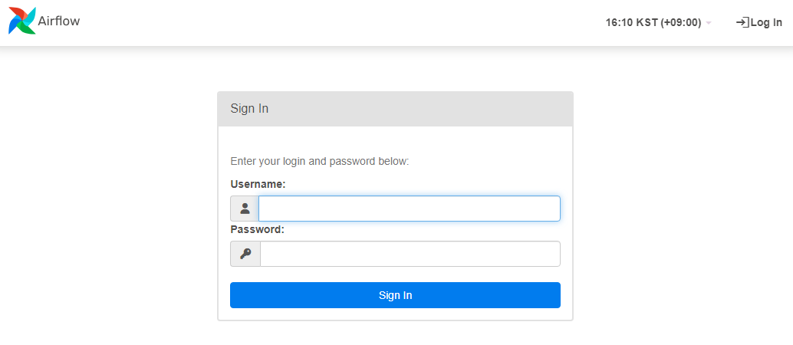  
- RBAC인터페이스의 첫 화면.
- 웹서버는 사용자 이름과 암호를 요구

### 13.1.1 RBAC 인터페이스에서 사용자 추가
```sh
airflow users create \
--role Admin \
--username bobsmith \
--password topsecret \
--email bobsmith@company.com \
--firstname Bob \
--lastname Smith

```
- 'bobsmith'라는 사용자에게 'Admin' 역할 할당
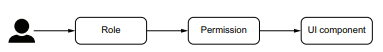  
- RBAC권한은  작업에 대한 권한, 역할을 가진 유저를 구성한다.
  
- 관리자 역할에 보안 탭이 표시된다.  
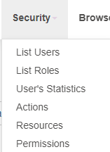  
- 사용자 리스트
- 사용자 역할
- 사용자 통계
- 기본 권한
- 뷰/메뉴
- 뷰/메뉴에 대한 권한

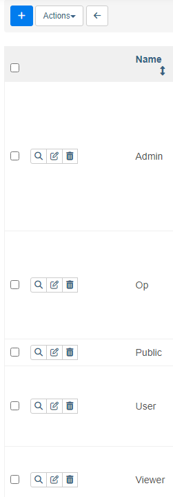  
- 기본적으로 역할은 5가지 이다.
- public 역할에는 권한이 없다.

| 역할명 | 역할의도 및 사용 | 기본 권한|
|-------|-------------|------------|
|Admin|보안 권한 관리 시에만 필요 | 모든 권한|
|Public|인증되지 않은 사용자|권한 없음|
|Viewer|Airflow에서 보기만 허용 | DAG에 대한 읽기 액세스|
|User| 보안사항 편집할 수 있는 개발자와 편집할 수 없는 개발자를 분리하는 경우 유용. DAG을 생성할 수 잇는 권한만 부여| 뷰어와 동일하지만 DAG에 대한 편집 권한이 부여됨|
|Op| Airflow DAG개발에 필요한 모든 권한 | 사용자와 동일하지만 연결, 풀, 변수, XCom 및 구성 읽기,쓰기 권한이 있음|

- menu access on XX 를 통해 메뉴 권한 부여가 가능
### 13.1.2 RBAC 인터페이스 설정
- RBAC인터페이스는 FAB(Flask-AppBuilder) 프레임워크 기반이다.
- $AIRFLOW_HOME에 web-server_config.py라는 파일이 있고, FAB에 대한 구성이 포함되어 있다.


## 13.2 미사용 데이터 암호화
- RBAC인터페이스 사용을 위해선 사용자가 사용자 이름과 암호를 사용하여 데이터베이스에 저장되어야 한다.
- 권한 없는 사용자가 시스템에 액세스할 수 있는 경로는 보안상 취약하다. 그 경로의 수를 줄여야 한다.
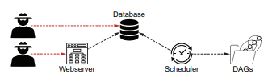  
### 13.2.1 Frenet Key 생성
- 액세스 권한을 얻은 후에도 데이터를 안전하게 보호해야한다.
- 사용자가 암호를 만들기 전에 Airflow에서 암호화 설정이 활성화 되어 있는지 확인해야한다.
- Airflow는 Fernet Key를 사용하여 보안 사항을 암호화 및 복호화 할 수 있다.
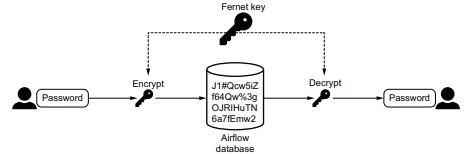
- `Fernet Key` : 암호화 및 복호화에 사용되는 시크릿 문자열

```python
from cryptography.fernet import Fernet
fernet_key = Fernet.generate_key()
print(fernet_key.decode())
# YlCImzjge_TeZc7jPJ7Jz2pgOtb4yTssA1pVyqIADWg=
```
- 위와 같은 방식으로 Fetnet Key를 생성할 수 있다.
- 이후 AIRFLOW__CORE__FERNET_KEY구성 항목을 성정하여 Airflow를 설정할 수 있다.
- 이 키를 이용해 누구나 복호화 할 수 있으므로 안전하게 유지해야한다.
- 텍스트가 아닌 방법으로 저장하려면 해당 키파일이 있는 경로를 읽어오게끔 설정하면된다.
     -  AIRFLOW__CORE__FERNET_KEY_CMD=cat 경로
## 13.3 LDAP 서비스로 연결
- `디렉토리 서비스`: 사용자 관리를 위한 Azure AD 또는 OpenLDAP와 같은 LDAP프로토콜을 지원하는 서비스
- Airflow 가 LDAP 서비스에 연결되면 로그인 시 백그라운드의 LDAP서비스에서 사용자 정보를 가져온다.  
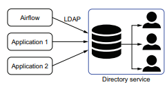  
### 13.3.1 LDAP의 이해
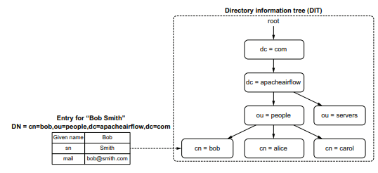  
- SQL과 관계형데이터베이스 간의 관계는 LDAP와 디렉터리 서비스 간의 관계와 유사하다.
- 디렉터리 서비스도 데이터를 저장하고 LDAP를 이용해 쿼리를 한다.
- LDAP는 대량의 읽기 작업을 위해 설계되었다.
- 디렉터리 서비스에서 엔티티는 디렉터리 정보트리(DIT)라는 계층 구조에 저장된다.
- 각 정보를 Entry라고 하며, 정보는 속성 및 값이라는 키-값 쌍으로 저장된다.
- 또한 고유 이름(DN)으로 개별적으로 식별된다.
- LDAP 요구 사항
    - 도메인 구성요소(dc)로 트리를 시작한다.
    - ou는 조직 단위 약자이다
    - cn은 일반 이름의 약자이다.
- LDAP표준은 특정 키와 함께 특정 엔티티를 정의하는 ObjectClass를 정의한다.
    - 사람은 sn(성), 이니셜과 같은 키로 정의한다.
- LDAP작업 개요
    |LDAP작업|설명|  
    |----|----|
    |Abandon| 이전 요청한 작업을 중단한다.|
    |Add| 새 항목을 만든다|
    |Bind| 지정된 사용자의 ID를 변경하여 디렉토리 서비스에서 특정 작업을 수행할 수 있도록한다|
    |Compare| 주어진 항목에 주어진 속성 값이 포함되어 있는지 확인|
    |Delete| 항목을 제거|
    | Exetended|LDAP표준엔 정의되지 않았지만, 디렉토리 서비스를 사용할 수 있는 작업을 요청한다.|
    |Modify DN| DN을 변경한다.|
    |Modify | 항목의 속성을 변경한다.|
    |Search| 주어진 기준과 일치하는 항목을 검색하고 반환한다.|
    |Unbind| 디렉토리 서비스에 대한 연결을 닫는다.|
- 검색 쿼리에는 필터집합과  uid=bsmith와 같이 검색 조건에 필요한 정보에 해당하는 여러 조건을 포함한다.
```sh
ldapsearch -b "dc=apacheairflow,dc=com" # dc=apacheairflow,dc=com아래의 모든 항목 나열
ldapsearch -b "dc=apacheairflow,dc=com" "(uid=bsmith)" # "dc=apacheairflow,dc=com" "(uid=bsmith)" 아래의 모든항목 나열
```
### 13.3.2 LDAP 서비스에서 사용자 가져오기
- LDAP인증은 FAB를 통해 지원되기에 web-server_config.py에서 구성해야 한다.
```python
from flask_appbuilder.security.manager import AUTH_LDAP
AUTH_TYPE = AUTH_LDAP
AUTH_USER_REGISTRATION = True
AUTH_USER_REGISTRATION_ROLE = "User" # 로그인하는 모든 사용자에게 할당된 기본 역할
AUTH_LDAP_SERVER = "ldap://openldap:389"
AUTH_LDAP_USE_TLS = False
AUTH_LDAP_SEARCH = "dc=apacheairflow,dc=com" # 사용자 검색을 위한 DIT섹션
AUTH_LDAP_BIND_USER = "cn=admin,dc=apacheairflow,dc=com" # 바인드 하고 검색할 LDAP서비스의 사용자
AUTH_LDAP_BIND_PASSWORD = "admin" # 바인드 하고 검색할 LDAP서비스의 사용자
AUTH_LDAP_UID_FIELD = "uid" # 사용자 이름을 검색할 LDAP서비스와 필드 이름
```
- 사용자 정보 검색을 통해 FAB는 발견된 사용자에게 AUTH_USER_REGISTRATION_ROLE에 의해 구성된 역할을 통해 액세스 허용.


## 13.4 웹 서버에 대한 트래픽 암호화
- 침입자는 두 시스템 간 데이터 전송중인 시점에서 데이터를 얻을 수 있다.
- `MITM`은 두 시스템 또는 사람이 서로통신하는 동안 세 번째 사람이 통신을 가로채서 메시지를 읽고 이를 전달하는 공격이다.  
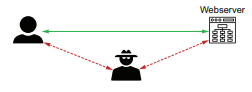  

### 13.4.1 HTTPS 이해
- HTTP프로토콜을 통해 Airflow와 통신하는 브라우저를 이용하여 Airflow 웹서버로 작업할 수 있다.  
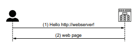  

- HTTP 
    - 웹사이트를 탐색할 때 요청 ID를 확인하기 위한 양쪽에 어떤 검사도 수행되지 않는다.
- HTTPS 안전한 이유
    - 사용자의 관점에서 최신 브라우저는 유효한 인증서를 나타내기 위해 자물쇠 혹은 녹색을 표시한다.
    - 브라우저와 웹서버가 HTTPS를 통해 통신할 때 초기 핸드쉐이크에는 원격측의 유효성을 확인하는 더 많은 단계가 포함된다.  
    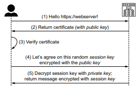  
    - (1) Hello https://webserver!
    - (2) 반환 증명서(공개 키 포함)
    - (3) 인증서 확인
    - (4) 공개 키로 암호화된 임의의 세션 키를 수락합니다.
    - (5) 개인 키로 해독합니다. 세션 키로 암호화된 메시지 반환
- HTTPS는 비대칭 암호화와 대칭 암호화를 모두 사용하는 TLS이다.
    - 대칭 암호화 : 암호화와 복호화 모두 단일 키 적용
    - 비대칭 암호화 : 공개 및 개인의 두 키로 구성
        - 공개 키로 암호화된 데이터는 개인 키로만 해독할 수 있고 개인 키로 암호화된 데이터는 공개 키로만 해독 가능
- HTTPS세션이 시작될 때 웹 서버는 먼저 인증서를 브라우저에게 반환한다.
- 브라우저는 임의로 생성된 세션 키를 공개 키로 암호화하여 웹 서버에 반환한다.
- 개인 키로만 이 메시지를 해독할 수 있으며, 웹 서버만 액세스할 수 있다.  
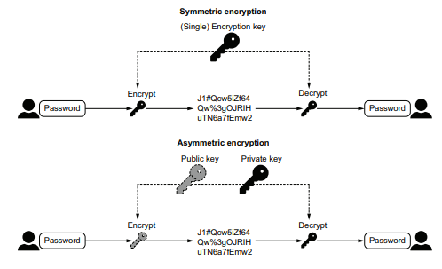
### 13.4.2 HTTPS용 인증서 구성
- Airflow는 man-in-the-middle공격을 탐지하고 방지하는것은 어렵다.
- 하지만 트래픽을 암호화 하여 공격자에게 데이터를 쓸모 없게 만드는 것은 간단하게 설저할 후 있다.
- HTTPS트래픽은 암호화 되어 있기 때문에 중간자가 읽어도 데이터를 해석할 수 없다.
- Airflow에서 대표적인 웹 서버 보호하는 방법
    - 개인 키(기밀 유지)
    - 인증서(공유하기에 안전)
        - 인증기관에서 제공하는 파일 이거나 자체 서명된 인증서
- 자체 서명된 인증서
```sh
openssl req \
-x509 \
-newkey rsa:4096 \
-sha256 \
-nodes \
-days 365 \ # 1년동안 유효한 키 생성
-keyout privatekey.pem \ # 개인 키의 파일 이름
-out certificate.pem \ # 인증서 파일 이름
# 보안상 이유로 SAN확장이 빌요하다.
-extensions san \
-config \
 <(echo "[req]";
    echo distinguished_name=req;
    echo "[san]";
    echo subjectAltName=DNS:localhost,IP:127.0.0.1
 ) \
-subj "/CN=localhost"
```

- AIRFLOW__WEBSERVER__WEB_SERVER_SSL_CERT=인증서경로
- AIRFLOW__WEBSERVER__WEB_SERVER_SSL_KEY=개인키파일 경로
- 이 두 설정을 통해 함께 실행되어야 한다.
- 개인키는 공유하지 않고 안전한 장소에 보관해야한다.
- 대부분의 리눅스 시스템에서 신뢰할 수 잇는 인증서는 /etc/ssl/certs에 저장된다.
- 브라우저가 신뢰할 수 있는 인증서 목록에 없는 인증서를 반환하는 웹사이트로 연결되는 경우, 자체 서명된 인증서를 사용할 때와 마찬가지로 브라우저에 경고가 표시된다.
- 자체 생성한 인증서를 신뢰하도록 설정해야 하는 경우가 있다.
- 유효성 검사를 할 수 있는 신뢰할 수 있는 기관에서 인증서를 발급하여 적용하는 것이 좋다.

## 13.5 시크릿 관리 시스템에서 자격 증명 가져오기
- 중앙 시크릿 저장 시스템을 적용하여 하나의 단일 시스템에 한번만 저장해놓고 애플리켕션에서 보안 사항을 저장하지 않고도 필요할 때 기밀 내용을 요청할 수 있다.
- Airflow의 시크릿 값은 변수 및 연결에 저장할 수 있다.
- Airflow 1.10.10부터는 기존 변수 및 연결 클래스를 계속 사용하면서 외부 시크릿 스토리지 시스템에서 시크릿을 가져오는 메커니즘을 제공하는 `시크릿 벡엔드` 기능을 도입했다.
- 시크릿 백엔드는 원하는 시크릿 스토리지 시스템을 구현하고 연결하기 위해 서브 클래스를 구성할 수 있는 일반 클래스를 제공한다.

```python
import airflow.utils.dates
from airflow.models import DAG
from airflow.providers.http.operators.http import SimpleHttpOperator

dag = DAG(
    dag_id="secretsbackend_with_vault",
    start_date=airflow.utils.dates.days_ago(1),
    schedule_interval=None,
)

call_api = SimpleHttpOperator(
    task_id="call_api",
    http_conn_id="secure_api",
    method="GET",
    endpoint="",
    log_response=True,
    dag=dag,
)
```
- **HashiCorp Vault와 Airflow 연동**
  - DAG 코드에 HashiCorp Vault에 대한 명시적 참조는 없음.
  - `SimpleHttpOperator`는 Airflow 연결에 설정된 URL로 HTTP 요청을 보냄.
  - 이전에는 URL을 Airflow 연결에 저장했지만, 이제 HashiCorp Vault 등 비밀 저장소에 저장 가능.

- **설정 요건**
  - **Secrets backend 구성**: `AIRFLOW__SECRETS__BACKEND`와 `AIRFLOW__SECRETS__BACKEND_KWARGS` 설정 필요.
  - **공통 접두사**: 모든 비밀은 공통 접두사를 가져야 함.
  - **연결 URI**: 모든 연결은 "conn_uri"라는 키에 저장.
  - **변수 값**: 모든 변수는 "value"라는 키에 저장.

- **비밀 저장소 경로 예시**
  - 예: `secret/connections/secure_api`
    - `secret`과 `connections`는 폴더, `secure_api`는 실제 비밀을 식별하는 이름.
  
- **Vault에서 비밀 생성**
  - 시크릿 이름: `connections/secure_api`
  - **Prefix 사용**: "connections/"는 필수가 아니지만, Airflow의 secrets backend는 특정 계층에서 비밀을 검색할 수 있어 편리함.

- **Airflow 연결 저장**
  - **필수 키**: 비밀 저장소에 Airflow 연결을 저장하려면 `conn_uri`라는 키를 설정해야 함.
  - **URI 형식**: 연결 정보는 URI 형식으로 제공되어야 하며, 이는 Airflow의 connection 클래스에서 세부 정보로 변환됨.

  - **시크릿 백엔드 설정**:
  1. `AIRFLOW__SECRETS__BACKEND`에 백엔드 클래스 지정:
     - HashiCorp Vault: `airflow.providers.hashicorp.secrets.vault.VaultBackend`
     - AWS SSM: `airflow.providers.amazon.aws.secrets.systems_manager.SystemsManagerParameterStoreBackend`
     - GCP Secret Manager: `airflow.providers.google.cloud.secrets.secrets_manager.CloudSecretsManagerBackend`
  2. `AIRFLOW__SECRETS__BACKEND_KWARGS`에 백엔드 세부 설정 추가 (예: Vault의 경우 URL, 토큰, connections_path 지정).

- **시크릿 검색 순서**:
  1. Secret backend
  2. 환경 변수 (AIRFLOW_CONN_*, AIRFLOW_VAR_*)
  3. Airflow 메타스토어

- **보안 강화**: 시크릿 정보를 한 번만 저장하고 여러 시스템이 연결 가능하여 잠재적 보안 침해를 줄임.